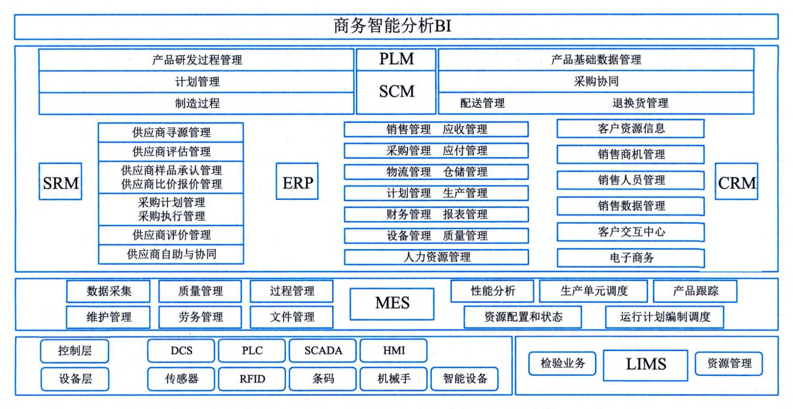
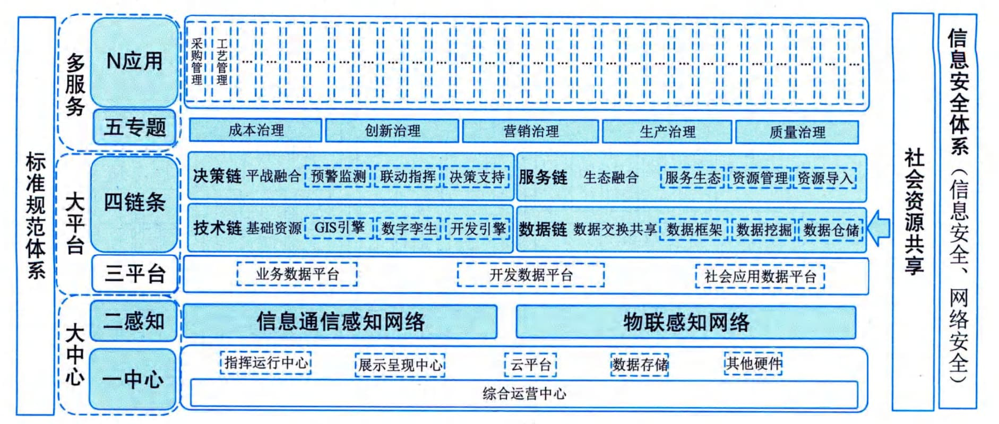
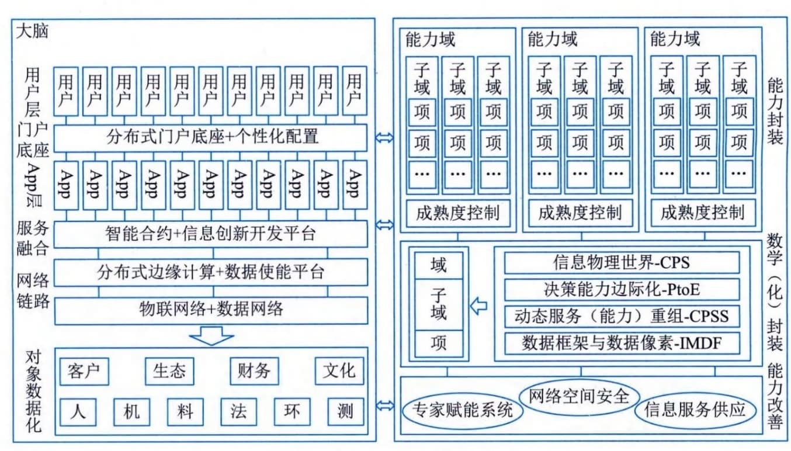
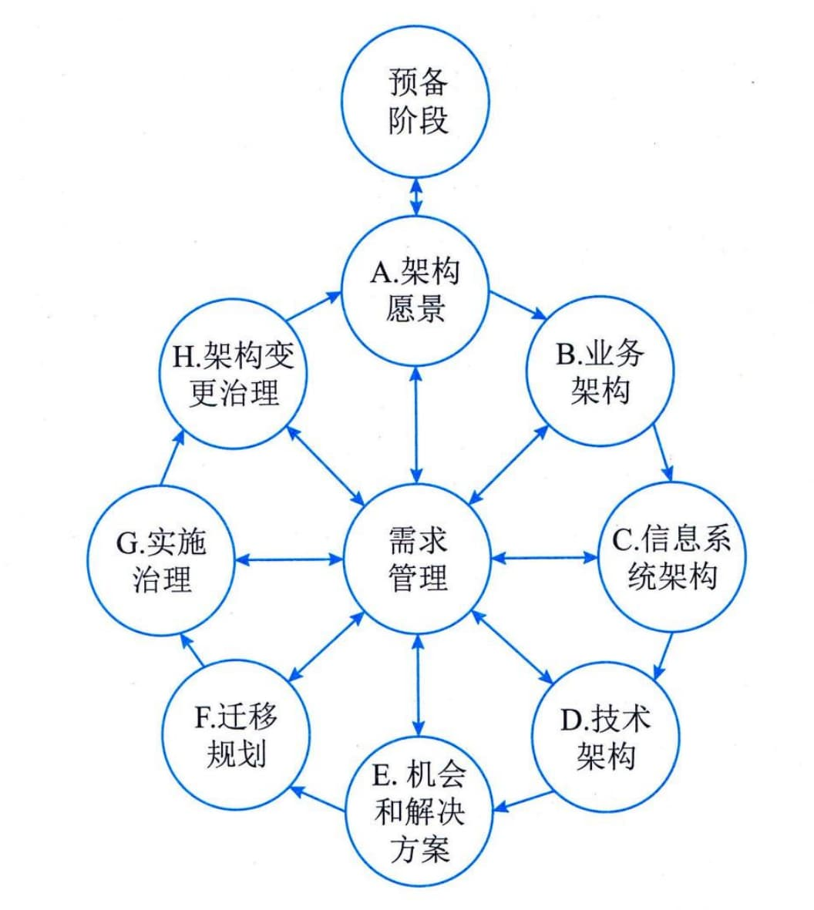
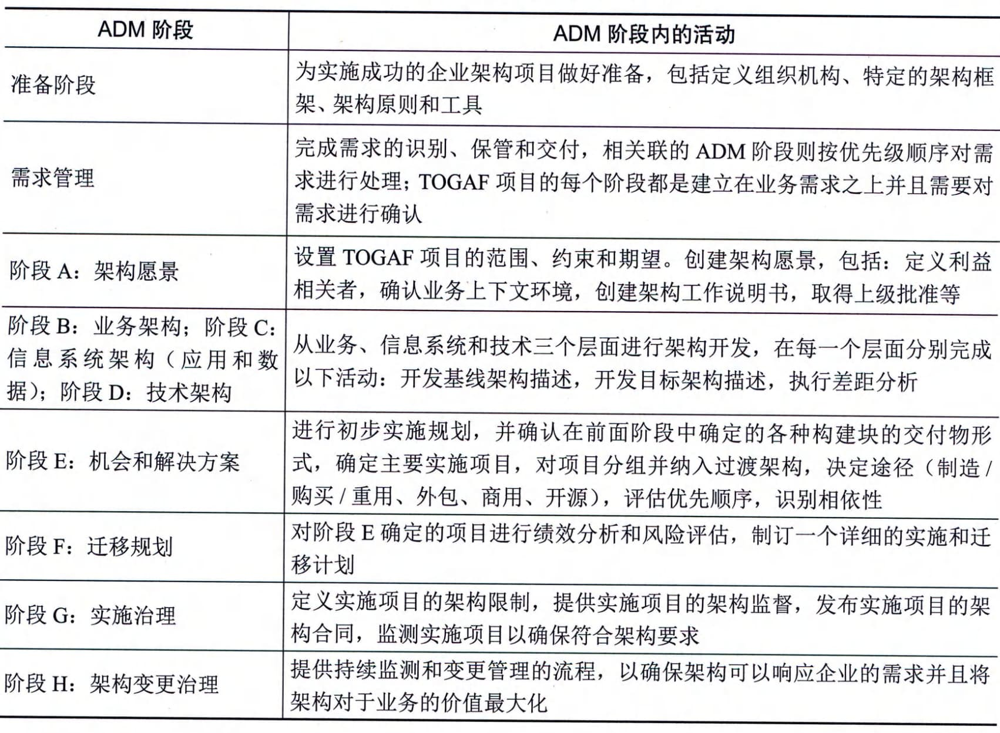

### 4.2.5 规划与设计
信息系统规划与设计因为组织的业务类型不同而各异，还要结合组织的发展阶段和数字化转型成熟度，不同阶段和成熟度条件下，其系统集成架构和设计导向差异较大。
#### **1．集成架构演进**
对任何组织来说，其信息系统集成架构随其业务发展、数字化转型成熟度和信息技术发展等持续演进和变化。以工业企业为例，其集成架构演进常为：以应用功能为主线架构、以平台能力为主线架构和互联网为主线架构。采用不同的主线架构，本质上取决于企业业务发展的程度，表现为企业数字化转型的成熟度。
1）以应用功能为主线架构
对于中小型工业企业或者处于信息化、数字化发展初级阶段的工业企业来说，其信息系统集成建设的主要目标是提高工作效能、降低业务风险。同时，受制于自身信息化队伍和人才的不足，以及业务体系对信息化、数字化理解得不深入等，企业往往采用"拿来主义"来构建其信息系统，即直接采购成套且成熟的应用软件，并基于应用软件的运行需求，建设相关的基础设施。
企业发展在该阶段重点关注的是组织职能的细化分工以及行业最佳实践的导入。因此组织的信息化建设往往以部门或职能为单元，核心关注点是信息系统的软件功能，如财务管理、设备管理、资产管理等，从而进行信息系统规划、设计、部署和运行等。同时，通过成套软件的部署，强化自身的管理或工艺水平等。应用软件或模块间的集成融合，主要通过系统的软件接口来完成。企业往往采用统一规划、分步实施的方式进行，即需要什么功能，部署上线什么功能，如图4-2所示。

图4-2 以应用功能为主线的工业企业信息系统集成架构
2）以平台能力为主线架构
随着工业企业发展，其组织规模和数字化转型能力成熟度往往会得到持续提升，企业会逐步从直接获取行业最佳实践，逐步进入自主知识沉淀和自主创新的发展时期。企业个性化、特色化得到快速发展，同时企业也会更加关注各业务体系的融合协同，要求信息系统能够基于数据的共享等，提升数据集成的灵活性和便捷性。这种情况下，以成套软件标准功能为基础的应用主线架构，往往无法满足企业的需求，大多数企业开始加强以平台化为基础，应用功能灵活可快速定制的新型系统集成架构，即以平台能力为主线系统集成架构，如图4-3所示。
以平台能力为主线的系统集成架构起源于云计算技术的发展和云服务的逐步成熟。其核心理念是将"竖井式"信息系统各个组成部分，转化为"平层化"建设方法，包括数据采集平层化、网络传输平层化、应用中间件平层化、应用开发平层化等，并通过标准化接口和新型信息技术，实现信息系统的弹性、敏捷等能力建设。通过平台化架构支撑的信息系统应用，可以结合专题建设或独立配置（或少量开发），快速得到企业需求的应用系统功能，从而突破成套软件商在个性化软件定制方面的不足。

图4-3 以平台能力融合为主线系统集成架构
在具体实践中，企业的架构转型是一个持续的过程。企业会将成熟度高、少变化的应用继续使用成套软件部署模式，对新型的、多变化的应用采用平台化架构，最终保持两种架构并存（也称双态IT，即敏态与稳态融合）或全部转换到平台化架构中。
3）以互联网为主线架构
当企业发展到产业链或生态链阶段，或者成为复杂多元的集团化企业，以平台能力为主线的架构往往也无法满足企业需求，企业开始寻求向以互联网为主线的系统集成架构方向转移或过渡。这是因为企业需要包容集团分支机构、生态伙伴或产业链伙伴等，发展水平或数字化转型能力成熟度水平存在不一致的情况。在以平台能力为主线的架构中，全集团、生态链或产业链都使用相同的信息系统功能模块，会因各机构的管理或工艺水平差异造成相关系统模块无法满足各单位的实际需求的情况。比如采购管理，在数字化转型成熟度较高的企业中，其管理颗粒度往往比较细致，每一种物料编码的获取与定义都有可能使用独立的管理流程，然而数字化转型成熟度相对较低的企业，其物料编码采用直接分配（乃至不关注物料编码）的方法，过高的管理要求反倒成为了相关机构的负担。
以互联网为主线的系统集成架构，强调将各信息系统功能最大限度地App化（微服务），如把采购管理中的编码管理作为一项App存在，如图4-4所示。通过App的编排与组合，生成可以适用各类成熟度的企业应用。面向具体工业企业场景，其App的组合模式与方法，可以借助面向不同组织的能力成熟度控制来定义实施（可具体到能力项的成熟度）。因为所有组织的相关管理处于同一个信息系统中，数据的互通和共享等，也可以基于成熟度等级控制来进行，比如采购管理的编码管理过程数据，可以在相同等级的组织间实现共享，而缺乏物料编码管理控制的组织，可以与更高水平或同等水平组织共享物料采购、物料信息等。
以互联网为主线的系统集成架构，整合应用了更多的新一代信息技术及其应用创新，比如区块链与App编排的融合应用、数字化能力封装与成熟度发展过程的融合应用、边缘计算与人工智能的融合应用、广域物联网技术应用、云原生技术的应用等。形象的比喻，就是把组织的各项业务职能和工艺活动等进行细化拆分，并实施数字化封装，从而通过云、边、端的融合，实现对职能或工艺活动的动态重组和编排，达到对不同成熟度组织的适配以及组织各项能力的敏捷组合与弹性变革。

图4-4 以互联网为主线的架构
#### **2．TOGAF架构开发方法**
TOGAF （The Open Group Architecture
Framework）是一种开放式企业架构框架标准，它为标准、方法论和企业架构专业人员之间的沟通提供一致性保障。
1）TOGAF基础
TOGAF由国际组织The Open
Group制定。该组织于1993年开始应客户要求制定系统架构标准，在1995年发表TOGAF架构框架。TOGAF的基础是美国国防部的信息管理技术架构（Technical
Architecture For Information Management，
TAFIM）。它是基于一个迭代（Iterative）的过程模型，支持最佳实践和一套可重用的现有架构资产。它可用于设计、评估并建立适合的企业架构。在国际上，TOGAF已经被验证，可以灵活、高效地构建企业IT架构。
该框架旨在通过以下四个目标帮助企业组织和解决所有关键业务需求：
 - ·确保从关键利益相关方到团队成员的所有用户都使用相同语言。这有助于每个人以相同的方式理解框架、内容和目标，并让整个企业在同一页面上打破任何沟通障碍。

 - ·避免被"锁定"到企业架构的专有解决方案。只要该企业在内部使用TOGAF而不是用于商业目的，该框架就是免费的。
 - · 节省时间和金钱，可以更有效地利用资源。
 - · 实现可观的投资回报（ROI）。
TOGAF反映了企业内部架构能力的结构和内容，TOGAF9版本包括六个组件：
 - ·架构开发方法。这部分是TOGAF的核心，它描述了TOGAF架构开发方法（Architecture
 - ·Development Method，ADM），ADM是一种开发企业架构的分步方法。
 - · ADM指南和技术。这部分包含一系列可用于应用ADM的指南和技术。
 - ·架构内容框架。这部分描述了TOGAF内容框架，包括架构工件的结构化元模型、可重用架构构建块（ABB）的使用以及典型架构可交付成果的概述。

 - ·企业连续体和工具。这部分讨论分类法和工具，用于对企业内部架构活动的输出进行分类和存储。

 - ·TOGAF参考模型。这部分提供了两个架构参考模型，即TO[G]{.underline}AF技术参考模型（TRM）和集成信息基础设施参考模型（III-RM）。

 - ·架构能力框架。这部分讨论在企业内建立和运营架构实践所需的组织、流程、技能、角色和职责。
TOGAF框架的核心思想是：
 - · 模块化架构。TOGAF标准采用模块化结构。
 - ·内容框架。TOGAF标准包括了一个遵循架构开发方法（ADM）所产出的结果更加一致的内容框架。TOGAF内容框架为架构产品提供了详细的模型。

 - ·扩展指南。TOGAF标准的一系列扩展概念和规范为大型组织的内部团队开发多层级集成架构提供支持，这些架构均在一个总体架构治理模式内运行。
 - · 架构风格。TOGAF标准在设计上注重灵活性，可用于不同的架构风格。
 - ·TOGAF的关键是架构开发方法，它是一个可靠的、行之有效的方法，能够满足商务需求的组织架构。
2）ADM方法
架构开发方法（ADM）为开发企业架构所需要执行的各个步骤以及它们之间的关系进行了详细的定义，同时它也是TOGAF规范中最为核心的内容。一个组织中的企业架构发展过程可以看成是其企业连续体从基础架构开始，历经通用基础架构和行业架构阶段而最终达到组织特定架构的演进过程，而在此过程中用于对组织开发行为进行指导的正是架构开发方法。由此可见，架构开发方法是企业连续体得以顺利演进的保障，而作为企业连续体在现实中的实现形式或信息载体，企业架构资源库也与架构开发方法有着千丝万缕的联系。企业架构资源库为架构开发方法的执行过程提供了各种可重用的信息资源和参考资料，而企业架构开发方法中各步骤所产生的交付物和制品也会不停地填充和刷新企业架构资源库中的内容，因此在刚开始执行企业架构开发方法时，各个企业或组织常常会因为企业架构资源库中内容的缺乏和简略而举步维艰，但随着一个又一个架构开发循环的持续进行，企业架构资源库中的内容日趋丰富和成熟，从而企业架构的开发也会越发明快。
ADM方法是由一组按照架构领域的架构开发顺序排列成一个环的多个阶段构成。通过这些开发阶段的工作，设计师可以确认是否已经对复杂的业务需求进行了足够全面的讨论。TOGAF
中最为著名的一个ADM架构开发的全生命周期模型见图4-5。此模型将ADM全生命周期划分为预备阶段、需求管理、架构愿景、业务架构、信息系统架构（应用和数据）、技术架构、机会和解决方案、迁移规划、实施治理、架构变更治理等十个阶段，这十个阶段是反复迭代的过程。

图4-5 ADM架构开发方法的全生命周期模型
ADM方法被迭代式应用在架构开发的整个过程中、阶段之间和每个阶段内部。在ADM的全生命周期中，每个阶段都需要根据原始业务需求对设计结果进行确认，这也包括业务流程中特有的一些阶段。确认工作需要对企业的覆盖范围、时间范围、详细程度、计划和里程碑进行重新审议。每个阶段都应该考虑到架构资产的重用。
因此，ADM便形成了3个级别的迭代概念：
 - ·基于ADM整体的迭代。用一种环形的方式来应用ADM方法，表明了在一个架构开发工作阶段完成后会直接进入随后的下一个阶段。

 - ·多个开发阶段间的迭代。在完成了技术架构阶段的开发工作后又重新回到业务架构开发阶段。

 - ·在一个阶段内部的迭代。TOGAF支持基于一个阶段内部的多个开发活动，对复杂的架构内容进行迭代开发。
ADM各个开发阶段的主要活动见表4-1所示。
**表4-1
ADM架构设计方法各阶段主要活动**
