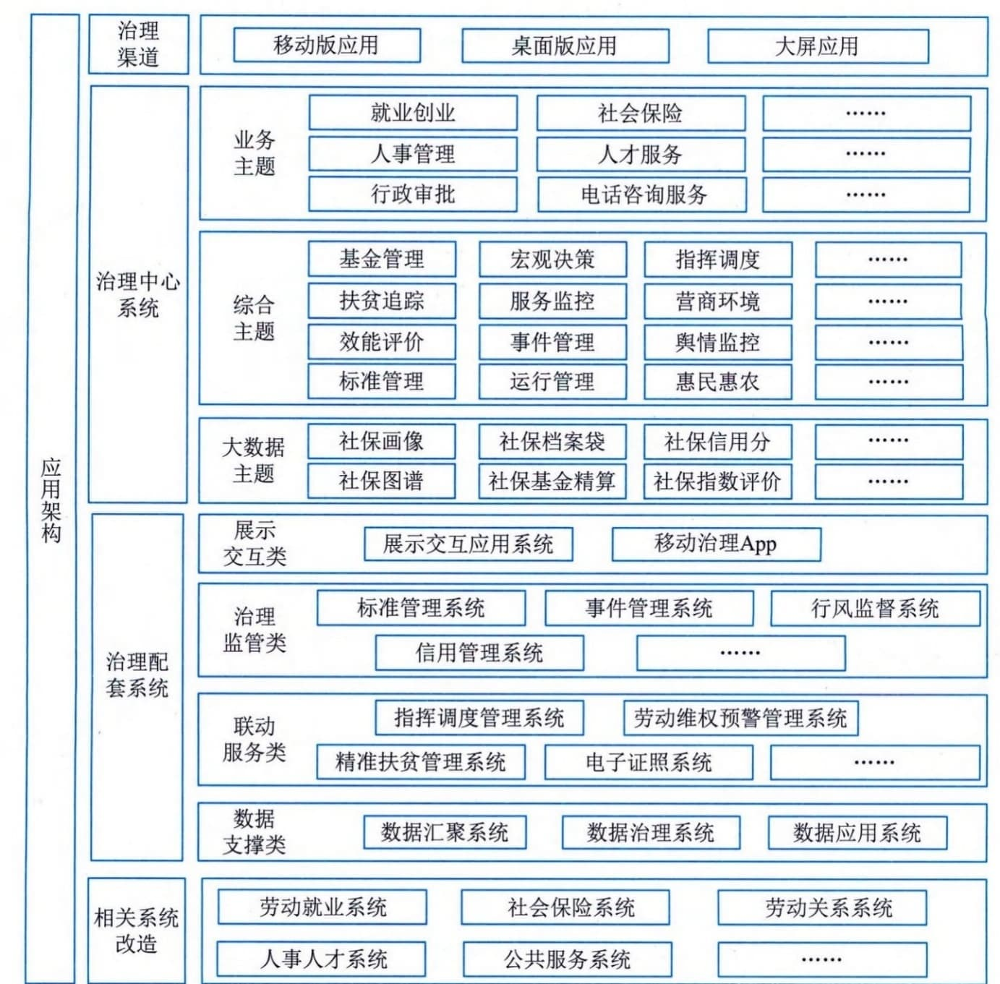

### 4.3.2 分层分组
对应用架构进行分层的目的是要实现业务与技术分离，降低各层级之间的耦合性，提高各层的灵活性，有利于进行故障隔离，实现架构松耦合。应用分层可以体现以客户为中心的系统服务和交互模式，提供面向客户服务的应用架构视图。对应用分组的目的是要体现业务功能的分类和聚合，把具有紧密关联的应用或功能内聚为一个组，可以指导应用系统建设，实现系统内高内聚，系统间低耦合，减少重复建设。图4-6给出了某城市社会保险智慧治理中心的应用架构示意。

图4-6 某城市社会保险智慧治理中心的应用架构示意
某城市社会保险智慧治理中心应用系统规划为治理渠道、治理中心系统、治理配套系统及相关系统改造四大类。
 - （1）治理渠道。应用根据不同的使用群体提供移动版应用、桌面版应用及大屏应用。移动版应用主要为各级管理者提供各类重要主题、热门主题、业务主题及大数据主题的可视化视图、重要指标监控、指数分析、绩效评价、趋势分析、指挥调度等应用功能，实现治理中心不同应用场景下社会保障发展事业数据、营商环境指数和相关报告的同步查阅。桌面版应用面向某城市社会保险各业务领域及信息部门管理人员，提供社会保险领域的综合主题、各业务领域的业务主题及大数据主题的人本化服务、可视化监管、智能化监督、科学化决策、在线化指挥等应用功能，实现指挥调度、会议会商、任务分发、协查协办、专项整治等不同应用场景的智慧治理。大屏应用面向某城市社会保险各级领导及部门管理人员，提供各类重要主题、热门主题、业务主题及大数据主题的重要指标监控、决策分析、绩效评价、趋势分析等可视化呈现。
 - （2）治理中心系统。治理中心系统主要集中展示交互三大类主题，其中业务主题包括就业创业、社会保险、劳动维权、人事管理、人才服务、人事和职业考试、行政审批、电话咨询服务、社会保障卡等。综合主题包括宏观决策、指挥调度、廉政风控、基金管理、事业发展、营商环境、扶贫追踪、服务监控、舆情监控、行风监督、效能评价、事件管理、电子证照、标准管理、惠民惠农等。大数据主题包括社保画像、社保档案袋、社保信用分、社保地图、社保图谱、社保基金精算、社保指数评价、社保全景分析等。
 - （3）治理配套系统。治理配套系统为本项目智慧治理中心提供四大类应用，其中数据支撑类应用包括数据汇聚系统、数据治理系统、数据应用系统。联动服务类应用包括指挥调度管理系统、精准扶贫管理系统、劳动维权预警管理系统、电子证照系统、用户画像系统。治理监管类应用包括标准管理系统、行风监督系统、信用管理系统、基金精算分析系统、服务效能评价系统。展示交互类应用包括移动治理App。
 - （4）相关系统改造。相关系统改造主要涉及与本次智慧治理中心相关主题的数据汇聚、展现、交互等关联的劳动就业系统、社会保险系统、劳动关系系统、人事人才系统、公共服务系统、风险防控系统等的改造。
