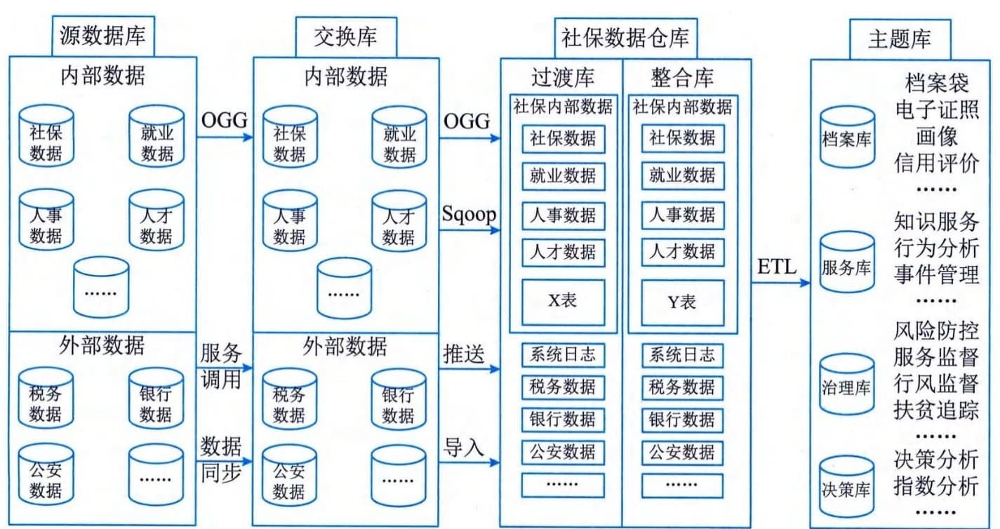

### 4.4.3 架构举例
图4-7给出了某城市社会保险智慧治理中心的数据架构示意。

图4-7 某城市社会保险智慧治理中心的数据架构示意
本项目采用集中式的数据资源管理模式建设全市统一的数据中心，汇聚全市就业、社保、劳动关系等社会保险内部各类数据资源，以及银行、税务、公安等外部数据资源。按照统一的技术规范、数据编码和格式标准，进行数据清洗整合、数据建模、数据挖掘，构建社会保险数据仓库，并根据治理主体应用需求，从数据仓库中抽取归集相关数据，形成保险档案、公共服务、监控治理、决策分析等专题库。主要数据资源库包括源数据库、交换库、过渡库、整合库、主题库等。
 - （1）源数据库。源数据库是某城市社会保险智慧治理中心所需数据的源端，包括社保数据、就业数据、劳动关系数据、人事人才数据等社会保险内部数据以及银行、税务、公安等外部部门数据。
 - （2）交换库。利用OGG等同步工具或通过数据同步、服务调用等方式将源端的数据库同步到交换数据库中，采用数据同步或者镜像的方式，降低对源数据库的影响。
 - （3）过渡库。通过OGG For
Bigdata抽取变量数据、Sqoop抽取、推送、导入等方式抽取交换库中的数据，存储于Hadoop平台中的过渡库中，以便提高大批量数据处理性能。
 - （4）整合库。对过渡库的数据进行对照、转换、清洗、聚集，按照统一的库表结构存储在整合库中，为各主题库提供增量数据源和全量数据源。
 - （5）主题库。主题库即服务库，根据治理主题应用需求，从整合库中提取所需数据，为治理应用和可视化展现提供支撑。
