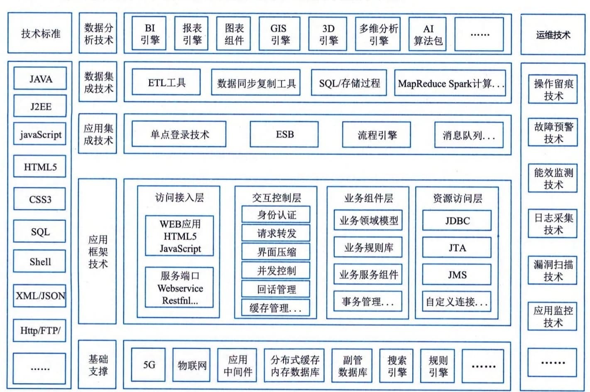

### 4.5.2 架构举例
图4-8给出了某城市社会保险智慧治理中心的技术架构示意。

图4-8 某城市社会保险智慧治理中心的技术架构示意
本项目采用当今先进成熟的技术架构和路线，保障某城市社会保险智慧治理中心的先进性、高效性、可靠性和可扩展性。技术架构按照分类分层法进行设计，包括技术标准、基础支撑、应用框架技术、应用集成技术、数据集成技术、数据分析技术和运维技术7部分。
 - （1）技术标准。某城市社会保险智慧治理中心技术架构遵循J2EE、HTML5、CSS3、SQL、Shell、XML／JSON、HTTP、FTP、SM2、SM3、JavaScript等国际和国内通用标准。
 - （2）基础支撑。依托5G网络、物联网为本项目提供基础网络支撑；依托应用中间件为本项目提供应用部署支撑；依托分布式缓存、内存数据库、MPP数据库、事务数据库为本项目提供基础数据存储支撑；依托Hadoop平台为本项目提供分布式存储和计算环境支撑；依托搜索引擎、规则引擎组件为治理应用提供技术组件支撑。
 - （3）应用框架技术。应用框架技术是应用系统开发需要严格遵循并采用的技术。应用框架采用分层设计，包括访问接入层、交互控制层、业务组件层、资源访问层。
 - （4）应用集成技术。应用集成技术包括单点登录、服务总线（ESB）、流程引擎、消息队列等技术，支撑各应用系统之间的整合集成。
 - （5）数据集成技术。数据集成技术包括ETL工具、数据同步复制工具、数据标引、SQL／存储过程、MapReduce／Spark计算引擎等技术，为某城市社会保险智慧治理中心的数据采集、数据清洗、数据转换、数据加工、数据挖掘等工作提供技术支撑。
 - （6）数据分析技术。数据分析包括BI引擎、报表引擎、GIS引擎、图表组件、3D引擎、多维建模引擎以及AI算法包、数据挖掘算法包等大数据技术，为社保地图、远程指挥调度、全景分析、宏观决策、监控监督等应用的可视化提供技术支撑。
 - （7）运维技术。运维技术包括操作留痕、故障预警、能效监测、日志采集、漏洞扫描、应用监控、网络分析等技术，支撑应用系统的规范化运维。
