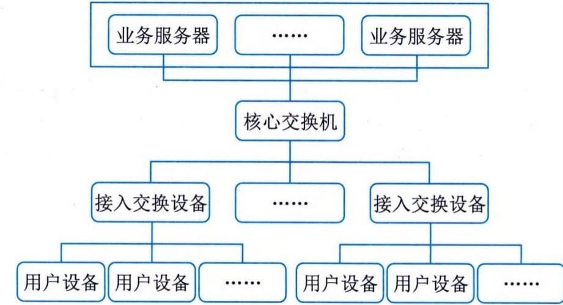
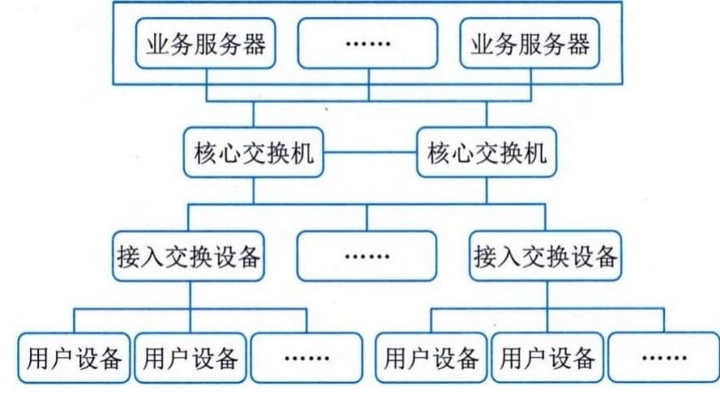
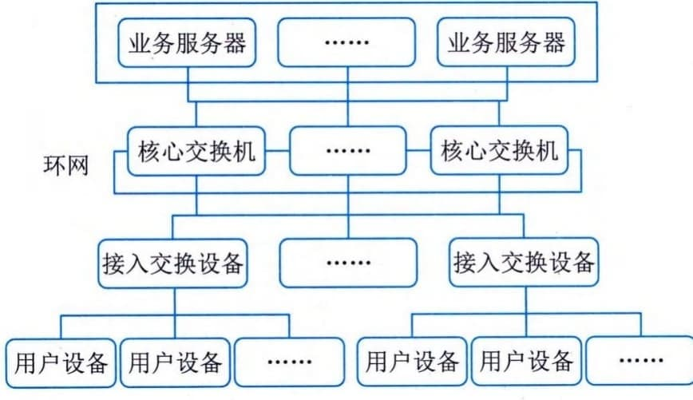
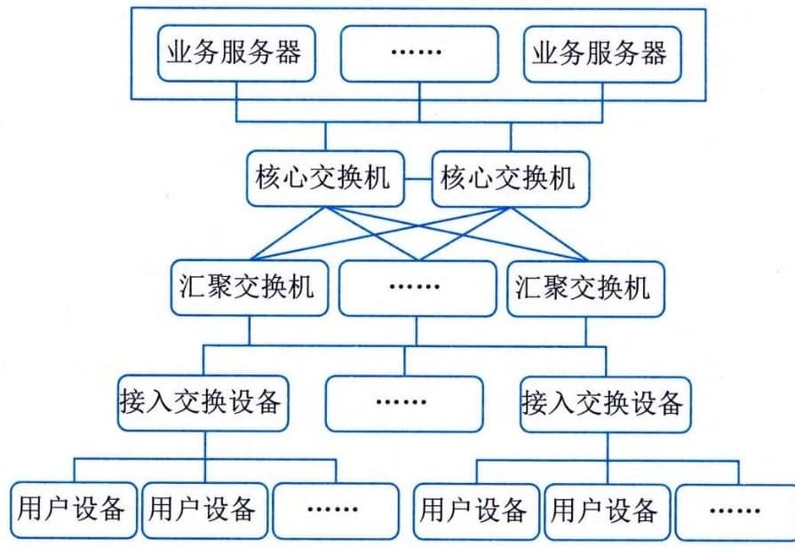

### 4.6.2 局域网架构
局域网指计算机局部区域网络，是一种为单一组织所拥有的专用计算机网络。其特点包括：①覆盖地理范围小，通常限定在相对独立的范围内，如一座建筑或集中建筑群内（通常在2.5km内）；②数据传输速率高（一般在10Mb／s以上，典型1Gb／s，甚至10Gb／s）；③低误码率（通常在10-°以下），可靠性高；④支持多种传输介质，支持实时应用。就网络拓扑而言，有总线、环形、星形、树状等类型。从传输介质来说，包含有线局域网和无线局域网等。局域网通常由计算机、交换机、路由器等设备组成。
从计算机诞生出现局域网到今天，局域网经历了若干年的演进。随着业务场景的多样化，以及业务对网络要求的不断提升，局域网已从早期只提供二层交换功能的简单网络发展到如今不仅提供二层交换功能，还提供三层路由功能的复杂网络。
#### **1．单核心架构**
单核心局域网通常由一台核心二层或三层交换设备充当网络的核心设备，通过若干台接入交换设备将用户设备（如用户计算机、智能设备等）连接到网络中，如图4-9所示。

图4-9 典型单核心局域网示意图
此类局域网可通过连接核心网交换设备与广域网之间的互联路由设备（边界路由器或防火墙）接入广域网，实现业务跨局域网的访问。单核心网具有如下特点：
 - · 核心交换设备通常采用二层、三层及以上交换机；如采用三层以上交换机可划分成VLAN，VLAN内采用二层数据链路转发，VLAN之间采用三层路由转发；
 - · 接入交换设备采用二层交换机，仅实现二层数据链路转发；
 - · 核心交换设备和接入设备之间可采用100M／GE／10GE（1GE＝1Gb／s）等以太网连接。
用单核心构建网络，其优点是网络结构简单，可节省设备投资。需要使用局域网的分项组织接入较为方便，直接通过接入交换设备连接至核心交换设备空闲接口即可。其不足是网络地理范围受限，要求使用局域网的分项组织分布较为紧凑；核心网交换设备存在单点故障，容易导致网络整体或局部失效；网络扩展能力有限；在局域网接入交换设备较多的情况下，对核心交换设备的端口密度要求高。
作为一种变通，对于较小规模的网络，采用此网络架构的用户设备也可直接与核心交换设备互联，进一步减少投资成本。
#### **2．双核心架构**
双核心架构通常是指核心交换设备采用三层及以上交换机。核心交换设备和接入设备之间可采用100M／GE／10GE等以太网连接，如图4-10所示。

图4-10 典型双核心局域网
网络内划分VLAN时，各VLAN之间访问需通过两台核心交换设备来完成。网络中仅核心交换设备具备路由功能，接入设备仅提供二层转发功能。
核心交换设备之间互联，实现网关保护或负载均衡。核心交换设备具备保护能力，网络拓扑结构可靠。在业务路由转发上可实现热切换。接入网络的各部门局域网之间互访，或访问核心业务服务器，有一条以上条路径可选择，可靠性更高。
需要使用局域网的专项组织接入较为方便，直接通过接入交换设备连接至核心交换设备空闲接口即可。设备投资相比单核心局域网高。对核心交换设备的端口密度要求较高。所有业务服务器同时连接至两台核心交换设备，通过网关保护协议进行保护，为用户设备提供高速访问。
#### **3．环形架构**
环形局域网是由多台核心交换设备连接成双RPR（Resilient Packet
Ring）动态弹性分组环，构建网络的核心。核心交换设备通常采用三层或以上交换机提供业务转发功能，如图4-11所示。

图4-11 典型环形局域网
典型环形局域网网络内各VLAN之间通过RPR环实现互访。RPR具备自愈保护功能，节省光纤资源；具备MAC层50ms自愈时间的能力，提供多等级、可靠的QoS服务、带宽公平机制和拥塞控制机制等。RPR环双向可用。网络通过两根反向光纤组成环形拓扑结构，节点在环上可从两个方向到达另一节点。每根光纤可同时传输数据和控制信号。RPR利用空间重用技术，使得环上的带宽得以有效利用。
通过RPR组建大规模局域网时，多环之间只能通过业务接口互通，不能实现网络直接互通。环形局域网设备投资比单核心局域网的高。核心路由冗余设计实施难度较高，且容易形成环路。此网络通过与环上的交换设备互联的边界路由设备接入广域网。
#### **4．层次局域网架构**
层次局域网（或多层局域网）由核心层交换设备、汇聚层交换设备和接入层交换设备以及用户设备等组成，如图4-12所示。

图4-12 层次局域网模型
层次局域网模型中的核心层设备提供高速数据转发功能；汇聚层设备提供的充足接口实现了与接入层之间的互访控制，汇聚层可提供所辖的不同接入设备（部门局域网内）业务的交换功能，减轻对核心交换设备的转发压力；接入层设备实现用户设备的接入。层次局域网网络拓扑易于扩展。网络故障可分级排查，便于维护。通常，层次局域网通过与广域网的边界路由设备接入广域网，实现局域网和广域网业务的互访。
