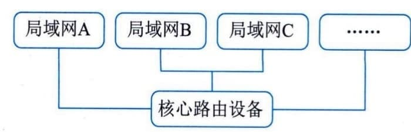
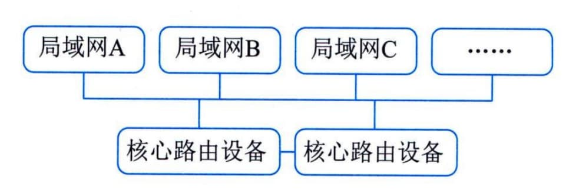
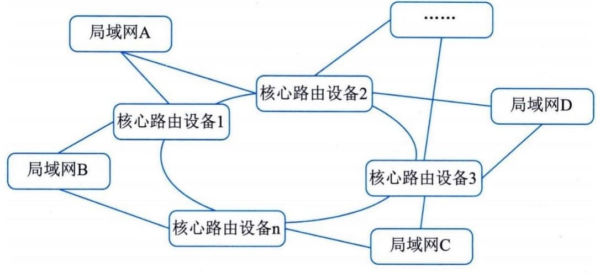
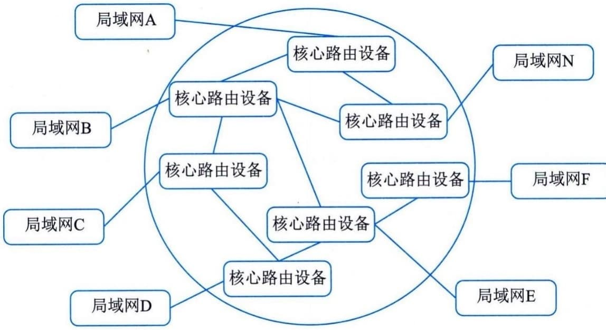
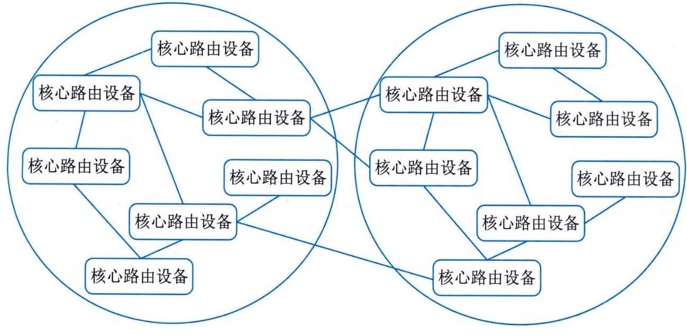
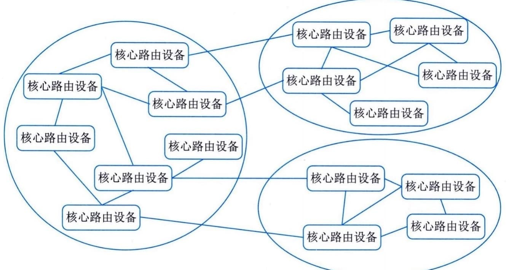

### 4.6.3 广域网架构
通俗来讲，广域网是将分布于相比局域网络更广区域的计算机设备连接起来的网络。广域网由通信子网与资源子网组成。通信子网可以利用公用分组交换网、卫星通信网和无线分组交换网来构建，将分布在不同地区的局域网或计算机系统互连起来，实现资源子网的共享。
广域网属于多级网络，通常由骨干网、分布网、接入网组成。在网络规模较小时，可仅由骨干网和接入网组成。在广域网规划时，需要根据业务场景及网络规模来进行三级网络功能的选择。例如规划某省银行广域网，设计骨干网，如支持数据、语音、图像等信息共享，为全银行系统提供高速、可靠的通信服务；设计分布网，提供数据中心与各分行、支行的数据交换，提供长途线路复用和主干访问；设计接入网，提供各分支行与各营业网点的数据交换时采用访问路由方式，实现网点线路复用和终端访问。
#### **1．单核心广域网**
单核心广域网通常由一台核心路由设备和各局域网组成，如图4-13所示。核心路由设备采用三层及以上交换机。网络内各局域网之间访问需要通过核心路由设备。

图4-13 单核心广域网
网络中各局域网之间不设立其他路由设备。各局域网至核心路由设备之间采用广播线路，路由设备与各局域网互联接口属于对应局域网子网。核心路由设备与各局域网可采用10M／100M／GE以太接口连接。该类型网络结构简单，节省设备投资。各局域网访问核心局域网以及相互访问的效率高。新的部门局域网接入广域网较为方便，只要核心路由设备留有端口即可。不过，核心路由设备存在单点故障容易导致整网失效的风险。网络扩展能力欠佳，对核心路由设备端口密度要求较高。
#### **2．双核心广域网**
双核心广域网通常由两台核心路由设备和各局域网组成，如图4-14所示。

图4.14双核心广域网
双核心广域网模型，其主要特征是核心路由设备通常采用三层及以上交换机。核心路由设备与各局域网之间通常采用10M／100M／GE等以太网接口连接。网络内各局域网之间访问需经过两台核心路由设备，各局域网之间不存在其他路由设备用于业务互访。核心路由设备之间实现网关保护或负载均衡。各局域网访问核心局域网以及它们相互访问可有多条路径选择，可靠性更高，路由层面可实现热切换，提供业务连续性访问能力。在核心路由设备接口有预留情况下，新的局域网可方便接入。不过，设备投资较单核心广域网高。核心路由设备的路由冗余设计实施难度较高，容易形成路由环路。网络对核心路由设备端口密度要求较高。
#### **3．环形广域网**
环形广域网通常是采用三台以上核心路由器设备构成路由环路，用以连接各局域网，实现广域网业务互访，如图4-15所示。

图4-15环形广域网
环形广域网的主要特征是核心路由设备通常采用三层或以上交换机。核心路由设备与各局域网之间通常采用10M[／100]{.underline}M／GE等以太网接口连接。网络内各局域网之间访问需要经过核心路由设备构成的环。各局域网之间不存在其他路由设备进行互访。核心路由设备之间具备网关保护或负载均衡机制，同时具备环路控制功能。各局域网访问核心局域网或互相访问有多条路径可选择，可靠性更高，路由层面可实现无缝热切换，保证业务访问连续性。
在核心路由设备接口有预留情况下，新的部门局域网可方便接入。不过，设备投资比双核心广域网高，核心路由设备的路由冗余设计实施难度较高，容易形成路由环路。环形拓扑结构需要占用较多端口，网络对核心路由设备端口密度要求较高。
#### **4．半冗余广域网**
半冗余广域网是由多台核心路由设备连接各局域网而形成的，如图4-16所示。其中，任意核心路由设备至少存在两条以上连接至其他路由设备的链路。如果任何两个核心路由设备之间均存在链接，则属于半冗余广域网特例，即全冗余广域网。

图4-16 半冗余广域网
半冗余广域网的主要特征是结构灵活、扩展方便。部分网络核心路由设备可采用网关保护或负载均衡机制或具备环路控制功能。网络结构呈网状，各局域网访问核心局域网以及相互访问存在多条路径，可靠性高。路由层面的路由选择较为灵活。网络结构适合于部署OSPF等链路状态路由协议。不过，网络结构零散，不便于管理和排障。
#### **5．对等子域广域网**
对等子域网络是通过将广域网的路由设备划分成两个独立的子域，每个子域路由设备采用半冗余方式互连。两个子域之间通过一条或多条链路互连，对等子域中任何路由设备都可接入局域网络，如图4-17所示。
对等子域广域网的主要特征是对等子域之间的互访以对等子域之间互连链路为主。对等子域之间可做到路由汇总或明细路由条目匹配，路由控制灵活。通常，子域之间链路带宽应高于子域内链路带宽。域间路由冗余设计实施难度较高，容易形成路由环路，或存在发布非法路由风险。对域边界路由设备的路由性能要求较高。网络中路由协议主要以动态路由为主。对等子域适合于广域网可以明显划分为两个区域且区域内部访问较为独立的场景。

图4-17 对等子域广域网
#### **6．层次子域广域网**
层次子域广域网结构是将大型广域网路由设备划分成多个较为独立的子域，每个子域内路由设备采用半冗余方式互连，多个子域之间存在层次关系，高层次子域连接多个低层次子域。层次子域中任何路由设备都可以接入局域网，如图4-18所示。

图4-18 层次子域广域网
层次子域的主要特征是层次子域结构具有较好扩展性。低层次子域之间互访需要通过高层次子域完成。域间路由冗余设计实施难度较高，容易形成路由环路，存在发布非法路由的风险。子域之间链路带宽须高于子域内链路带宽。对用于域互访的域边界路由设备的路由转发性能要求较高。路由设备路由协议主要以动态路由为主，如OSPF协议。层次子域与上层外网互连，主要借助高层子域完成；与下层外网互连，主要借助低层子域完成。
