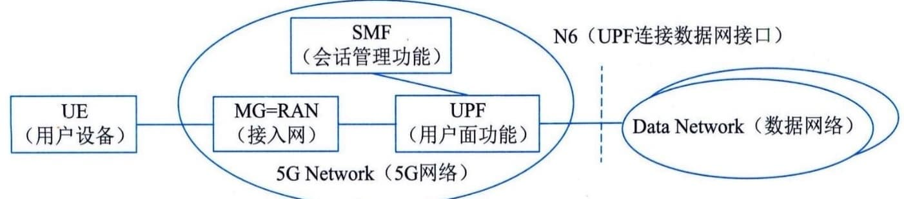
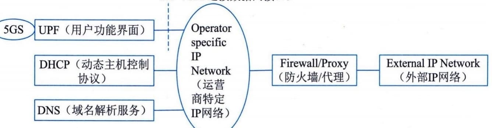
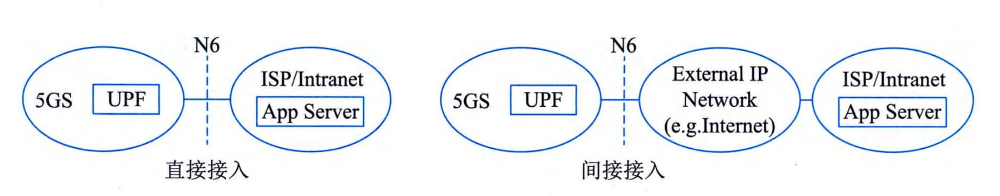
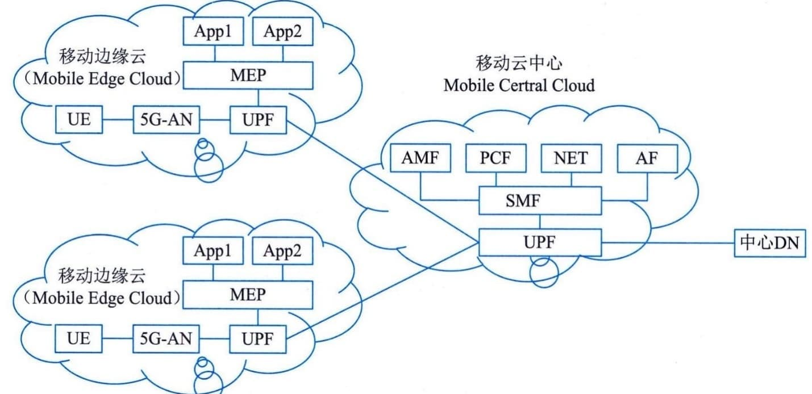

### 4.6.4 移动通信网架构
移动通信网为移动互联网提供了强有力的支持，尤其是5G网络为个人用户、垂直行业等提供了多样化的服务。5G常用业务应用方式包括：5GS（5G
System）与DN（Data Network，数据网络）互联、5G网络边缘计算等。
#### **1.5GS与DN互连**
5GS在为移动终端用户（User
Equipment，UE）提供服务时，通常需要DN网络，如Internet、IMS（IP Media
Subsystem）、专用网络等互连来为UE提供所需的业务。各式各样的上网、语音、AR／VR、工业控制和无人驾驶等5GS中UPF网元作为DN的接入点。5GS和DN之间通过5GS定义的N6接口互连，如图4-19所示。

图4-19 5G网络与DN网络连接关系
5G
Network属于5G范畴，包括若干网络功能实体，如AMF／SMF／PCF／NRF／NSSF等。简洁起见，图中仅标示出了与用户会话密切相关的网络功能实体。
在5GS和DN基于IPv4／IPv6互连时，从DN来看，UPF可看作是普通路由器。相反从5GS来看，与UPF通过N6接口互连的设备，通常也是路由器。换言之，5GS和DN之间是一种路由关系。UE访问DN的业务流在它们之间通过双向路由配置实现转发。就5G网络而言，把从UE流向DN的业务流称之为上行（UL，UpLink）业务流；把从DN流向UE的业务流称为下行（DL，DownLink）业务流。UL业务流通过UPF上配置的路由转发至DN；DL业务流通过与UPF邻近的路由器上配置的路由转发至UPF。
此外，从UE通过5GS接入DN的方式来说，存在两种模式：透明模式和非透明模式。
1）透明模式
在透明模式下，5GS通过UPF的N6接口直接连至运营商特定的IP网络，然后通过防火墙（Firewall）或代理服务器连至DN（即外部IP网络），如Internet等。UE分配由运营商规划的网络地址空间的IP地址。UE在向5GS发起会话建立请求时，通常5GS不触发向外部DN-AAA
服务器发起认证过程，如图4-20所示。N6（UPF连接数据网接口）

图4-20 UE透明接入5G网络
在此模式下，5GS至少为UE提供一个基本ISP服务。对于5GS而言，它只需提供基本的隧道QoS流服务即可。UE访问某个Intranet网络时，UE级别的配置仅在UE和Intranet网络之间独立完成，这对5GS而言是透明的。
2）非透明模式
在非透明模式下，5GS可直接接入Intranet／ISP或通过其他IP网络（如Internet）接入Intranet／ISP。如5GS通过Internet方式接入Intranet／ISP，通常需要在UPF和Intranet／ISP之间建立专用隧道来转发UE访问Intranet／ISP的业务。UE被指派属于Intranet／ISP地址空间的IP地址。此地址用于UE业务在UPF、Intranet／ISP中转发，如图4-21所示。
图4-21 UE通过5GS非透明接入DN原理图
综上所述，UE通过5GS访问Intranet／ISP的业务服务器，可基于任何网络如Internet等来进行，即使不安全也无妨，在UPF和Intranet／ISP之间可基于某种安全协议进行数据通信保护。至于采用何种安全协议，由移动运营商和Intranet／ISP提供商之间协商确定。
作为UE会话建立的一部分，5GS中SMF通常通过向外部DN-AAA服务器（如Radius，Diameter
服务器）发起对UE进行认证。在对UE认证成功后，方可完成UE会话的建立，之后UE才可访问Intemet／ISP的服务。
#### **2.5G网络边缘计算**
5G网络改变以往以设备、业务为中心的导向，倡导以用户为中心的理念。5G网络在为用户提供服务的同时，更注重用户的服务体验QoE（Quality
of
Experience）。其中5G网络边缘计算能力的提供正是为垂直行业赋能、提升用户QoE的重要举措之一。
5G网络的边缘计算（Mobile Edge
Computing，MEC）架构如图4-22所示，支持在靠近终端用户UE的移动网络边缘部署5GUPF网元，结合在移动网络边缘部署边缘计算平台（Mobile
Edge
Platform，MEP），为垂直行业提供诸如以时间敏感、高带宽为特征的业务就近分流服务。于是，一来为用户提供极佳服务体验，二来降低了移动网络后端处理的压力。

图4-22 5G网络边缘计算架构
运营商自有应用或第三方应用AF（Application
Function）通过5GS提供的能力开放功能网元NEF（Network Exposure
Function），触发5G网络为边缘应用动态地生成本地分流策略，由PCF（Policy
Charging
Function）将这些策略配置给相关SMF，SMF根据终端用户位置信息或用户移动后发生的位置变化信息动态实现UPF（即移动边缘云中部署的UPF）在用户会话中插入或移除，以及对这些UPF分流规则的动态配置，达到用户访问所需业务的极佳效果。
另外，从业务连续性来说，5G网络可提供SSC模式1（在用户移动过程中用户会话的IP
接入点始终保持不变），SSC模式2（用户移动过程中网络触发用户现有会话释放并立即触发新会话建立），SS[C]{.underline}模式3（用户移动过程中在释放用户现有会话之前先建立一个新的会话）供业务提供者ASP（Application
Service Provider）或运营商选择。
