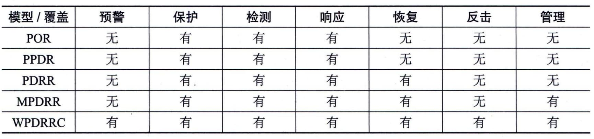
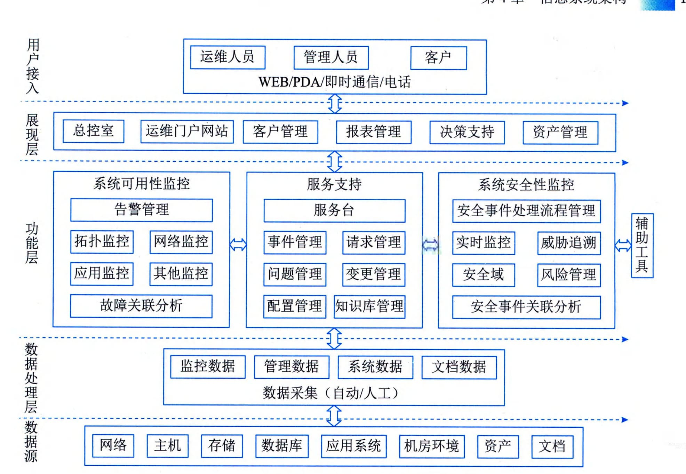

### 4.7.3 整体架构设计
构建信息安全保障体系框架应包括技术体系、组织机构体系和管理体系等三部分。也就是说，人、管理和技术手段是信息安全架构设计的三大要素，而构建动态的信息与网络安全保障体系框架是实现系统安全的保障。
#### **1．WPDRRC模型**
针对网络安全防护问题，各个国家曾提出了多个网络安全体系模型和架构，比如PDRR
 - （Protection／Detection／Reaction／Recovery，防护／检测／响应／恢复）模型、P2DR模型（Policy／Protection／Detection／Response，安全策略／防护／检测／响应）。WPDRRC（Waring／Protect／Detect／React／Restore／Counterattack）是我国信息安全专家组提出的信息系统安全保障体系建设模型。WPDRRC是在PDRR信息安全体系模型的基础上前后增加了预警和反击功能。
在PDRR模型中，安全的概念已经从信息安全扩展到了信息保障，信息保障内涵已超出传统的信息安全保密，它是保护（Protect）、检测（Detect）、反应（React）、恢复（Restore）的有机结合。PDRR模型把信息的安全保护作为基础，将保护视为活动过程，用检测手段来发现安全漏洞，及时更正。同时采用应急响应措施对付各种入侵，在系统被入侵后，要采取相应的措施将系统恢复到正常状态，这样才能使信息的安全得到全方位的保障，该模型强调的是自动故障恢复能力。
WPDRRC模型有六个环节和三大要素。六个环节包括：预警（W）、保护（P）、检测（P）、响应（R）、恢复（R）和反击（C），它们具有较强的时序性和动态性，能够较好地反映出信息系统安全保障体系的预警能力、保护能力、检测能力、响应能力、恢复能力和反击能力。三大要素包括：人员、策略和技术。人员是核心，策略是桥梁，技术是保证。落实在WPDRRC的六个环节的各个方面，将安全策略变为安全现实。
 - （1）预警（W）。预警主要是指利用远程安全评估系统提供的模拟攻击技术，来检查系统可能存在的被利用的薄弱环节，收集和测试网络与信息的安全风险所在，并以直观的方式进行报告，提供解决方案的建议。在经过分析后，分解网络与信息的风险变化趋势和严重风险点，从而有效降低网络与信息的总体风险，保护关键业务和数据。
 - （2）防护（P）。防护通常是通过采用成熟的信息安全技术及方法，来实现网络与信息的安全。主要内容有加密机制、数字签名机制、访问控制机制、认证机制、信息隐藏和防火墙技术等。
 - （3）检测（D）。检测是通过检测和监控网络以及系统，来发现新的威胁和弱点，强制执行安全策略。在这个过程中采用入侵检测、恶意代码过滤等技术，形成动态检测的制度、奖励报告协调机制，提高检测的实时性。主要内容有入侵检测、系统脆弱性检测、数据完整性检测和攻击性检测等。
 - （4）响应（R）。响应是指在检测到安全漏洞和安全事件之后必须及时做出正确的响应，从而把系统调整到安全状态。为此需要相应的报警、跟踪和处理系统，其中处理包括了封堵、隔离、报告等能力。主要内容有应急策略、应急机制、应急手段、入侵过程分析和安全状态评估等。
 - （5）恢复（R）。恢复是指当前网络、数据、服务受到黑客攻击并遭到破坏或影响后，通过必要技术手段，在尽可能短的时间内使系统恢复正常。主要内容有容错、冗余、备份、替换、修复和恢复等。
 - （6）反击（C）。反击是指采用一切可能的高新技术手段，侦察、提取计算机犯罪分子的作案线索与犯罪证据，形成强有力的取证能力和依法打击手段。
网络安全体系模型经过多年发展，形成了PDP、PPDR、PDRR、MPDRR和WPDRRC等模型，这些模型在信息安全防范方面的功能更加完善，表4-2给出网络安全体系模型安全防范功能对照表。
**表4-2安全防范功能对照表**
#### **2．架构设计**
信息系统的安全需求是任何单一安全技术都无法解决的，要设计一个信息安全体系架构，应当选择合适的安全体系结构模型。信息系统安全设计重点考虑两个方面：一是系统安全保障体系；二是信息安全体系架构。
1）系统安全保障体系
安全保障体系是由安全服务、协议层次和系统单元三个层面组成，且每层都涵盖了安全管理的内容。系统安全保障体系设计工作主要考虑以下几点：
 - ·安全区域策略的确定。根据安全区域的划分，主管部门应制定针对性的安全策略。如定时审计评估、安装入侵检测系统、统一授权、认证等。

 - ·统一配置和管理防病毒系统。主管部门应当建立整体防御策略，以实现统一的配置和管理。网络防病毒的策略应满足全面性、易用性、实时性和可扩展性等方面要求。

 - ·网络与信息安全管理。在网络安全中，除了采用一些技术措施之外，还需加强网络与信息安全管理，制定有关规章制度。在相关管理中，任何的安全保障措施，最终要落实到具体的管理规章制度以及具体的管理人员职责上，并通过管理人员的工作得到实现。详见本书8.1节。
2）信息安全体系架构
通过对信息系统应用的全面了解，按照安全风险、需求分析结果、安全策略以及网络与信息的安全目标等方面开展安全体系架构的设计工作。具体在安全控制系统，可以从物理安全、系统安全、网络安全、应用安全和安全管理等5个方面开展分析和设计工作。
 - ·物理安全。保证计算机信息系统各种设备的物理安全是保障整个网络系统安全的前提。物理安全是保护计算机网络设备、设施以及其他媒体免受地震、水灾、火灾等环境事故以及人为操作失误或错误及各种计算机犯罪行为导致的破坏过程。物理安全主要包括：环境安全、设备安全、媒体安全等。

 - ·系统安全。系统安全主要是指对信息系统组成中各个部件的安全要求。系统安全是系统整体安全的基础。它主要包括网络结构安全、操作系统安全和应用系统安全等。

 - ·网络安全。网络安全是整个安全解决方案的关键。它主要包括访问控制、通信保密、入侵检测、网络安全扫描和防病毒等。

 - ·应用安全。应用安全主要是指多个用户使用网络系统时，对共享资源和信息存储操作所带来的安全问题。它主要包括资源共享和信息存储两个方面。

 - ·安全管理。安全管理主要体现在三个方面：制定健全的安全管理体制，构建安全管理平台，增强人员的安全防范意识。
#### **3．设计要点**
网络与信息安全架构设计可以参照各类架构模型，结合组织的具体战略、实际现状和预期目标等，细致开展相关工作。
1）系统安全设计要点
系统安全设计要点主要包括以下几个方面。
 - ·网络结构安全领域重点关注网络拓扑结构是否合理，线路是否冗余，路由是否冗余和防止单点失败等。

 - ·操作系统安全重点关注两个方面：①操作系统的安全防范可以采取的措施，如：尽量采用安全性较高的网络操作系统并进行必要的安全配置，关闭一些不常用但存在安全隐患的应用，使用权限进行限制或加强口令的使用等。②通过配备操作系统安全扫描系统对操作系统进行安全性扫描，发现漏洞，及时升级等。

 - ·应用系统安全方面重点关注应用服务器，尽量不要开放一些不经常使用的协议及协议端口，如文件服务、电子邮件服务器等。可以关闭服务器上的如HTTP、FTP、Telnet等服务。可以加强登录身份认证，确保用户使用的合法性。
2）网络安全设计要点
网络安全设计要点主要包括以下几个方面。
 - · 隔离与访问控制要有严格的管制制度，可制定比如《用户授权实施细则》《口令及账户管理规范》《权限管理制定》等一系列管理办法。
 - ·通过配备防火墙实现网络安全中最基本、最经济、最有效的安全措施。通过防火墙严格的安全策略实现内外网络或内部网络不同信任域之间的隔离与访问控制，防火墙可以实现单向或双向控制，并对一些高层协议实现较细粒度的访问控制。

 - ·入侵检测需要根据已有的、最新的攻击手段的信息代码对进出网段的所有操作行为进行实时监控、记录，并按制定的策略实施响应（阻断、报警、发送E-mail）。从而防止针对网络的攻击与犯罪行为。入侵检测系统一般包括控制台和探测器（网络引擎），控制台用作制定及管理所有探测器（网络引擎），网络引擎用作监听进出网络的访问行为，根据控制台的指令执行相应行为。

 - ·病毒防护是网络安全的必要手段，由于在网络环境下，计算机病毒有不可估量的威胁性和破坏力。网络系统中使用的操作系统（如Windows系统），容易感染病毒，因此计算机病毒的防范也是网络安全建设中应该考虑的重要环节之一，反病毒技术包括预防病毒、检测病毒和杀毒三种。
3）应用安全设计要点
应用安全设计要点主要包括以下两个方面。
 - ·资源共享要严格控制内部员工对网络共享资源的使用，在内部子网中一般不要轻易开放共享目录，否则会因为疏忽而在员工间交换信息时泄露重要信息。对有经常交换信息需求的用户，在共享时也必须加上必要的口令认证机制，即只有通过口令的认证才能允许访问数据。

 - ·信息存储是指对于涉及秘密信息的用户主机，使用者在应用过程中应该做到尽量少开放一些不常用的网络服务。对数据服务器中的数据库做安全备份。通过网络备份系统可以对数据库进行远程备份存储。
4）安全管理设计要点
安全管理设计要点主要包括以下几个方面。
 - ·制定健全安全管理体制将是网络安全得以实现的重要保证，可以根据自身的实际情况制定如安全操作流程、安全事故的奖罚制度以及任命安全管理人员全权负责监督和指导。

 - ·构建安全管理平台将会降低许多因为无意的人为因素而造成的风险。构建安全管理平台可从技术上进行防护，如组成安全管理子网、安装集中统一的安全管理软件、网络设备管理系统以及网络安全设备统一管理软件等，通过安全管理平台实现全网的安全管理。

 - ·应该经常对单位员工进行网络安全防范意识的培训，全面提高员工的整体安全方法意识。
#### **4．架构示例**
图4-24给出一种面向组织运维管理系统的安全架构。这里的安全控制系统是指能提供一种高度可靠的安全保护手段的系统，可以最大限度地避免相关设备的不安全状态，防止恶性事故的发生或在事故发生后尽可能地减少损失，保护生产装置及最重要的人身安全。

图4-24 某组织运维管理系统安全架构示例
该架构采用了传统的层次化结构，分为数据层、功能层和展现层。数据层主要对组织数据进行统一管理，按数据的不同安全特性进行存储、隔离与保护等。功能层是系统安全防范的主要核心功能，包括可用性监控、服务支持和安全性监控。可用性监控主要实现网络安全、系统安全和应用安全中的监控能力；服务支持中的业务过程包含了安全管理设计，实现安全管理环境下的运维管理的大多数功能；安全性监控主要针对系统中发现的任何不安全现象进行相关处理，涵盖了威胁追溯、安全域审计评估、授权、认证等，以及风险分析与评估等。展现层主要完成包含安全架构的使用、维护、决策等在内的用户各种类型应用功能实现。
