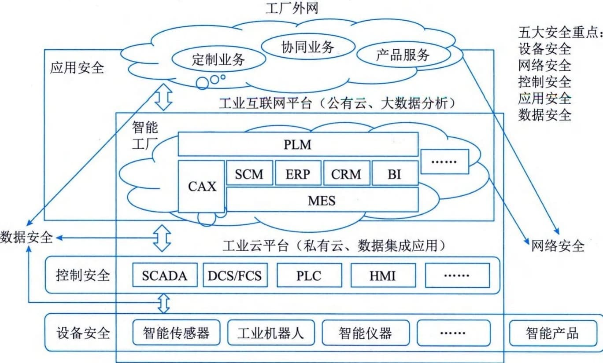

### 4.7.6 安全架构设计案例分析
以某基于混合云的工业安全架构设计为例。
跨区域的安全生产管理是大型集团企业面临的主要生产问题。大型企业希望可以通过云计算平台实现异地的设计、生产、制造、管理和数据处理等，并确保企业内部生产的安全、保密和数据的完整。
目前，混合云架构往往被大型企业所接受。混合云融合了公有云和私有云，是近年来云计算的主要模式和发展方向。我们知道私有云主要是面向企业用户，出于安全考虑，企业更愿意将数据存放在私有云中，但是同时又希望可以获得公有云的计算资源，在这种情况下混合云被越来越多地采用，它将公有云和私有云进行混合和匹配，以获得最佳的效果，这种个性化的解决方案，达到了既省钱又安全的目的。
从企业对混合云的需求来看，企业要想将内部服务器与一个或多个混合云架构融合在一起，从技术上讲是一种挑战，想简单地增加一段代码是无法将虚拟服务器与公有云对接起来的，这涉及潜在的数据迁移、安全问题，以及建立应用与混合云架构映射等问题。因此，要分析企业究竟想在混合云架构中放什么，哪些必须保留在混合云架构内部，哪些可以放到混合云中，实际上混合云架构大量数据都是开放的，所有Web页面以及公司公共站点上的大多数数据都可以放在公有混合云架构上，需求时能够进行扩展以应对日常的负载模式。
图4-27给出了大型企业采用混合云技术的安全生产管理系统的架构，企业由多个跨区域的智能工厂和公司总部组成，公司总部负责相关业务的管理、协调和统计分析，而每个智能工厂负责智能产品的设计与生产制造。智能工厂内部采用私有云实现产品设计、数据共享和生产集成等，公司总部与智能工厂间采用公有云实现智能工厂间、智能工厂与公司总部间的业务管理、协调和统计分析等。整个安全生产管理系统架构由三层组成，即设备层、控制层、设计管理层和应用层。设备层主要是指用于智能工厂生产产品所需的相关设备，包括智能传感器、工业机器人和智能仪器。控制层主要是指智能工厂生产产品所需要建立的一套自动控制系统，控制智能设备完成生产工作，包括数据采集与监视控制系统（SCADA）、集散控制系统（DCS）、现场总线控制系统（FCS）、顺序控制系统（PLC）和人机接口（HMI）等。设计管理层是指智能工厂各种开发、业务控制和数据管理功能的集合，实现数据集成与应用，包括：企业生产信息化管理系统（MES）、计算机辅助设计／工程／制造（CAD／CAE／CAM）等（统称CAX）、供应链管理（SCM）、企业资源计划管理（ERP）、客户关系管理（CRM）、商业智能分析（BI）和产品生命周期管理系统（PLM）。应用层主要是指在云计算平台上进行信息处理，主要涵盖两个核心功能：一是"数据"，应用层需要完成数据的管理和数据的处理；二是"应用"，仅仅管理和处理数据还远远不够，必须将这些数据与行业应用相结合，本系统主要包括定制业务、协同业务和产品服务等。

图4-27 基于混合云的安全生产管理系统架构
在设计基于混合云的安全生产管理系统中，需要重点考虑5个方面的安全问题。设备安全、网络安全、控制安全、应用安全和数据安全。
 - （1）设备安全。设备安全是指企业（单位）在生产经营活动中，将危险、有害因素控制在安全范围内，以及减少、预防和消除危害所配置的装置（设备）和采用的设备。安全设备对于保护人类活动的安全尤为重要。设备安全的保障技术主要包括维护、保养和检测等。
 - （2）网络安全。网络安全是指网络系统的硬件、软件及其系统中的数据受到保护，不因偶然的或者恶意的原因而遭受到破坏、更改、泄露，系统连续可靠正常地运行。网络安全的保障技术主要包括防火墙、入侵检测系统部署、漏洞扫描系统和网卡杀毒产品部署等。
 - （3）控制安全。控制安全主要包括三种措施，其一是减少和消除生产过程中的事故，保证人员健康安全和财产免受损失；其二是生产过程中涉及的计划、组织、监控、调节和改进等一系列致力于安全所进行的管理活动，包括安全法规、安全技术和工业卫生等；其三是减少甚至消除事故隐患，尽量把事故消灭在萌芽状态。控制安全的保障技术主要包括冗余、容错、（降级）备份、容灾等。
 - （4）应用安全。应用安全，顾名思义就是保障应用程序使用过程和结果的安全。简而言之，就是针对应用程序或工具在使用过程中可能出现计算、传输数据的泄露和失窃，通过其他安全工具或策略来消除隐患。应用安全的保障技术主要包括服务器报警策略、用户密码策略、用户安全策略、访问控制策略和时间策略等。
 - （5）数据安全。数据安全是指通过采取必要措施，确保数据处于有效保护和合法利用的状态，以及具备保障持续安全状态的能力。要保证数据处理的全过程的安全，就得保证数据在收集、存储、使用、加工、传输、提供和公开等的每一个环节内的安全。数据安全的保障技术主要包括对立的两方面：一是数据本身的安全，主要是指采用现代密码算法对数据进行主动保护，如数据保密、数据完整性、双向强身份认证等；二是数据防护的安全，主要是采用现代信息存储手段对数据进行主动防护，如通过磁盘阵列、数据备份、异地容灾等手段保证数据的安全。本系统的数据安全主要分布于各层之间数据交换过程和公有云的数据存储安全。
