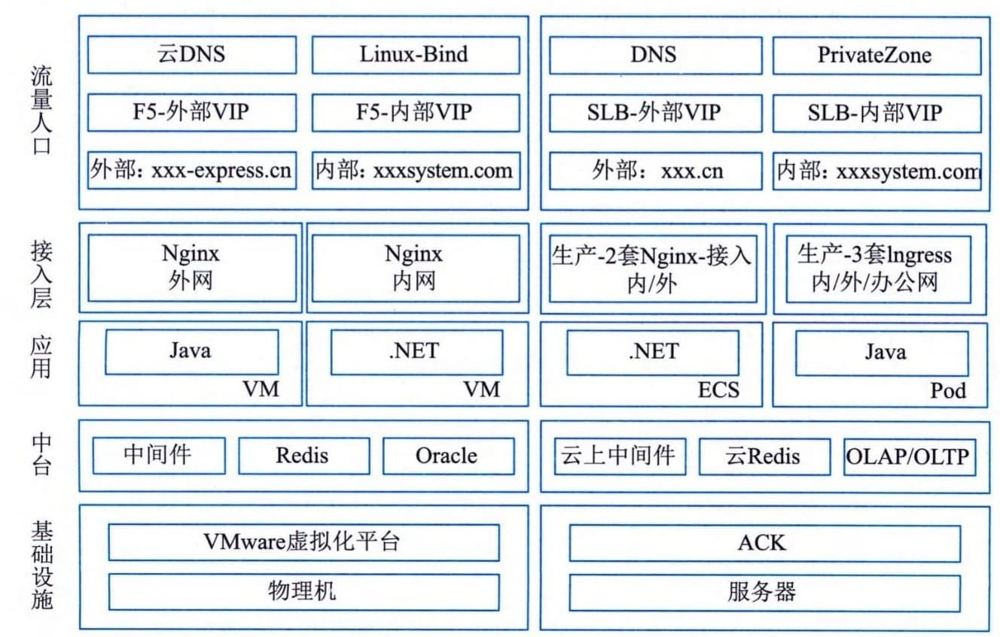

### 4.8.5 云原生案例
某快递公司作为发展最为迅猛的物流组织之一，一直积极探索技术创新赋能商业增长之路，以期达到降本提效的目的。目前，该公司日订单处理量已达千万量级，亿级别物流轨迹处理量，每天产生数据已达到TB级别，使用1300＋个计算结点来实时处理业务。过往该公司的核心业务应用运行在IDC机房，原有IDC系统帮助该公司安稳度过早期业务快速发展期。但伴随着业务体量指数级增长，业务形式愈发多元化。原有系统暴露出不少问题，传统IOE架构、各系统架构的不规范、稳定性、研发效率都限制了业务高速发展的可能。软件交付周期过长，大促保障对资源的特殊要求难实现、系统稳定性难以保障等业务问题逐渐暴露。在与某云服务商进行多次需求沟通与技术验证后，该公司最终确定云原生技术和架构实现核心业务搬迁上云。
#### **1．解决方案**
该公司核心业务系统原架构基于VMware＋Oracle数据库进行搭建。随着搬迁上云，架构全面转型为基于Kubernetes的云原生架构体系。其中，引入云原生数据库并完成应用基于容器的微服务改造是整个应用服务架构重构的关键点。
 - （1）引入云原生数据库。通过引入OLTP跟OLAP型数据库，将在线数据与离线分析逻辑拆分到两种数据库中，改变此前完全依赖Oracle数据库的现状。满足在处理历史数据查询场景下Oracle数据库所支持实际业务需求的不足。
 - （2）应用容器化。伴随着容器化技术的引进，通过应用容器化有效解决了环境不一致的问题，确保应用在开发、测试、生产环境的一致性。与虚拟机相比，容器化提供了效率与速度的双重提升，让应用更适合微服务场景，有效提升产研效率。
 - （3）微服务改造。由于过往很多业务是基于Oracle的存储过程及触发器完成的，系统间的服务依赖也需要Oracle数据库OGG（Oracle
Golden
Gate）同步完成。这样带来的问题就是系统维护难度高且稳定性差。通过引入Kubernetes的服务发现，组建微服务解决方案，将业务按业务域进行拆分，让整个系统更易于维护。
#### **2．架构确立**
综合考虑某快递公司实际业务需求与技术特征，该企业确定的上云架构如图4-30所示。

图4-30 某快递公司核心业务上云架构示意图
1）基础设施
全部计算资源取自某云服务商上的裸金属服务器。相较于一般云服务器（ECS），Kubernetes
搭配服务器能够获得更优性能及更合理的资源利用率。且云上资源按需取量，对于拥有促活动等短期大流量业务场景的某公司而言极为重要。相较于线下自建机房、常备机器云上资源随取随用。在促活动结束后，云上资源使用完毕后即可释放，管理与采购成本更低。
#### **2）流量接入**
云服务商提供两套流量接入，一套是面向公网请求，另外一套是服务内部调用。域名解析采用云DNS及PrivateZone。借助Kubernetes的Ingress能力实现统一的域名转发，以节省公网SLB的数量，提高运维管理效率。
3）平台层
基于Kubernetes打造的云原生PaaS平台优势明显突出，主要包括：
 - · 打通DevOps闭环，统一测试、集成、预发、生产环境；
 - · 天生资源隔离，机器资源利用率高；
 - · 流量接入可实现精细化管理；
 - · 集成了日志、链路诊断、Metrics平台；
 - · 统一APIServer接口和扩展，支持多云及混合云部署。
4）应用服务层
每个应用都在Kubernetes上面创建单独的一个Namespace，应用和应用之间实现资源隔离。通过定义各个应用的配置YAML模板，当应用在部署时直接编辑其中的镜像版本即可快速完成版本升级，当需要回滚时直接在本地启动历史版本的镜像快速回滚。
5）运维管理。
线上Kubernetes集群采用云服务商托管版容器服务，免去了运维Master结点的工作，只需要制定Worker结点上线及下线流程即可。同时业务系统均通过阿里云的PaaS平台完成业务日志搜索，按照业务需求投交扩容任务，系统自动完成扩容操作，降低了直接操作Kubernetes集群带来的业务风险。
#### **3．应用效益**
该公司通过云原生架构的使用，其应用效益主要体现在成本、稳定性、效率、赋能业务等方面。
 - （1）成本方面。使用公有云作为计算平台，可以让企业不必因为业务突发性的增长需求，而一次性投入大量资金成本用于采购服务器及扩充机柜。在公共云上可以做到随用随付，对于一些创新业务想做技术调研十分便捷，用完即释放，按量付费。另外云产品都免运维自行托管在云端，有效节省人工运维成本，让企业更专注于核心业务。
 - （2）稳定性方面。云上产品提供至少5个9（99.999％）以上的SLA服务确保系统稳定，而自建系统稳定性调高很多。在数据安全方面云上数据可以轻松实现异地备份，云服务商数据存储体系下的归档存储产品具备高可靠、低成本、安全性、存储无限等特点，让企业数据更安全。（3）效率方面。借助与云产品深度集成，研发人员可以完成一站式研发、运维工作。从业务需求立项到拉取分支开发，再到测试环境功能回归验证，最终部署到预发验证及上线，整个持续集成流程耗时可缩短至分钟级。排查问题方面，研发人员直接选择所负责的应用，并通过集成的SLS日志控制台快速检索程序的异常日志进行问题定位，免去了登录机器查日志的麻烦。
 - （4）赋能业务。云服务商提供超过300余种的云上组件，组件涵盖计算、AI、大数据、IoT
等诸多领域。研发人员开箱即用，有效节省业务创新带来的技术成本。
