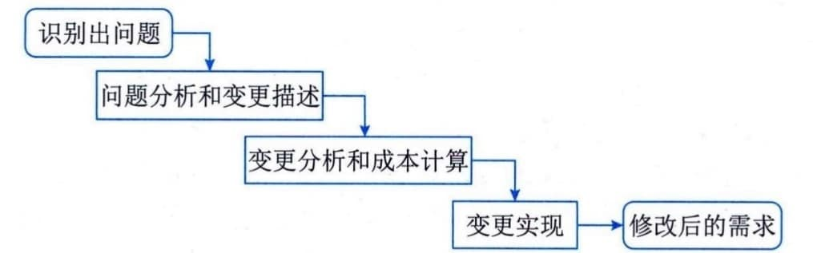

### 5.2.6 需求变更
在当前的软件开发过程中，需求变更已经成为一种常态。需求变更的原因有很多种，可能是需求获取不完整，存在遗漏的需求，可能是对需求的理解产生了误差，也可能是业务变化导致了需求的变化等。一些需求的改进是合理的且不可避免的，要使得软件需求完全不变更基本上是不可能的。但毫无控制的变更会导致项目陷入混乱，不能按进度完成或者软件质量无法保证。
事实上，迟到的需求变更会对已进行的工作产生非常大的影响。如果不控制变更的影响范围，在项目开发过程中持续不断地采纳新功能，不断地调整资源、进度或者质量标准是极为有害的。如果每一个建议的需求变更都采用，该项目将有可能永远不能完成。软件需求文档应该精确描述要交付的产品与服务，这是一个基本的原则。为了使开发组织能够严格控制软件项目，应该确保做到仔细评估已建议的变更、挑选合适的人选对变更做出判定、变更应及时通知所有相关人员、项目要按一定的程序来采纳需求变更，以实现对变更的过程和状态进行控制。
1）变更控制过程
变更控制过程用来跟踪已建议变更的状态，以确保已建议的变更不会丢失或疏忽。一旦确定了需求基线，应该使所有已建议的变更都遵循变更控制过程。需求变更管理过程如图5-1所示。

图5-1 需求变更管理过程
 - ·问题分析和变更描述：当提出一份变更提议后，需要对该提议做进一步的问题分析，检查它的有效性，从而产生一个更明确的需求变更提议。

 - ·变更分析和成本计算：当接受该变更提议后，需要对需求变更提议进行影响分析和评估。变更成本计算应该包括该变更所引起的所有改动的成本，例如修改需求文档、相应的设计、实现等工作成本。一旦分析完成并且被确认，应该采取是否执行这一变更的决策。

 - ·变更实现：当确定执行该变更后，需要根据该变更的影响范围，按照开发的过程模型执行相应的变更。在计划驱动过程模型中，往往需要回溯到需求分析阶段开始，重新做对应的需求分析、设计和实现等步骤；在敏捷开发模型中，往往会将需求变更纳入到下一次迭代的执行过程中。
变更控制过程并不是给变更设置障碍。相反地，它是一个渠道和过滤器，通过它可以确保采纳最合适的变更，使变更产生的负面影响降到最低。
#### **2）变更策略**
控制需求变更与项目其他配置的管理决策有着密切的联系。项目管理应该达成一个策略，用来描述如何处理需求变更，而且策略应具有现实可行性。常见的需求变更策略主要包括：
 - · 所有需求变更必须遵循变更控制过程；
 - · 对于未获得批准的变更，不应该做设计和实现工作；
 - · 应该由项目变更控制委员会决定实现哪些变更；
 - · 项目风险承担者应该能够了解变更的内容；
 - · 绝不能从项目配置库中删除或者修改变更请求的原始文档；
 - · 每一个集成的需求变更必须能跟踪到一个经核准的变更请求。
目前存在很多问题跟踪工具，这些工具用来收集、存储和管理需求变更。问题跟踪工具也可以随时按变更状态分类报告变更请求的数目和实现情况等。
3）变更控制委员会
变更控制委员会（Change Control
Board，CCB）是项目所有者权益代表，负责裁定接受哪些变更。CCB由项目所涉及的多方成员共同组成，通常包括用户和实施方的决策人员。CCB是决策机构，不是作业机构，通常CCB的工作是通过评审手段来决定项目是否能变更，但不提出变更方案。变更控制委员会可能包括如下方面的代表：
 - · 产品或计划管理部门；
 - · 项目管理部门；
 - · 开发部门；
 - · 测试或质量保证部门；
 - · 市场部或客户代表；
 - · 用户文档的编制部门；
 - · 技术支持部门；
 - · 桌面或用户服务支持部门；
 - · 配置管理部门。
变更控制委员会应该有一个总则，用于描述变更控制委员会的目的、管理范围、成员构成、做出决策的过程及操作步骤。总则也应该说明举行会议的频度和事由等。管理范围描述该委员会能做什么样的决策，以及哪一类决策应上报到高一级的委员会。过程及操作步骤主要包括制定决策、交流情况和重新协商约定等。
 - ·制定决策。制定决策过程的描述应确认：①变更控制委员会必须到会的人数或做出有效决定必须出席的人数；②决策的方法，例如投票、一致通过或其他机制；③变更控制委员会主席是否可以否决该集体的决定等。变更控制委员会应该对每个变更权衡利弊后做出决定："利"包括节省的资金或额外的收入、增强的客户满意度、竞争优势、减少上市时间等；"弊"是指接受变更后产生的负面影响，包括增加的开发费用、推迟的交付日期、产品质量的下降、减少的功能、用户不满意度等。
 - · 交流情况。一旦变更控制委员会做出决策，相应的人员应及时更新请求的状态。
 - ·重新协商约定。变更总是有代价的，即使拒绝的变更也因为决策行为（提交、评估、决策）而耗费了资源。当项目接受了重要的需求变更时，为了适应变更情况，要与管理部门和客户重新协商约定。协商的内容可能包括推迟交付时间、要求增加人手、推迟实现尚未实现的较低优先级的需求，或者质量上进行调整等。
