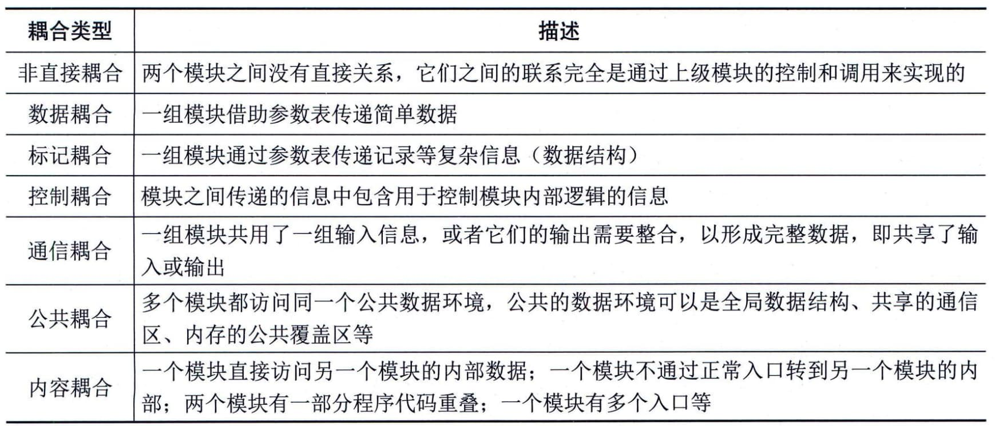
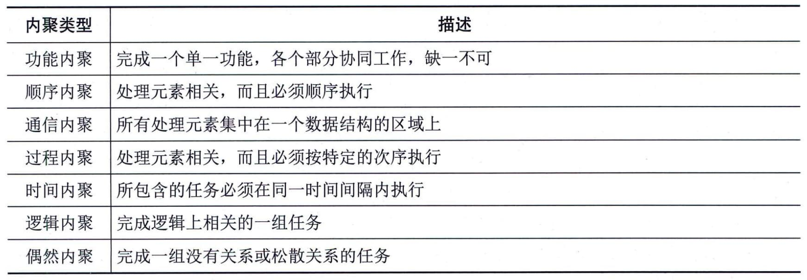

### 5.3.1 结构化设计
结构化设计（Structured
Design，SD）是一种面向数据流的方法，其目的在于确定软件结构。它以SRS和SA阶段所产生的DFD和数据字典等文档为基础，是一个自顶向下、逐层分解、逐步求精和模块化的过程。SD方法的基本思想是将软件设计成由相对独立且具有单一功能的模块组成的结构。从管理角度讲，其分为概要设计和详细设计两个阶段。其中，概要设计又称为总体结构设计，它是开发过程中很关键的一步，其主要任务是确定软件系统的结构，将系统的功能需求进行模块划分，确定每个模块的功能、接口和模块之间的调用关系，形成软件的模块结构图，即系统结构图。在概要设计中，将系统开发的总任务分解成许多个基本的、具体的任务，而为每个具体任务选择适当的技术手段和处理方法的过程称为详细设计。详细设计的主要任务是为每个模块设计实现的细节，根据任务的不同，详细设计又可分为多种，例如，输入／输出设计、处理流程设计、数据存储设计、用户界面设计、安全性和可靠性设计等。
#### **1．模块结构**
系统是一个整体，它具有整体性的目标和功能，但这些目标和功能的实现又是由相互联系的各个组成部分共同工作的结果。人们在解决复杂问题时使用的一个很重要的原则，就是将它分解成多个小问题分别处理，在处理过程中，需要根据系统总体要求，协调各业务部门的关系。在SD中，这种功能分解就是将系统划分为模块，模块是组成系统的基本单位，它的特点是可以自由组合、分解和变换，系统中任何一个处理功能都可以看成一个模块。
 - （1）信息隐藏与抽象。信息隐藏原则要求采用封装技术，将程序模块的实现细节（过程或数据等）隐藏起来，对于不需要这些信息的其他模块来说是不能访问的，使模块接口尽量简单。按照信息隐藏的原则，系统中的模块应设计成"黑盒"，模块外部只能使用模块接口说明中给出的信息，如操作和数据类型等。模块之间相对独立，既易于实现，也易于理解和维护。抽象原则要求抽取事物最基本的特性和行为，参见本章5.2.4小节中关于抽象的说明。
 - （2）模块化。在SD方法中，模块是实现功能的基本单位，它一般具有功能、逻辑和状态3个基本属性。其中，功能是指该模块"做什么"，逻辑是描述模块内部"怎么做"，状态是该模块使用时的环境和条件。在描述一个模块时，必须按模块的外部特性与内部特性分别描述。模块的外部特性是指模块的模块名、参数表和给程序乃至整个系统造成的影响；模块的内部特性则是指完成其功能的程序代码和仅供该模块内部使用的数据。对于模块的外部环境（例如，需要调用这个模块的上级模块）来说，只需要了解这个模块的外部特性就足够了，不必了解它的内部特性。而软件设计阶段，通常是先确定模块的外部特性，然后再确定它的内部特性。
 - （3）耦合。耦合表示模块之间联系的程度。紧密耦合表示模块之间联系非常强，松散耦合表示模块之间联系比较弱，非直接耦合则表示模块之间无任何直接联系。模块的耦合类型通常分为7种，根据耦合度从低到高排序如表5-1所示。
**表5-1
模块的耦合类型**
对于模块之间耦合的强度，主要依赖于一个模块对另一个模块的调用、一个模块向另一个模块传递的数据量、一个模块施加到另一个模块的控制的多少，以及模块之间接口的复杂程度等。
 - （4）内聚。内聚表示模块内部各代码成分之间联系的紧密程度，是从功能角度来度量模块内的联系，一个好的内聚模块应当恰好做目标单一的一件事情。模块的内聚类型通常也可以分为7种，根据内聚度从高到低排序如表5-2所示。
**表5-2 模块的内聚类型**

一般来说，系统中各模块的内聚越高，则模块间的耦合就越低，但这种关系并不是绝对的。耦合低使得模块间尽可能相对独立，各模块可以单独开发和维护；内聚高使得模块的可理解性和维护性大大增强。因此，在模块的分解中应尽量减少模块的耦合，力求增加模块的内聚，遵循"高内聚、低耦合"的设计原则。
#### **2．系统结构图**
系统结构图（Structure
Chart，SC）又称为模块结构图，它是软件概要设计阶段的工具，反映系统的功能实现和模块之间的联系与通信，包括各模块之间的层次结构，即反映了系统的总体结构。在系统分析阶段，系统分析师可以采用SA方法获取由DFD、数据字典和加工说明等组成的系统的逻辑模型；在系统设计阶段，系统设计师可根据一些规则，从DFD中导出系统初始的SC。
详细设计的主要任务是设计每个模块的实现算法、所需的局部数据结构。详细设计的目标有两个：实现模块功能的算法要逻辑上正确；算法描述要简明易懂。详细设计必须遵循概要设计来进行。详细设计方案的更改，不得影响到概要设计方案；如果需要更改概要设计，必须经过项目经理的同意。详细设计应该完成详细设计文档，主要是模块的详细设计方案说明。设计的基本步骤如下：
 - · 分析并确定输入／输出数据的逻辑结构；
 - · 找出输入数据结构和输出数据结构中有对应关系的数据单元；
 - · 按一定的规则由输入、输出的数据结构导出程序结构；
 - · 列出基本操作与条件，并把它们分配到程序结构图的适当位置；
 - · 用伪码写出程序。
详细设计的表示工具有图形工具、表格工具和语言工具。
 - （1）图形工具。利用图形工具可以把过程的细节用图形描述出来。具体的图形有业务流程图、程序流程图、问题分析图（Problem
Analysis
Diagram，PAD）、NS流程图（由Nassi和Shneiderman开发，简称NS）等。
 - ·业务流程图：是一种描述管理系统内各单位、人员之间的业务关系、作业顺序和管理信息流向的图表。业务流程图的绘制是按照业务的实际处理步骤和过程进行的，它用一些规定的符号及连线表示某个具体业务的处理过程，帮助分析人员找出业务流中的不合理流向。

 - ·程序流程图：又称为程序框图，是使用最广泛的一种描述程序逻辑结构的工具。它用方框表示一个处理步骤，用菱形表示一个逻辑条件，用箭头表示控制流向。其优点是结构清晰，易于理解，易于修改；缺点是只能描述执行过程而不能描述有关的数据。

 - ·NS流程图：也称为盒图或方框图，是一种强制使用结构化构造的图示工具。其具有以下特点：功能域明确，不可能任意转移控制，很容易确定局部和全局数据的作用域，很容易表示嵌套关系及模板的层次关系。

 - ·PAD图：是一种改进的图形描述方式，可以用来取代程序流程图，比程序流程图更直观，结构更清晰。最大的优点是能够反映和描述自顶向下的历史和过程。PAD提供了5种基本控制结构的图示，并允许递归使用。
 - （2）表格工具。可以用一张表来描述过程的细节，在这张表中列出了各种可能的操作和相应的条件。
 - （3）语言工具。用某种高级语言来描述过程的细节，例如伪码或PDL（Program
Design
Language）等。PDL也可称为伪码或结构化语言，它用于描述模块内部的具体算法，以便开发人员之间比较精确地进行交流。语法是开放式的，其外层语法是确定的，而内层语法则不确定。外层语法描述控制结构，它用类似于一般编程语言控制结构的关键字表示，所以是确定的。内层语法描述具体操作，考虑到不同软件系统的实际操作种类繁多，内层语法因而不确定，它可以按系统的具体情况和不同的设计层次灵活选用。
 - ·PDL的优点：可以作为注释直接插在源程序中；可以使用普通的文本编辑工具或文字处理工具产生和管理；已经有自动处理程序存在，而且可以自动由PDL生成程序代码。

 - ·PDL的不足：不如图形工具形象直观，描述复杂的条件组合与动作间的对应关系时不如判定树清晰简单。
