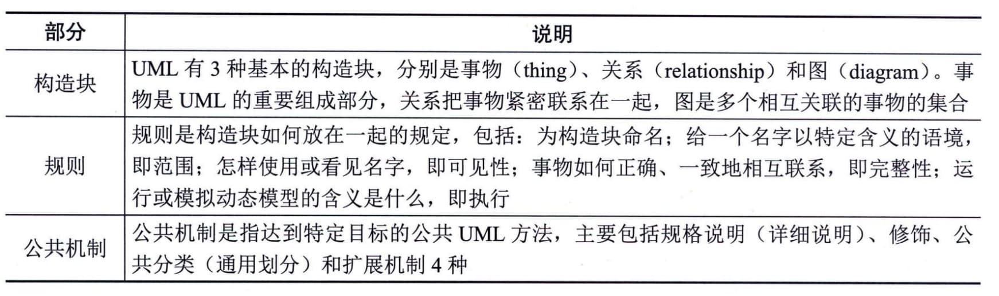
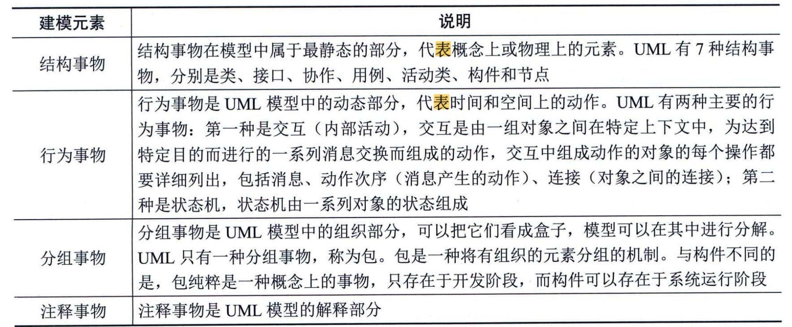
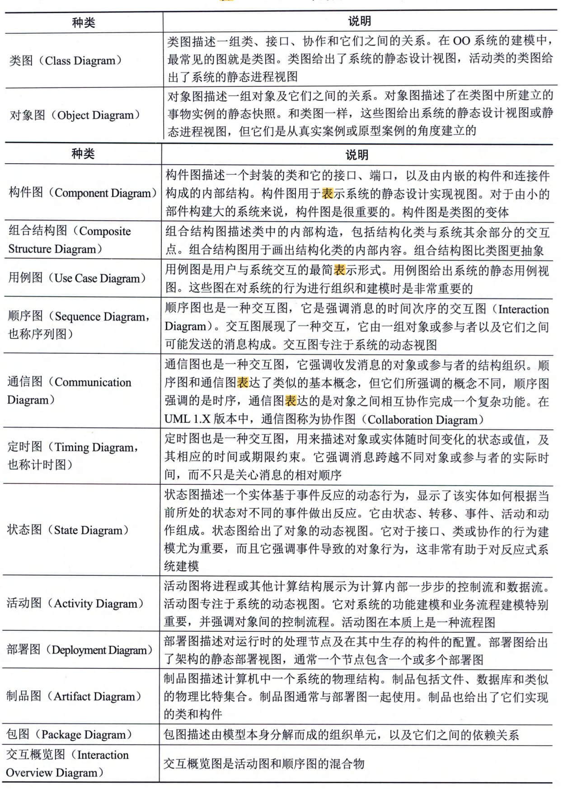

### 5.3.3 统一建模语言
统一建模语言（Unified Modeling
Language，UML）是一种定义良好、易于表达、功能强大且普遍适用的建模语言。它融入了软件工程领域的新思想、新方法和新技术，它的作用域不仅支持OOA（面向对象分析法）和OOD（面向对象设计），还支持从需求分析开始的软件开发的全过程。从总体上来看，UML的结构包括构造块、规则和公共机制3个部分，如表5-3所示。
**表5-3 UML的结构**

#### **1．UML中的事物**
UML中的事物也称为建模元素，包括结构事物（Structural
Things）、行为事物（Behavioral
Things，也称动作事物）、分组事物（Grouping
Things）和注释事物（Annotational
Things，也称注解事物）。这些事物是UML模型中最基本的OO（面向对象）构造块，如表5-4所示。
**表5-4 UML中的事物**

#### **2．UML中的关系**
UML用关系把事物结合在一起，主要有4种关系：依赖、关联、泛化和实现。
 - （1）依赖（Dependency）。依赖是两个事物之间的语义关系，其中一个事物发生变化会影响另一个事物的语义。
 - （2）关联（Association）。关联是指一种对象和另一种对象有联系。
 - （3）泛化（Generalization）。泛化是一般元素和特殊元素之间的分类关系，描述特殊元素的对象可替换一般元素的对象。
 - （4）实现（Realization）。实现将不同的模型元素（例如，类）连接起来，其中的一个类指定了由另一个类保证执行的契约。
#### **3．UML 2.0中的图**
UML 2.0包括14种图，如表5-5所示。
**表5-5 UML2.0中的图**

#### **4．UML 视图**
UML对系统架构的定义是系统的组织结构，包括系统分解的组成部分，以及它们的关联性、交互机制和指导原则等提供系统设计的信息。具体来说，就是指逻辑视图、进程视图、实现视图、部署视图和用例视图这5个系统视图。（1）逻辑视图。逻辑视图也称为设计视图，它用系统静态结构和动态行为来展示系统内部的功能是如何实现的，其侧重点在于如何得到功能。它表示了设计模型中在架构方面具有重要意义的部分，即类、子系统、包和用例实现的子集。
 - （2）进程视图。进程视图是可执行线程和进程作为活动类的建模，它是逻辑视图的一次执行实例，描述了并发与同步结构。
 - （3）实现视图。实现视图对组成基于系统的物理代码的文件和构件进行建模。
 - （4）部署视图。部署视图把构件部署到一组物理节点上，表示软件到硬件的映射和分布结构。
 - （5）用例视图。用例视图是最基本的需求分析模型。它从外部角色的视角来展示系统功能。
另外，UML还允许在一定的阶段隐藏模型的某些元素、遗漏某些元素，以及不保证模型的完整性，但模型要逐步地达到完整和一致。
#### **5.3.4 设计模式**
设计模式是前人经验的总结，它使人们可以方便地复用成功的软件设计。当人们在特定的环境下遇到特定类型的问题，采用他人已使用过的一些成功的解决方案，一方面可以降低分析、设计和实现的难度，另一方面可以使系统具有更好的可复用性和灵活性。设计模式包含模式名称、问题、目的、解决方案、效果、实例代码和相关设计模式等基本要素。
根据处理范围不同，设计模式可分为类模式和对象模式。类模式处理类和子类之间的关系，这些关系通过继承建立，在编译时刻就被确定下来，属于静态关系；对象模式处理对象之间的关系，这些关系在运行时刻变化，更具动态性。
根据目的和用途不同，设计模式可分为创建型（Creational）模式、结构型（Structural）模式和行为型（Behavioral）模式3种。创建型模式主要用于创建对象，包括工厂方法模式、抽象工厂模式、原型模式、单例模式和建造者模式等；结构型模式主要用于处理类或对象的组合，包括适配器模式、桥接模式、组合模式、装饰模式、外观模式、享元模式和代理模式等；行为型模式主要用于描述类或对象的交互以及职责的分配，包括职责链模式、命令模式、解释器模式、迭代器模式、中介者模式、备忘录模式、观察者模式、状态模式、策略模式、模板方法模式、访问者模式等。
