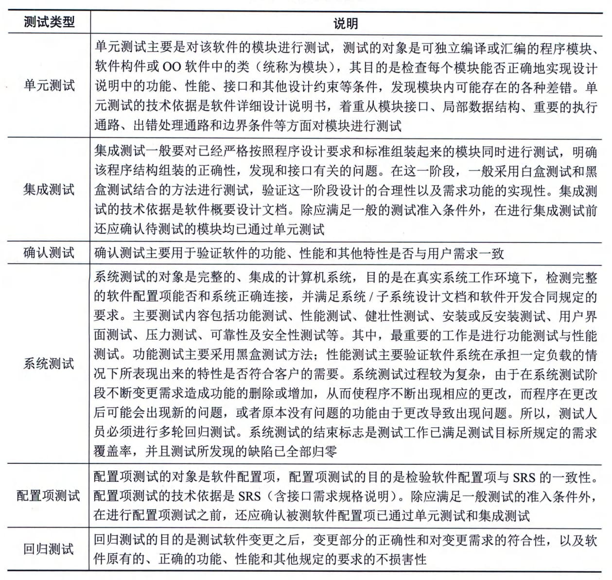

### 5.4.3 软件测试
软件测试是在将软件交付给客户之前所必须完成的重要步骤。软件测试是使用人工或自动的手段来运行或测定某个软件系统的过程，其目的在于检验它是否满足规定的需求或弄清预期结果与实际结果之间的差别。
软件测试的目的就是确保软件的质量，确认软件以正确的方法是检查软件是否做了用户所期望的事情，所以软件测试工作主要是发现软件的错误，有效定义和实现软件成分由低层到高层的组装过程，验证软件是否满足任务书和系统定义文档所规定的技术要求，为软件质量模型的建立提供依据。软件测试不仅要确保软件的质量，还要给开发人员提供信息，以方便其为风险评估做相应的准备，重要的是软件测试要贯穿在整个软件开发过程中，保证整个软件开发的过程是高质量的。目前，软件的正确性证明尚未得到根本的解决，软件测试仍是发现软件错误（缺陷）的主要手段。根据国家标准《计算机软件测试规范》（GB／T
15532），软件测试的目的是验证软件是否满足软件开发合同或项目开发计划、系统／子系统设计文档、[SRS、]{.underline}软件设计说明和软件产品说明等规定的软件质量要求。通过测试，发现软件缺陷，为软件产品的质量测量和评价提供依据。
#### **1．测试方法**
软件测试方法可分为静态测试和动态测试。
1）静态测试
静态测试是指被测试程序不在机器上运行，只依靠分析或检查源程序的语句、结构、过程等来检查程序是否有错误，即通过对软件的需求规格说明书、设计说明书以及源程序做结构分析和流程图分析，从而找出错误。静态测试包括对文档的静态测试和对代码的静态测试。对文档的静态测试主要以检查单的形式进行，而对代码的静态测试一般采用桌前检查（Desk
Checking）、代码走查和代码审查的方式。经验表明，使用这种方法能够有效地发现30％～70％的逻辑设计和编码错误。
2）动态测试
动态测试是指在计算机上实际运行程序进行软件测试，对得到的运行结果与预期的结果进行比较分析，同时分析运行效率和健壮性能等。一般采用白盒测试和黑盒测试方法。
白盒测试也称为结构测试，主要用于软件单元测试中。它的主要思想是，将程序看作一个透明的白盒，测试人员完全清楚程序的结构和处理算法，按照程序内部逻辑结构设计测试用例，检测程序中的主要执行通路是否都能按设计规格说明书的设定进行。白盒测试方法是从程序结构方面出发对测试用例进行设计，主要用于检查各个逻辑结构是否合理，对应的模块独立路径是否正常，以及内部结构是否有效，包括控制流测试、数据流测试和程序变异测试等。另外，使用静态测试的方法也可以实现白盒测试。例如，使用人工检查代码的方法来检查代码的逻辑问题，也属于白盒测试的范畴。白盒测试方法中，最常用的技术是逻辑覆盖，即使用测试数据运行被测程序，考查对程序逻辑的覆盖程度，主要的覆盖标准有语句覆盖、判定覆盖、条件覆盖、条件／判定覆盖、条件组合覆盖、修正的条件／判定覆盖和路径覆盖等。
黑盒测试也称为功能测试，它是通过测试来检测每个功能能否正常使用。黑盒测试将程序看作一个不透明的黑盒，完全不考虑（或不了解）程序的内部结构和处理算法，根据需求规格说明书设计测试实例，并检查程序的功能是否能够按照规范说明准确无误地运行。对于黑盒测试行为必须加以量化才能够有效地保证软件的质量。黑盒测试根据SRS所规定的功能来设计测试用例，一般包括等价类划分、边界值分析、判定表、因果图、状态图、随机测试、猜错法和正交试验法等。
#### **2．测试类型**
根据国家标准《计算机软件测试规范》（GB／T
15532），软件测试可分为单元测试、集成测试、确认测试、系统测试、配置项测试和回归测试等类别，如表5-6所示。
**表5-6 测试类型说明**

#### **3．面向对象的测试**
OO系统的测试目标与传统信息系统的测试目标是一致的，但OO系统的测试策略与传统的结构化系统的测试策略有很大的不同，这种不同主要体现在两个方面，分别是测试的焦点从模块移向了类，以及测试的视角扩大到了分析和设计模型。与传统的结构化系统相比，OO系统具有3个明显特征，即封装性、继承性与多态性。正是由于这3个特征，给OO系统的测试带来了一系列的困难。封装性决定了OO系统的测试必须考虑到信息隐蔽原则对测试的影响，以及对象状态与类的测试序列；继承性决定了OO系统的测试必须考虑到继承对测试充分性的影响，以及误用引起的错误；多态性决定了OO系统的测试必须考虑到动态绑定对测试充分性的影响，抽象类的测试及误用对测试的影响。
#### **4．软件调试**
软件调试（排错）与成功的测试形影相随。测试成功的标志是发现了错误，根据错误迹象确定错误的原因和准确位置，并加以改正，主要依靠软件调试技术。常用的软件调试策略可以分为蛮力法、回溯法和原因排除法。
