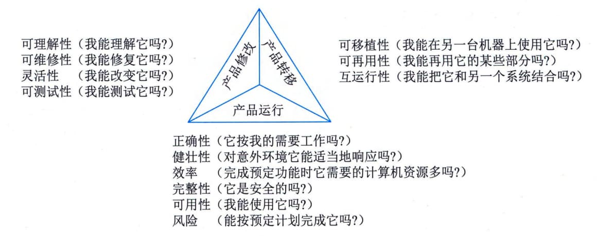

## 5.6 软件质量管理
软件质量就是软件与明确地和隐含地定义的需求相一致的程度，更具体地说，软件质量是软件符合明确地叙述的功能和性能需求、文档中明确描述的开发标准以及所有专业开发的软件都应具有的隐含特征的程度。从管理角度出发，可以将影响软件质量的因素划分为3组，分别反映用户在使用软件产品时的3种不同倾向和观点。这3组分别是产品运行、产品修改和产品转移，三者的关系如图5-2所示。

图5-2 影响软件质量的3个主要因素的关系图
软件质量保证（Software Quality
Assurance，SQA）是建立一套有计划、有系统的方法，来向管理层保证拟定出的标准、步骤、实践和方法能够正确地被所有项目所采用。软件质量保证的目的是使软件过程对于管理人员来说是可见的，它通过对软件产品和活动进行评审和审计来验证软件是合乎标准的。软件质量保证组在项目开始时就一起参与建立计划、标准和过程。这些使软件项目满足机构方针的要求。
软件质量保证的关注点集中在一开始就避免缺陷的产生。质量保证的主要目标是：
 - · 事前预防工作，例如，着重于缺陷预防而不是缺陷检查；
 - · 尽量在刚刚引入缺陷时即将其捕获，而不是让缺陷扩散到下一个阶段；
 - · 作用于过程而不是最终产品，因此它有可能会带来广泛的影响与巨大的收益；
 - · 贯穿于所有的活动之中，而不是只集中于一点。
软件质量保证的目标是以独立审查的方式，从第三方的角度监控软件开发任务的执行，就软件项目是否正确遵循已制订的计划、标准和规程给开发人员和管理层提供反映产品和过程质量的信息和数据，提高项目透明度，同时辅助软件工程取得高质量的软件产品。
软件质量保证的主要作用是给管理者提供预定义的软件过程的保证，因此SQA组织要保证如下内容的实现：选定的开发方法被采用、选定的标准和规程得到采用和遵循、进行独立的审查、偏离标准和规程的问题得到及时的反映和处理、项目定义的每个软件任务得到实际的执行。软件质量保证的主要任务包括：SQA审计与评审、SQA报告、处理不合格问题。
 - （1）SQA审计与评审。SQA审计包括对软件工作产品、软件工具和设备的审计，评价这几项内容是否符合组织规定的标准。SQA评审的主要任务是保证软件工作组的活动与预定的软件过程一致，确保软件过程在软件产品的生产中得到遵循。
 - （2）SQA报告。SQA人员应记录工作的结果，并写入报告之中，发布给相关的人员。SQA
报告的发布应遵循3条原则：SQA和高级管理者之间应有直接沟通的渠道；SQA报告必须发布给软件工程组，但不必发布给项目管理人员；在可能的情况下向关心软件质量的人发布SQA
报告。
 - （3）处理不合格问题。这是SQA的一个重要的任务，SQA人员要对工作过程中发现的问题进行处理，及时向有关人员及高级管理者反映。
