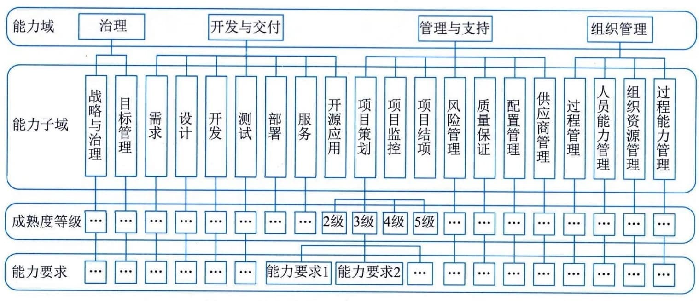

### 5.7.1 成熟度模型
CSMM定义的软件过程能力成熟度模型旨在通过提升组织的软件开发能力帮助顾客提升软件的业务价值。该模型借鉴吸收了软件工程、项目管理、产品管理、组织治理、质量管理、卓越绩效管理、精益软件开发等领域的优秀实践，为组织提供改进和评估软件过程能力的一个成熟度模型。其层次结构如图5-3所示。

图5-3 软件过程能力成熟度模型的层次结构
CSMM模型由4个能力域、20个能力子域、161个能力要求组成。
 - （1）治理：包括战略与治理、目标管理能力子域，确定组织的战略、产品的方向、组织的业务目标，并确保目标的实现。
 - （2）开发与交付：包括需求、设计、开发、测试、部署、服务、开源应用能力子域，这些能力子域确保通过软件工程过程交付满足需求的软件，为顾客与利益相关方增加价值。
 - （3）管理与支持：包括项目策划、项目监控、项目结项、质量保证、风险管理、配置管理、供应商管理能力子域，这些能力子域覆盖了软件开发项目的全过程，以确保软件项目能够按照既定的成本、进度和质量交付，能够满足顾客与利益相关方的要求。
 - （4）组织管理：包括过程管理、人员能力管理、组织资源管理、过程能力管理能力子域，对软件组织能力进行综合管理。
