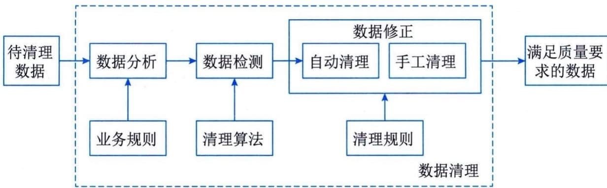

### 6.1.2 数据预处理
数据的预处理一般采用数据清洗的方法来实现。数据预处理是一个去除数据集重复记录，发现并纠正数据错误，并将数据转换成符合标准的过程，从而使数据实现准确性、完整性、一致性、唯一性、适时性、有效性等。一般来说，数据预处理主要包括数据分析、数据检测和数据修正3个步骤，如图6-1所示。

图6-1 数据预处理的流程
 - （1）数据分析：是指从数据中发现控制数据的一般规则，比如字段域、业务规则等。通过对数据的分析，定义出数据清理的规则，并选择合适的算法。
 - （2）数据检测：是指根据预定义的清理规则及相关数据清理算法，检测数据是否正确，比如是否满足字段域、业务规则等，或检测记录是否重复。
 - （3）数据修正：是指手工或自动地修正检测到的错误数据或重复的记录等。
