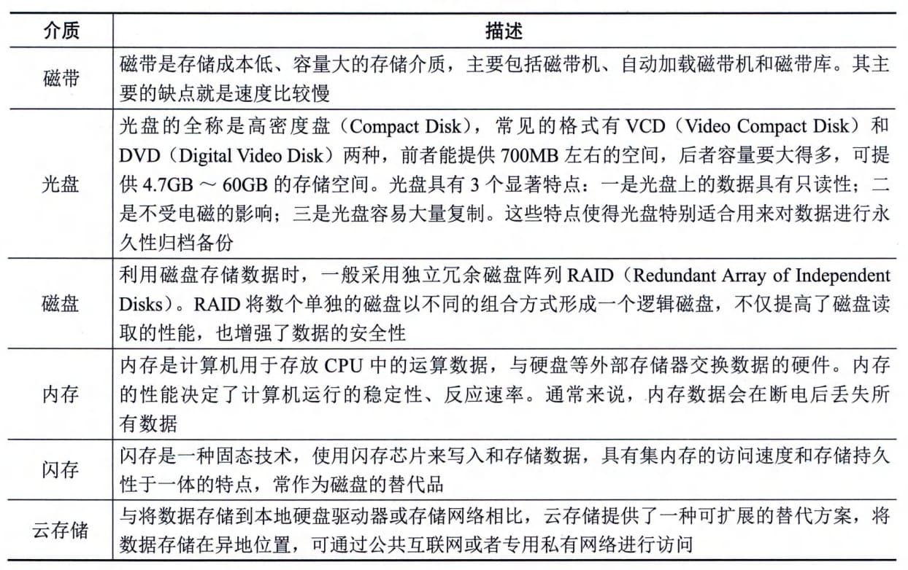
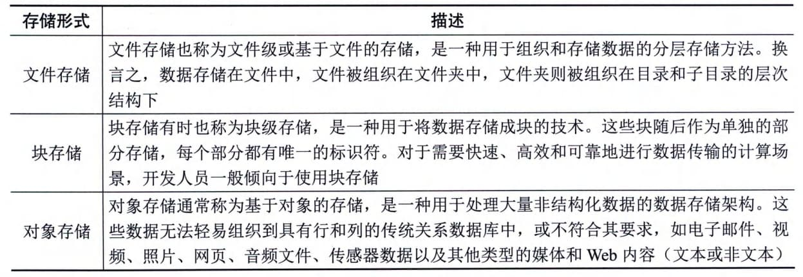
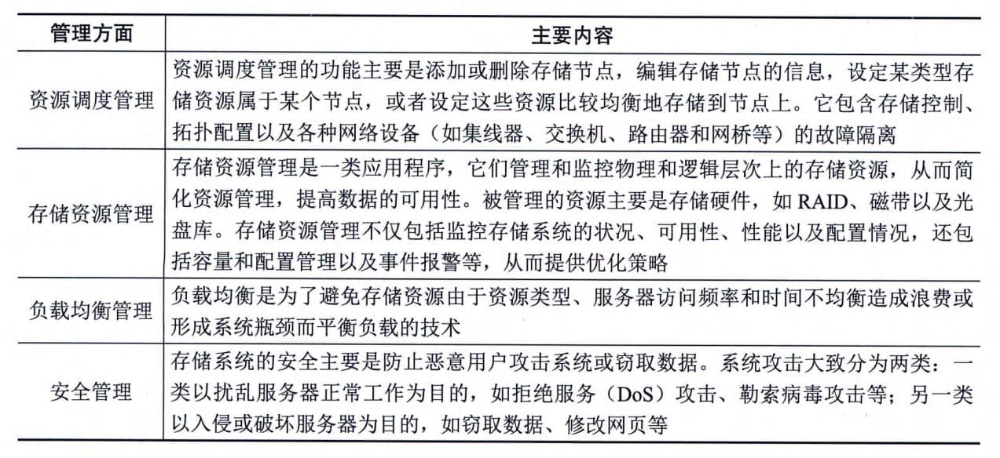

### 6.2.1 数据存储
数据存储就是根据不同的应用环境，通过采取合理、安全、有效的方式将数据保存到物理介质上，并能保证对数据实施有效的访问。其中包含两个方面：一是数据临时或长期驻留的物理媒介；二是保证数据完整、安全存放和访问而采取的方式或行为。数据存储就是把这两个方面结合起来，提供完整的解决方案。
#### **1．数据存储介质**
数据存储首先要解决的是存储介质的问题。存储介质是数据存储的载体，是数据存储的基础。存储介质并不是越贵越好、越先进越好，要根据不同的应用环境，合理选择存储介质。存储介质的类型主要有磁带、光盘、磁盘、内存、闪存、云存储等，其描述如表6-1所示。
**表6-1 常见数据存储介质的描述**

#### **2．存储形式**
一般而言，主要有3种形式来记录和存储数据，分别是文件存储、块存储和对象存储，如表6-2所示。
**表6-2
主要数据存储形式的描述**
#### **3．存储管理**
存储管理在存储系统中的地位越来越重要，例如，如何提高存储系统的访问性能，如何满足数据量不断增长的需要，如何有效地保护数据、提高数据的可用性，如何满足存储空间的共享等。存储管理的具体内容如表6-3所示。
**表6-3
存储管理的主要内容**
