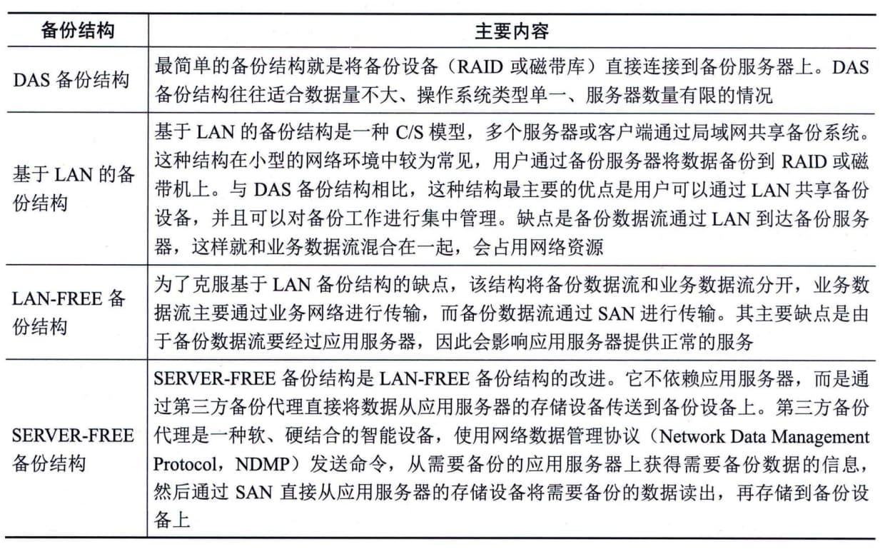
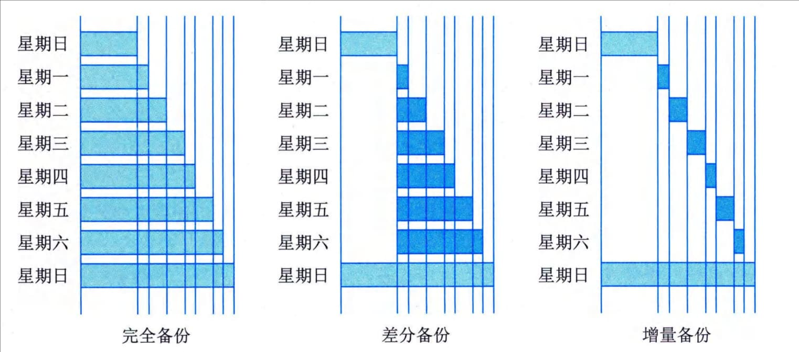

### 6.2.3 数据备份
数据备份是为了防止由于各类操作失误、系统故障等意外原因导致的数据丢失，而将整个应用系统的数据或一部分关键数据复制到其他存储介质上的过程。这样做是为了保证当应用系统的数据不可用时，可以利用备份的数据进行恢复，尽量减少损失。
#### **1．备份结构**
当前最常见的数据备份结构可以分为4种：DAS备份结构、基于LAN的备份结构、LAN-FREE备份结构和SERVER-FREE备份结构。具体如表6-4所示。
**表6-4
常见的数据备份结构的主要内容**
#### **2．备份策略**
备份策略是指确定需要备份的内容、备份时间和备份方式。主要有3种备份策略：完全备份、差分备份和增量备份。这3种备份策略的对比如图6-2所示。
图6-2 备份策略对比
 - （1）完全备份（Full
Backup）：每次都对需要进行备份的数据进行全备份。当数据丢失时，用完全备份下来的数据进行恢复即可。这种备份主要有两个缺点：一是由于每次都对数据进行全备份，会占用较多的服务器、网络等资源；二是在备份数据中有大量的数据是重复的，对备份介质资源的消耗往往也较大。
 - （2）差分备份（Differential
Backup）：每次所备份的数据只是相对上一次完全备份之后发生变化的数据。与完全备份相比，差分备份所需时间短，而且节省了存储空间。另外，差分备份的数据恢复很方便，管理员只需两份备份数据，如星期日的完全备份数据和故障发生前一天的差分备份数据，就能对系统数据进行恢复。
 - （3）增量备份（Incremental
Backup）：每次所备份的数据只是相对于上一次备份后改变的数据。这种备份策略没有重复的备份数据，节省了备份数据存储空间，缩短了备份的时间，但是当进行数据恢复时就会比较复杂。如果其中有一个增量备份数据出现问题，那么后面的数据也就无法恢复了。因此增量备份的可靠性没有完全备份和差分备份高。
