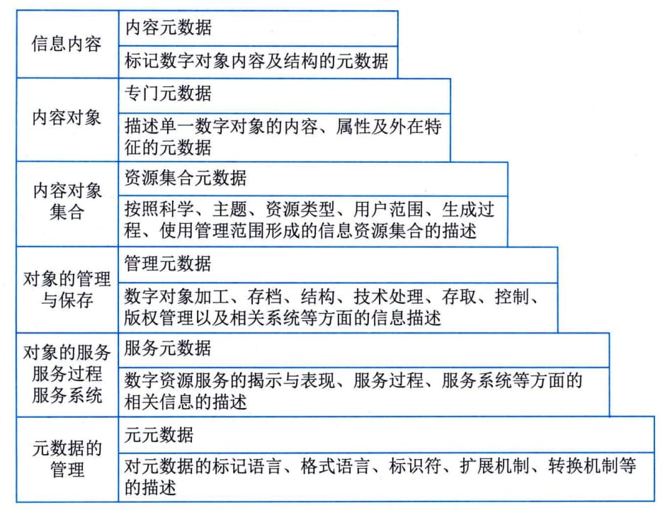
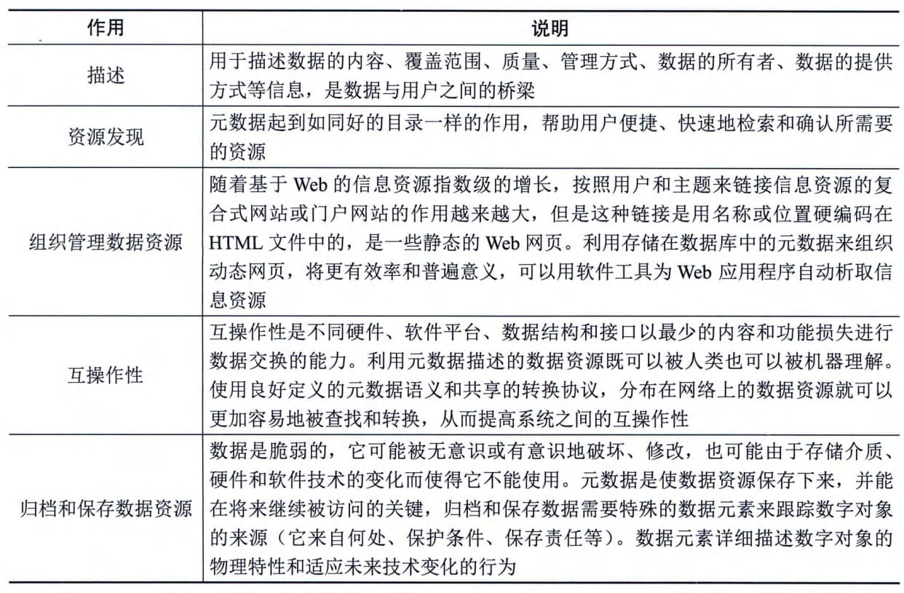

### 6.3.1 元数据
简单来说，元数据是关于数据的数据（Data About
Data）。在信息技术及其服务行业，元数据往往被定义为提供关于信息资源或数据的一种结构化数据，是对信息资源的结构化描述。其实质是用于描述信息资源或数据的内容、覆盖范围、质量、管理方式、数据的所有者、数据的提供方式等有关的信息。
#### **1．信息对象**
元数据描述的对象可以是单一的全文、目录、图像、数值型数据以及多媒体（声音、动态图像）等，也可以是多个单一数据资源组成的资源集合，或是这些资源的生产、加工、使用、管理、技术处理、保存等过程及其过程中产生的参数的描述等。
#### **2．元数据体系**
根据信息对象从产生到服务的生命周期中，元数据描述和管理内容的不同以及元数据作用的不同，可以将元数据分为多种类型，从最基本的资源内容描述元数据开始，到指导描述元数据的元元数据，形成了一个层次分明、结构开放的元数据体系，如图6-3所示。
图6-3元数据体系与元数据类型
元数据为数据的管理、发现和获取提供了一种实际而简便的方法。通过元数据，数据的使用者能够对数据进行详细、深入的了解，包括数据的格式、质量、处理方法和获取方法等各方面细节，可以利用元数据进行数据维护、历史资料维护等，具体作用包括描述、资源发现、组织管理数据资源、互操作性、归档和保存数据资源等，如表6-5所示。
**表6-5元数据对数据使用者的作用说明**
