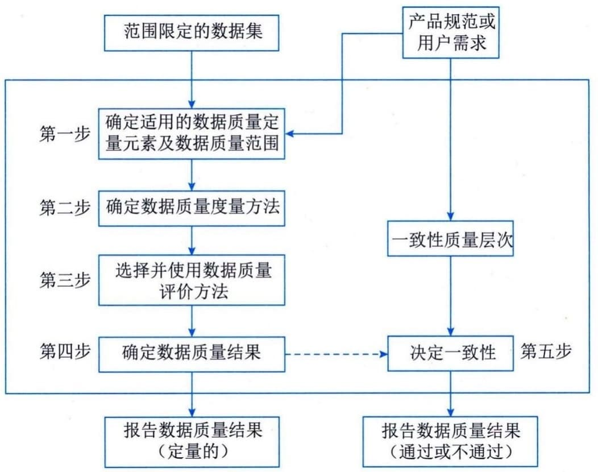

### 6.3.3 数据质量
数据质量指在特定的业务环境下，数据满足业务运行、管理与决策的程度，是保证数据应用效果的基础。数据质量管理是指运用相关技术来衡量、提高和确保数据质量的规划、实施与控制等一系列活动。衡量数据质量的指标体系包括完整性、规范性、一致性、准确性、唯一性、及时性等。数据质量是一个广义的概念，是数据产品满足指标、状态和要求能力的特征总和。
 - （1）数据质量描述。数据质量可以通过数据质量元素来描述，数据质量元素分为数据质量定量元素和数据质量非定量元素。
 - （2）数据质量评价过程。数据质量评价过程是产生和报告数据质量结果的一系列步骤，如图6-4所示描述了数据质量评价过程。

图6-4 数据质量评价过程
 - （3）数据质量评价方法。数据质量评价程序是通过应用一个或多个数据质量评价方法来完成的。数据质量评价方法分为直接评价法和间接评价法。直接评价法通过将数据与内部或外部的参照信息（如理论值等）进行对比来确定数据质量，间接评价法利用数据相关信息（如对数据源、采集方法等的描述）推断或评估数据质量。
 - （4）数据质量控制。数据产品的质量控制分成前期控制和后期控制两大部分。前期控制包括数据录入前的质量控制、数据录入过程中的实时质量控制；后期控制为数据录入完成后的后处理质量控制与评价。
在数据质量的前期控制中，在提交成果（即数据入库）之前对所获得的原始数据与完成的工作进行检查，进一步发现和改正错误；在数据质量管理过程中，通过减少和消除误差和错误，对数据在录入过程中进行属性的数据质量控制；在数据入库后进行系统检测，设计检测模板，利用检测程序进行系统自检；在数据存储管理中，可以通过各种精度评价方法进行精度分析，为用户提供可靠的数据质量。
