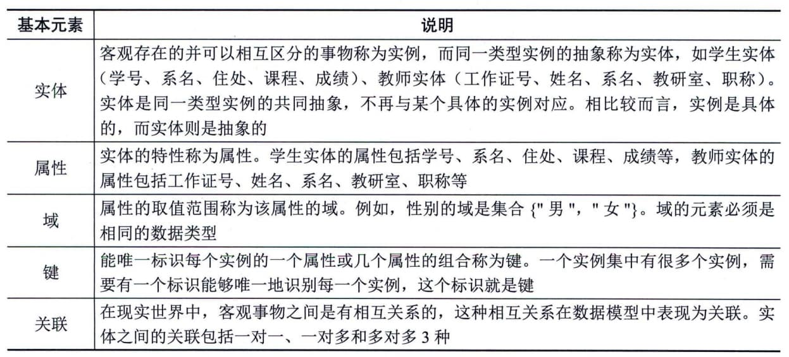
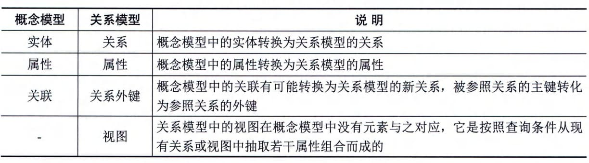

### 6.3.4 数据模型
数据模型是指现实世界数据特征的抽象，用于描述一组数据的概念和定义，是用来将数据需求从业务传递到需求分析，以及从分析师、建模师和架构师传递到数据库设计人员和开发人员的主要媒介。根据模型应用的目的不同，可以将数据模型划分为3类：概念模型、逻辑模型和物理模型。
#### **1．概念模型**
概念模型也称为信息模型，它是按用户的观点来对数据和信息建模，也就是说，把现实世界中的客观对象抽象为某一种信息结构，这种信息结构不依赖于具体的计算机系统，也不对应某个具体的数据库管理系统（Database
Management
System，DBMS），它是概念级别的模型。概念模型的基本元素如表6-6所示。
**表6-6
概念模型基本元素说明**
#### **2．逻辑模型**
逻辑模型是在概念模型的基础上确定模型的数据结构，目前主要的逻辑模型有层次模型、网状模型、关系模型、面向对象模型和对象关系模型。其中，关系模型是目前最重要的一种逻辑数据模型。关系模型的基本元素包括关系、关系的属性、视图等。关系模型是在概念模型的基础上构建的，因此关系模型的基本元素与概念模型中的基本元素存在一定的对应关系，具体如表6-7所示。
**表6-7
关系模型与概念模型的对应关系**
关系模型的数据操作主要包括查询、插入、删除和更新数据，这些操作必须满足关系的完整性约束条件。关系的完整性约束包括三大类型：实体完整性、参照完整性和用户定义的完整性。其中，实体完整性、参照完整性是关系模型必须满足的完整性约束条件，用户定义的完整性是应用领域需要遵照的约束条件，体现了具体领域中的语义约束。
#### **3．物理模型**
物理模型是在逻辑模型的基础上，考虑各种具体的技术实现因素，进行数据库体系结构设计，真正实现数据在数据库中的存放。物理模型的内容包括确定所有的表和列，定义外键用于确定表之间的关系，基于性能的需求可能进行反规范化处理等。在物理实现上的考虑，可能会导致物理模型和逻辑模型有较大的不同。物理模型的目标是用数据库模式来实现逻辑模型，以及真正地保存数据。物理模型的基本元素包括表、字段、视图、索引、存储过程、触发器等，其中表、字段和视图等元素与逻辑模型中的基本元素有一定的对应关系。
