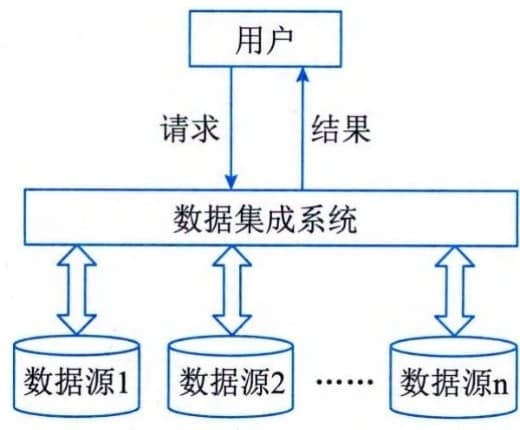
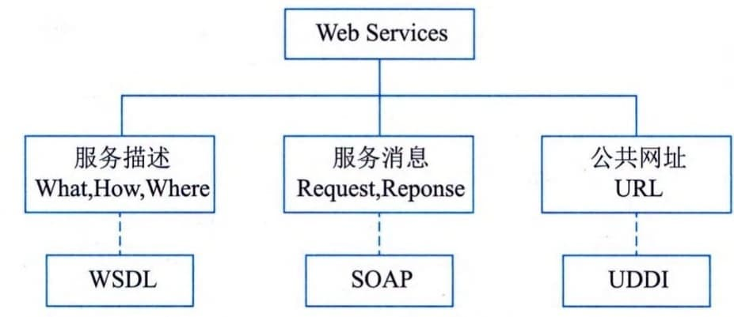

### 6.5.1 数据集成
数据集成就是将驻留在不同数据源中的数据进行整合，向用户提供统一的数据视图，使得用户能以透明的方式访问数据。其中，"数据源"主要是指不同类别的DBMS，以及各类XML
文档、HTML文档、电子邮件、普通文件等结构化、半结构化和非结构化数据。这些数据源具有存储位置分散、数据类型异构、数据库产品多样等特点。
数据集成的目标就是充分利用已有数据，在尽量保持其自治性的前提下，维护数据源整体上的一致性，提高数据共享利用效率。实现数据集成的系统称为数据集成系统，它为用户提供了统一的数据源访问接口，用于执行用户对数据源的访问请求。典型的数据集成系统模型如图6-5所示。
 - （1）数据集成方法。数据集成的常用方法有模式集成、复制集成和混合集成，具体描述为：
 - ·模式集成：也叫虚拟视图方法，是人们最早采用的数据集成方法，也是其他数据集成方法的基础。
图6-5 数据集成系统模型

其基本思想是：在构建集成系统时，将各数据源共享的视图集成为全局模式（GlobalSchema），供用户透明地访问各数据源的数据。全局模式描述了数据源共享数据的结构、语义和操作等，用户可直接向集成系统提交请求，集成系统再将这些请求处理并转换，使之能够在数据源的本地视图上被执行。

 - ·复制集成：将数据源中的数据复制到相关的其他数据源上，并对数据源的整体一致性进行维护，从而提高数据的共享和利用效率。数据复制可以是整个数据源的复制，也可以是仅对变化数据的传播与复制。数据复制的方法可减少用户使用数据集成系统时对异构数据源的访问量，提高系统的性能。

 - ·混合集成：该方法为了提高中间件系统的性能，保留虚拟数据模式视图为用户所用，同时提供数据复制的方法。对于简单的访问请求，通过数据复制方式，在本地或单一数据源上实现访问请求；而对数据复制方式无法实现的复杂的用户请求，则用模式集成方法。
 - （2）数据访问接口。常用的数据访问接口标准有ODBC、JDBC、OLEDB和ADO，具体描述为：
 - · ODBC（Open DatabaseConnectivity）：ODBC是当前被业界广泛接受的、用于数据库访问的应用程序编程接口（API），它以X／Open和ISO／IEC的调用接口规范为基础，并使用结构化查询语言（SQL）作为其数据库访问语言。ODBC由应用程序接口、驱动程序管理器、驱动程序和数据源4个组件组成。·JDBC（Java DatabaseConnectivity）：JDBC是用于执行SQL语句的Java应用程序接口，它由Java语言编写的类和接口组成。JDBC是一种规范，其宗旨是各数据库开发商为Java程序提供标准的数据库访问类和接口。使用JDBC能够方便地向任何关系数据库发送SQL语句。同时，采用Java语言编写的程序不必为不同的系统平台、不同的数据库系统开发不同的应用程序。

 - · OLE DB （Object Linking and Embedding Database） ：OLEDB是一个基于组件对象模型（Component ObjectModel，COM）的数据存储对象，能提供对所有类型数据的操作，甚至能在离线的情况下存取数据。
 - · ADO （ActiveX DataObjects）：ADO是应用层的接口，它的应用场合非常广泛，不仅可用在VC、VB、Delphi等高级编程语言环境，还可用在Web开发等领域。ADO使用简单，易于学习，已成为常用的实现数据访问的主要手段之一。ADO是COM自动接口，几乎所有数据库工具、应用程序开发环境和脚本语言都可以访问这种接口。
 - （3）Web Services技术。Web Services
技术是一个面向访问的分布式计算模型，是实现Web
数据和信息集成的有效机制。它的本质是用一种标准化方式实现不同服务系统之间的互调或集成。它基于XML、SOAP（Simple
Object Access Protocol，简单对象访问协议）、WSDL（Web Services
Description
Language，Web服务描述语言）和UDDI（UniversalDescription，Discovery，and
Integration，统一描述、发现和集成协议规范）等协议，开发、发布、发现和调用跨平台、跨系统的各种分布式应用。其三要素WSDL、SOAP和UDDI及其组成如图6-6所示。

图6-6 Web Services的3个组成部分
 - · WSDL：WSDL是一种基于XML格式的关于Web服务的描述语言，主要目的在于Web
> Services的提供者将自己的Web服务的所有相关内容（如所提供的服务的传输方式、服务方法接口、接口参数、服务路径等）生成相应的文档，发布给使用者。使用者可以通过这个WSDL文档，创建相应的SOAP请求（request）消息，通过HTTP传递给
> Web Services
> 提供者；Web服务在完成服务请求后，将SOAP返回（response）消息传回请求者，服务请求者再根据WSDL文档将SOAP返回消息解析成自己能够理解的内容。

 - ·SOAP：SOAP是消息传递的协议，它规定了Web
> Services之间是怎样传递信息的。简单地说，SOAP规定了：①传递信息的格式为XML，这就使Web
> Services
> 能够在任何平台上，用任何语言进行实现；②远程对象方法调用的格式，规定了怎样表示被调用对象以及调用的方法名称和参数类型等；③参数类型和XML格式之间的映射，这是因为，被调用的方法有时候需要传递一个复杂的参数，怎样用XML来表示一个对象参数，也是SOAP所定义的范围；④异常处理以及其他的相关信息。

 - ·UDDI：UDDI是一种创建注册服务的规范。简单地说，UDDI用于集中存放和查找WSDL描述文件，起着目录服务器的作用，以便服务提供者注册发布Web
> [S]{.underline}ervices，供使用者查找。
 - （4）数据网格技术。数据网格是一种用于大型数据集的分布式管理与分析的体系结构，目标是实现对分布、异构的海量数据进行一体化存储、管理、访问、传输与服务，为用户提供数据访问接口和共享机制，统一、透明地访问和操作各个分布、异构的数据资源，提供管理、访问各种存储系统的方法，解决应用所面临的数据密集型网格计算问题。数据网格的透明性体现为：
 - · 分布透明性：用户感觉不到数据是分布在不同的地方的；
 - · 异构透明性：用户感觉不到数据的异构性，感觉不到数据存储方式的不同、数据格式的不同、数据管理系统的不同等；
 - · 数据位置透明性：用户不用知道数据源的具体位置，也没有必要了解数据源的具体位置；
 - · 数据访问方式透明性：不同系统的数据访问方式不同，但访问结果相同。
