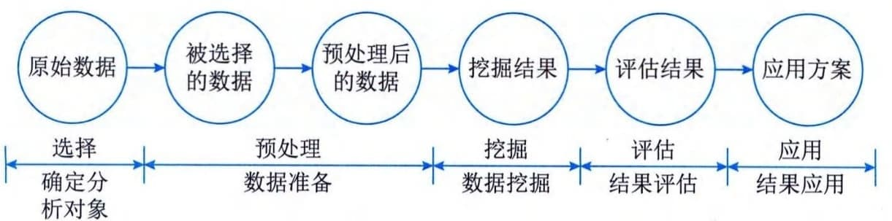

### 6.5.2 数据挖掘
数据挖掘是指从大量数据中提取或"挖掘"知识，即从大量的、不完全的、有噪声的、模糊的、随机的实际数据中，提取隐含在其中的、人们不知道的、却是潜在有用的知识，它把人们从对数据的低层次的简单查询，提升到从数据库挖掘知识，提供决策支持的高度。数据挖掘是一门交叉学科，其过程涉及数据库、人工智能、数理统计、可视化、并行计算等多种技术。
数据挖掘与传统数据分析存在较大的不同，主要表现在以下4个方面。
 - （1）两者分析对象的数据量有差异。数据挖掘所需的数据量比传统数据分析所需的数据量大。数据量越大，数据挖掘的效果越好。
 - （2）两者运用的分析方法有差异。传统数据分析主要运用统计学的方法手段对数据进行分析；而数据挖掘综合运用数据统计、人工智能、可视化等技术对数据进行分析。
 - （3）两者分析侧重有差异。传统数据分析通常是回顾型和验证型的，通常分析已经发生了什么；而数据挖掘通常是预测型和发现型的，预测未来的情况，解释发生的原因。
 - （4）两者成熟度不同。传统数据分析由于研究较早，其分析方法相当成熟；而数据挖掘除基于统计学等方法外，部分方法仍处于发展阶段。
数据挖掘的目标是发现隐藏于数据之后的规律或数据间的关系，从而服务于决策。数据挖掘常见的主要任务包括数据总结、关联分析、分类和预测、聚类分析和孤立点分析。
 - （1）数据总结。数据总结的目的是对数据进行浓缩，给出它的总体综合描述。通过对数据的总结，将数据从较低的个体层次抽象总结到较高的总体层次上，从而实现对原始数据的总体把握。传统的、也是最简单的数据总结方法是利用统计学中的方法计算出各个数据项的和值、均值、方差、最大值、最小值等基本描述统计量，还可以利用统计图形工具，对数据制作直方图、散点图等。
 - （2）关联分析。数据库中的数据一般都存在着关联关系，也就是说，两个或多个变量的取值之间存在某种规律性。关联分析就是找出数据库中隐藏的关联网，描述一组数据项的密切度或关系。有时并不知道数据库中数据的关联是否存在精确的关联函数，即使知道也是不确定的，因此关联分析生成的规则带有置信度，置信度度量了关联规则的强度。
 - （3）分类和预测。使用一个分类函数或分类模型（也常称作分类器），根据数据的属性将数据分派到不同的组中，即分析数据的各种属性，并找出数据的属性模型，确定哪些数据属于哪些组，这样就可以利用该模型来分析已有数据，并预测新数据将属于哪个组。
 - （4）聚类分析。当要分析的数据缺乏描述信息，或者无法组织成任何分类模型时，可以采用聚类分析。聚类分析是按照某种相近程度度量方法，将数据分成一系列有意义的子集合，每一个集合中的数据性质相近，不同集合之间的数据性质相差较大。统计方法中的聚类分析是实现聚类的一种手段，它主要研究基于几何距离的聚类。人工智能中的聚类是基于概念描述的。概念描述就是对某类对象的内源进行描述，并概括这类对象的有关特征。概念描述又分为特征性描述和区别性描述，前者描述某类对象的共同特征，后者描述非同类对象之间的区别。
 - （5）孤立点分析。数据库中的数据常有一些异常记录，与其他记录存在着偏差。孤立点分析（或称为离群点分析）就是从数据库中检测出偏差。偏差包括很多潜在的信息，如分类中的反常实例、不满足规则的特例、观测结果与模型预测值的偏差等。
数据挖掘流程一般包括确定分析对象、数据准备、数据挖掘、结果评估与结果应用5个阶段，如图6-7所示，这些阶段在具体实施中可能需要重复多次。为完成这些阶段的任务，需要不同专业人员参与其中，专业人员主要包括业务分析人员、数据挖掘人员和数据管理人员。

图6-7 数据挖掘流程图
 - （1）确定分析对象。定义清晰的挖掘对象，认清数据挖掘的目标是数据挖掘的第一步。数据挖掘的最后结果往往是不可预测的，但要探索的问题应该是可预见、有目标的。在开始数据挖掘之前，最基础的就是理解数据和实际的业务问题，对目标有明确的定义。
 - （2）数据准备。数据准备是保证数据挖掘得以成功的先决条件，数据准备在整个数据挖掘过程中占有重要比重。数据准备包括数据选择和数据预处理，具体描述为：
 - ·数据选择：在确定挖掘对象之后，搜索所有与挖掘对象有关的内部和外部数据，从中选出适合于数据挖掘的部分。

 - ·数据预处理：选择后的数据通常不完整、有噪声且不一致，这就需要对数据进行预处理。数据预处理包括数据清理、数据集成、数据变换和数据归约。
 - （3）数据挖掘。数据挖掘是指运用各种方法对预处理后的数据进行挖掘。然而任何一种数据挖掘算法，不管是统计分析方法、神经网络，还是遗传算法，都不是万能的。不同的社会或商业问题，需要用不同的方法去解决。即使对于同一个社会或商业问题，也可能有多种算法。这个时候就需要运用不同的算法，构建不同的挖掘模型，并对各种挖掘模型进行评估。数据挖掘过程细分为模型构建过程和挖掘处理过程，具体描述为：
 - ·模型构建：挖掘模型是针对数据挖掘算法而构建的。建立一个真正适合挖掘算法的挖掘模型是数据挖掘成功的关键。模型的构建可通过选择变量、从原始数据中构建新的预示值、基于数据子集或样本构建模型、转换变量等步骤来实现。

 - ·挖掘处理：挖掘处理是对所得到的经过转化的数据进行挖掘，除了完善与选择合适的算法需要人工干预外，其余工作都可由分析工具自动完成。
 - （4）结果评估。当数据挖掘出现结果后，要对结果进行解释和评估。具体的解释与评估方法一般根据数据挖掘操作结果所制定的决策成败来定，但是管理决策分析人员在使用数据挖掘结果之前，希望能够对挖掘结果进行评价，以保证数据挖掘结果在实际应用中的成功率。
 - （5）结果应用。数据挖掘的结果经过决策人员的许可，才能实际运用，以指导实践。将通过数据挖掘得出的预测模式和各个领域的专家知识结合在一起，构成一个可供不同类型的人使用的应用程序。也只有通过对分析知识的应用，才能对数据挖掘的成果做出正确的评价。
