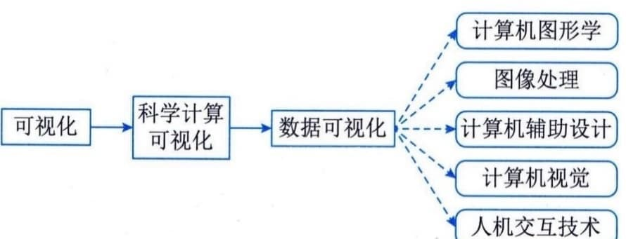
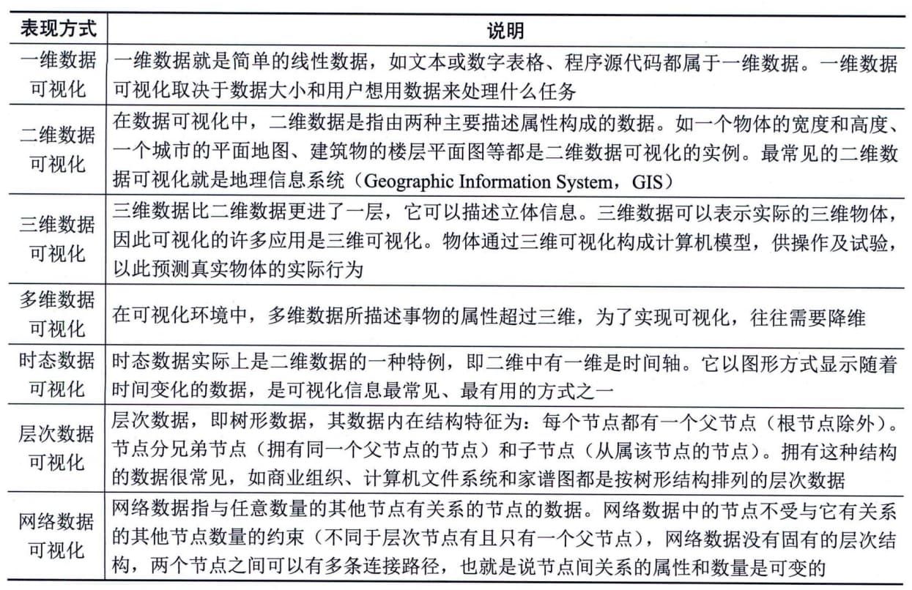

### 6.5.4 数据可视化
数据可视化（Data
Visualization）的概念来自科学计算可视化。数据可视化主要运用计算机图形学和图像处理技术，将数据转换成图形或图像在屏幕上显示出来，并能进行交互处理，它涉及计算机图形学、图像处理、计算机辅助设计、计算机视觉及人机交互技术等多个领域，是一门综合性的学科，具体如图6-8所示。

图6-8 数据可视化
由于所要展现数据的内容和角度不同，可视化的表现方式也多种多样，主要可分为7类：一维数据可视化、二维数据可视化、三维数据可视化、多维数据可视化、时态数据可视化、层次数据可视化和网络数据可视化。具体如表6-8所示。
**表6-8
常见数据可视化表现方式**
