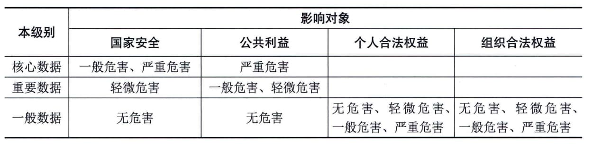

### 6.6.3 数据分级
数据分级是指按照数据遭到破坏（包括攻击、泄露、篡改、非法使用等）后对国家安全、社会秩序、公共利益以及公民、法人和其他组织的合法权益（受侵害客体）的危害程度，对数据进行定级，主要是为数据全生命周期管理进行的安全策略制定。
数据分级常用的分级维度有按特性分级、基于价值（公开、内部、重要核心等）、基于敏感程度（公开、秘密、机密、绝密等）、基于司法影响范围（境内、跨区、跨境等）等。
从国家数据安全角度出发，数据分级基本框架分为一般数据、重要数据、核心数据3个级别，如表6-9所示。数据处理者可在基本框架定级的基础上，结合行业数据分类分级规则或组织生产经营需求，考虑影响对象、影响程度两个要素进行分级。
**表6-9
数据分级参考表**
