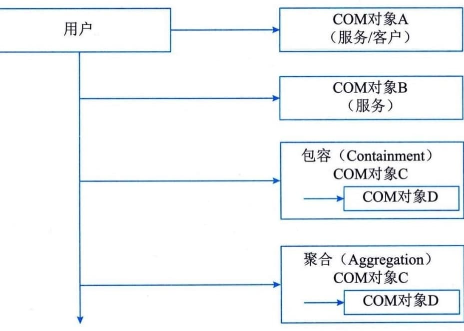
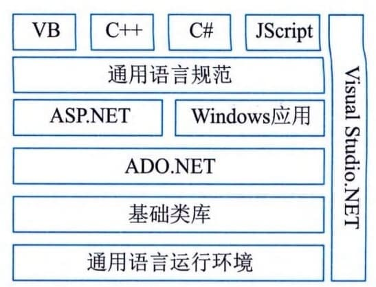

### 7.3.2 应用软件集成
随着软件工程面向对象技术和网络技术的发展，信息系统开发环境也逐步体现出从结构化到面向对象、从集中到分布、从同构到异构、从独立到集成、从辅助到智能、从异步到协同的发展趋势。应用系统的开发已从以单机为中心逐步过渡到以网络环境为中心，成千上万台个人计算机与工作站已变成全球共享的庞大的计算机信息资源。开放系统可让用户透明地应用由不同厂商制造的不同硬件平台、不同操作系统组成的异构型计算资源，在千差万别的信息资源（异构的、网络的、物理性能差别很大的、不同厂商和不同语言的信息资源）的基础上构造起信息共享的分布式系统。面对这样的趋势，必须对面向对象技术进行改进和扩展，使之符合异构网络应用的要求。就用户来说，这种软件构件能够"即插即用"，即能从所提供的对象构件库中获得合适的构件并重用；就供应商来说，这种软件构件便于用户裁剪、维护和重用。当然，应用软件集成还包括对应用软件本身上线运行的性能进行持续优化。由此可见，应用软件集成就是指，根据软件需求，把现有软件构件重新组合，以较低的成本、较高的效率实现目的要求的技术和集成方法。基于此，应用软件系统之间的集成和整合势在必行。应用软件系统集成和整合的常见方式有软件系统间以接口方式相互调用、软件系统功能完全融合在一个系统中、软件系统之间使用单点登录等，被产业界公认的解决应用集成的最佳方式是S[O]{.underline}A。应用软件系统集成的功能通常包括界面集成、功能集成、接口集成以及系统对应的数据集成等。
应用系统的组件化将大而全的软件分解成很多小部分，每一小部分和其他部分都是松耦合的关系。信息在应用内的组件之间的流动要非常高效，否则工作的体验和生产效率就会受到影响。因此，集成工作者做了大量工作，致力于改进组件间信息的交换。在应用软件集成领域，移动和移动工作的巨大作用鼓励越来越多的应用系统组件化。应用系统组件化的一大驱动因素是组件重用，从一个通用组件集构建出多个应用。根据业务和信息发展需要，要在应用间重用组件，应用本身的壁垒被打破，应用集成和组件集成成为趋势。组件集成工具，比如服务和消息总线或服务数据定义语言，也能够用来集成应用程序。
当前，云计算和虚拟化已经打破了应用程序或者组件和服务器资源之间的传统壁垒。服务器已经是资源池的一部分，一些服务器甚至可能在组织外的公有云上。任何功能都可能运行在任何地方，因此需要记录下来它到底在哪里运行，这样其他组件才能够找到它。以动态方式部署应用意味着在部署组件之间提供动态的链接。
应用集成随着应用开发的进化在不停演变，促使应用集成也在持续改进。敏捷运营创建出了新工具集的需求，并且这些工具已经进化为更为复杂的编排工具，来部署并且链接运行在资源池上的应用和组件。这些工具随着进化和改进，吸收了曾经是应用集成传统部分的功能。
在软件集成的大背景下，出现了有代表性的软件构件标准，如公共对象请求代理结构（Common
Object Request Broker
Architecture，CORBA）、COM、DCOM与COM＋、NET、J2EE应用架构等标准。
#### **1.CORBA**
对象管理组织（Object Management
Group，OMG）是CORBA规范的制定者，是由800多个信息系统供应商、软件开发者和用户共同构成的国际组织，建立于1989年。OMG在理论上和实践上促进了面向对象软件的发展。OMG的目的则是将对象和分布式系统技术集成为一个可相互操作的统一结构，此结构既支持现有的平台，也将支持未来的平台集成。以CORBA为基础，利用JINI技术，可以结合各类电子产品成为网络上的服务资源，使应用集成走向更广阔的应用领域，同时Object
Web把CORBA的技术带入了Internet世界。CORBA是OMG进行标准化分布式对象计算的基础。CORBA自动匹配许多公共网络任务，例如对象登记、定位、激活、多路请求、组帧和错误控制、参数编排和反编排、操作分配等。CORBA具有以下功能：
 - （1）对象请求代理（Object Request
Broker，ORB）。在CORBA中，各个模块的相互作用都是通过对象请求代理完成的。ORB的作用是把用户发出的请求传给目标对象，并把目标对象的执行结果返回给发出请求的用户。因此，ORB是以对象请求的方式实现应用互操作的构架，它提供了用户与目标对象间的交互透明性，是人们能够有效使用面向对象方法开发分布式应用的基础，而ORB是整个参考模型的核心。
 - （2）对象服务。CORBA对象服务扩展了基本的CORBA体系结构。它的对象服务代表了一组预先实现的、软件开发商通常需要的分布式对象，其接口与具体应用领域无关，所有分布式对象程序都可以使用。目前CORBA共规范定义了15种服务，如名录服务（Naming
Service）、事件服务（Event Service）、生命周期服务（Life Cycle
Service）、关系服务（Relationship Service）以及事务服务（Transaction
Service）等。
 - （3）公共功能（Common
Facility）。公共功能与对象服务的基本功能类似，只是公共功能是面向最终用户的应用。例如，分布式文档组件功能（基于OpenDoc的组件文档公共功能）就是公共功能的一个例子。
 - （4）域接口（Domain
Interface）。提供与对象服务和公共功能相似的接口，但这些接口是面向特定应用领域的。这些领域包括制造业、电信、医药和金融业等。
 - （5）应用接口（Application Interface）。提供给应用程序开发的接口。
目前，CORBA规范本身还处于不断发展的过程中，随着与其他相关技术的结合，CORBA
将能够为应用开发提供功能更强大的服务。
#### **2.COM**
COM中的对象是一种二进制代码对象，其代码形式是DLL或EXE执行代码。COM中的对象都被直接注册在Windows的系统库中，所以，COM中的对象都不再是由特定的编程语言及其程序设计环境所支持的对象，而是由系统平台直接支持的对象。COM对象可能由各种编程语言实现，并为各种编程语言所引用。COM对象作为某个应用程序的构成单元，不但可以作为该应用程序中的其他部分，而且可以单独地为其他应用程序系统提供服务。
COM技术要达到的基本目标是：即使对象是由不同的开发人员用不同的编程语言实现的，在开发软件系统时，仍能够有效地利用已经存在于其他已有软件系统中的对象，同时，也要使当前所开发的对象便于今后开发其他软件系统时进行重用。
为了实现与编程语言的无关性，将COM对象制作成二进制可执行代码，然后在二进制代码层使用这种标准接口的统一方式，为对象提供标准的互操作接口，并且由系统平台直接对COM对象的管理与使用提供支持。COM具备了软件集成所需要的许多特征，包括面向对象、客户机／服务器、语言无关性、进程透明性和可重用性。
 - （1）面向对象。COM是在面向对象的基础上发展起来的。它继承了对象的所有优点，并在实现上进行了进一步的扩充。
 - （2）客户机／服务器。COM以客户机／服务器（C／S）模型为基础，且具有非常好的灵活性，如图7-1所示。

图7-1 在COM应用中的C／S计算模型
 - （3）语言无关性。COM规范的定义不依赖于特定的语言，因此，编写构件对象所使用的语言与编写用户程序使用的语言可以不同，只要它们都能够生成符合COM规范的可执行代码即可。
 - （4）进程透明性。COM提供了3种类型的构件对象服务程序，即进程内服务程序、本地服务程序和远程服务程序。
 - （5）可重用性。可重用性是任何对象模型的实现目标，尤其对于大型的软件系统，可重用性非常重要，它使复杂的系统简化为一些简单的对象模型，体现了面向对象的思想。COM用两种机制（包容和聚合）来实现对象的重用。对于COM对象的用户程序来说，它只是通过接口使用对象提供的服务，并不需要关心对象内部的实现过程。
#### **3．DCOM与COM＋**
DCOM作为COM的扩展，不仅继承了COM的优点，而且针对分布环境提供了一些新的特性，如位置透明性、网络安全性、跨平台调用等。DCOM实际上是对用户调用进程外服务的一种改进，通过RPC协议，使用户通过网络可以以透明的方式调用远程机器上的远程服务。在调用的过程中，用户并不是直接调用远程机器上的远程服务，而是首先在本地机器上建立一个远程服务代理，通过RPC协议，调用远程服务机器上的存根（stub），由存根来解析用户的调用以映射到远程服务的方法或属性上。
COM＋为COM的新发展或COM更高层次上的应用，其底层结构仍然以COM为基础，几乎包容了COM的所有内容。COM＋倡导了一种新的概念，它把COM组件软件提升到应用层而不再是底层的软件结构，通过操作系统的各种支持，使组件对象模型建立在应用层上，把所有组件的底层细节留给操作系统。因此，COM＋与操作系统的结合更加紧密。COM＋的主要特性包括：真正的异步通信、事件服务、可伸缩性、继承并发展了MTS的特性、可管理和可配置性、易于开发等。
 - （1）真正的异步通信。COM＋底层提供了队列组件服务，这使用户和组件有可能在不同的时间点上协同工作，COM＋应用无须增加代码就可以获得这样的特性。
 - （2）事件服务。新的事件机制使事件源和事件接收方实现事件功能更加灵活，利用系统服务简化了事件模型，避免了COM可连接对象机制的琐碎细节。
 - （3）可伸缩性。COM＋的可伸缩性来源于多个方面，动态负载平衡以及内存数据库、对象池等系统服务都为COM＋的可伸缩性提供了技术基础。COM＋的可伸缩性原理上与多层结构的可伸缩特性一致。
 - （4）继承并发展了MTS的特性。从COM到MTS是一个概念上的飞跃，但实现上还欠成熟，COM＋则完善并实现了MTS的许多概念和特性。
 - （5）可管理和可配置性。管理和配置是应用系统开发完成后的行为，在软件维护成本不断增加的今天，COM＋应用将有助于软件厂商和用户减少这方面的投入。
 - （6）易于开发。COM＋应用开发的复杂性和难易程度将决定COM＋的成功与否，虽然COM＋开发模型比以前的COM组件开发更为简化，但真正提高开发效率仍需要借助于一些优秀的开发工具。
COM＋标志着组件技术达到了一个新的高度，它不再局限于一台机器上的桌面系统，而把目标指向了更为广阔的组织内部网，甚至互联网。COM＋与多层结构模型，以及Windows操作系统为组织应用或Web应用提供了一套完整的解决方案。
#### **4..NET**
.NET是基于一组开放的互联网协议推出的一系列的产品、技术和服务。NET开发框架在通用语言运行环境的基础上，给开发人员提供了完善的基础类库、数据库访问技术及网络开发技术，开发者可以使用多种语言快速构建网络应用。．NET开发框架如图7-2所示。
图7-2 ．NET开发框架
 - （1）通用语言运行环境（Common Language
Runtime，CLR）处于.NET开发框架的底层，是该框架的基础，它为多种语言提供了统一的运行环境、统一的编程模型，大大简化了应用程序的发布和升级、多种语言之间的交互、内存和资源的自动管理等。
 - （2）基础类库（Base Class
Library，BCL）给开发人员提供了一个统一的、面向对象的、层次化的、可扩展的编程接口，使开发人员能够高效、快速地构建基于下一代互联网的应用。
 - （3）ADO．NET技术用于访问数据库，提供了一组用来连接到数据库、运行命令、返回记录集的类库。ADO.NET提供了对XML的强大支持，为XML成为.NET中数据交换的统一格式提供了基础。
 - （4）ASP．NET是．NET中的网络编程结构，可以方便、高效地构建、运行和发布网络应用，ASP.NET
还支持Web服务（Web
Services）。在.NET中，ASP.NET应用不再是解释脚本，而采用编译运行，再加上灵活的缓冲技术，从根本上提高了性能。
#### **5. J2EE**
J2EE架构是使用Java技术开发组织级应用的一种事实上的工业标准，它是Java技术不断适应和促进组织级应用过程中的产物。J2EE为搭建具有可伸缩性、灵活性、易维护性的组织系统提供了良好的机制。J2EE的体系结构可以分为客户端层、服务器端组件层、EJB层和信息系统层。
 - （1）客户端层。本层负责与用户直接交互，J2EE支持多种客户端，所以客户端既可以是Web浏览器，也可以是专用的Java客户端。
 - （2）服务器端组件层。本层是为基于Web的应用服务的，利用J2EE中的JSP与Java
Servlet技术，可以响应客户端的请求，并向后访问封装有商业逻辑的组件。
 - （3）EJB层。本层主要封装了商业逻辑，完成企业计算，提供了事务处理、负载均衡、安全、资源连接等各种基本服务，程序在编写EJB时可以不关心这些基本的服务，集中注意力于业务逻辑的实现。
 - （4）信息系统层。信息系统层包括了组织的现有系统（包括数据库系统、文件系统），J2EE
提供了多种技术以访问这些系统，如JDBC访问DBM[S]{.underline}。
在J2EE规范中，J2EE平台包括一整套的服务、应用编程接口和协议，可用于开发一般的多层应用和基于Web的多层应用，是J2EE的核心和基础。它还提供了对EJB、Java
Servlets API、JSP和XML技术的全面支持等。
