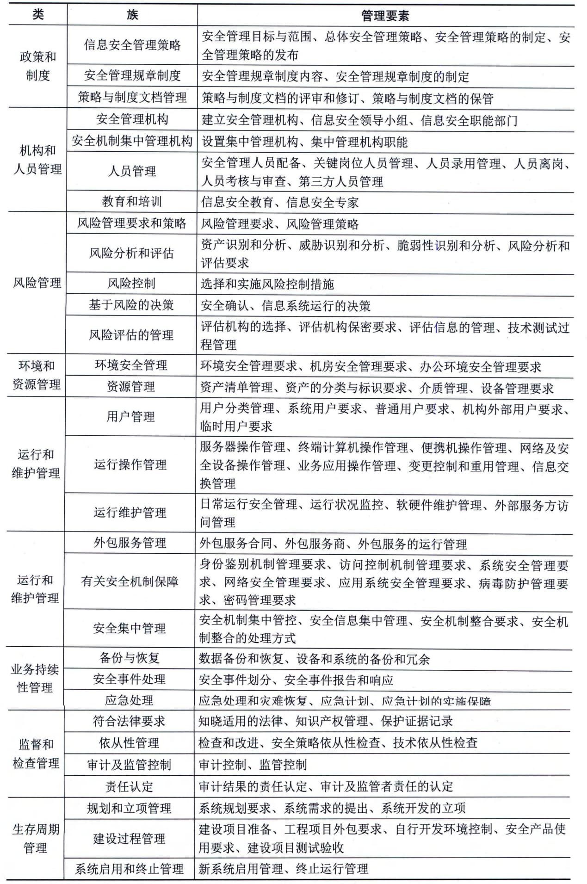

### 8.1.3 管理体系
信息系统安全管理是对一个组织机构中信息系统的生存周期全过程实施符合安全等级责任要求的管理，主要包括：
 - · 落实安全管理机构及安全管理人员，明确角色与职责，制定安全规划；
 - · 开发安全策略；
 - · 实施风险管理；
 - · 制订业务持续性计划和灾难恢复计划；
 - · 选择与实施安全措施；
 - · 保证配置、变更的正确与安全；
 - · 进行安全审计；
 - · 保证维护支持；
 - · 进行监控、检查，处理安全事件；
 - · 安全意识与安全教育；
 - · 人员安全管理等。
在组织机构中应建立安全管理机构，不同安全等级的安全管理机构逐步建立自己的信息系统安全组织机构管理体系，参考步骤包括：①配备安全管理人员。管理层中应有一人分管信息系统安全工作，并为信息系统的安全管理配备专职或兼职的安全管理人员。②建立安全职能部门。建立管理信息系统安全工作的职能部门，或者明确指定一个职能部门监管信息安全工作，并将此项工作作为该部门的关键职责之一。③成立安全领导小组。在管理层成立信息系统安全管理委员会或信息系统安全领导小组，对覆盖全国或跨地区的组织机构，应在总部和下级单位建立各级信息系统安全领导小组，在基层至少要有一位专职的安全管理人员负责信息系统安全工作。④主要负责人出任领导。由组织机构的主要负责人出任信息系统安全领导小组负责人。⑤建立信息安全保密管理部门。建立信息系统安全保密监督管理的职能部门，或对原有保密部门明确信息安全保密管理责任，加强对信息系统安全管理重要过程和管理人员的保密监督管理。
GB／T 20269《信息安全技术
信息系统安全管理要求》提出了对信息系统安全管理体系的要求，其信息系统安全管理要素如表8-1所示。
**表8-1 信息系统安全管理要素一览表**

