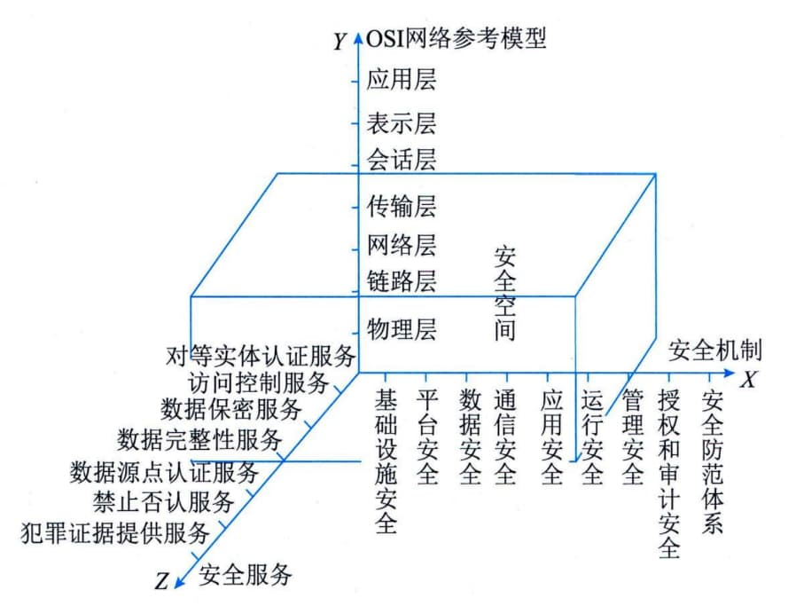

## 8.2 信息安全系统
信息安全保障系统一般简称为信息安全系统，它是"信息系统"的一个部分，用于保证"业务应用信息系统"正常运营。现在人们已经明确，要建立一个"信息系统"，就必须要建立一个或多个业务应用信息系统和一个信息安全系统。信息安全系统是客观的、独立于业务应用信息系统而存在的信息系统。
我们用一个"宏观"三维空间图来反映信息安全系统的体系架构及其组成，如图8-1所示。

图8-1 信息安全系统的体系架构及其组成
X轴是"安全机制"。安全机制可以理解为提供某些安全服务，利用各种安全技术和技巧，所形成的一个较为完善的结构体系。如"平台安全"机制，实际上就是指安全操作系统、安全数据库、应用开发运营的安全平台以及网络安全管理监控系统等。
Y轴是"OSI网络参考模型"。信息安全系统的许多技术、技巧都是在网络的各个层面上实施的，离开网络，信息系统的安全也就失去了意义。
Z轴是"安全服务"。安全服务就是从网络中的各个层次提供给信息应用系统所需要的安全服务支持。如对等实体认证服务、数据完整性服务、数据保密服务等。
由X、Y、Z三个轴形成的信息安全系统三维空间就是信息系统的"安全空间"。随着网络逐层扩展，这个空间不仅范围逐步加大，安全的内涵也更加丰富，具有认证、权限、完整、加密和不可否认五大要素，也叫作"安全空间"的五大属性。
