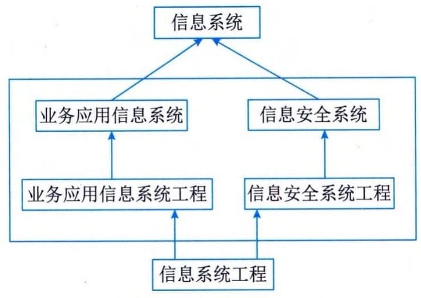
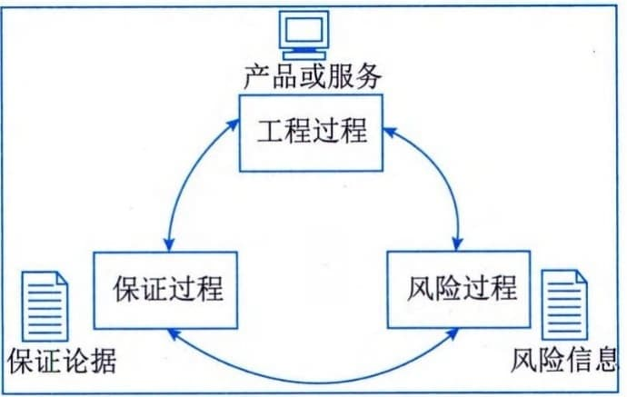
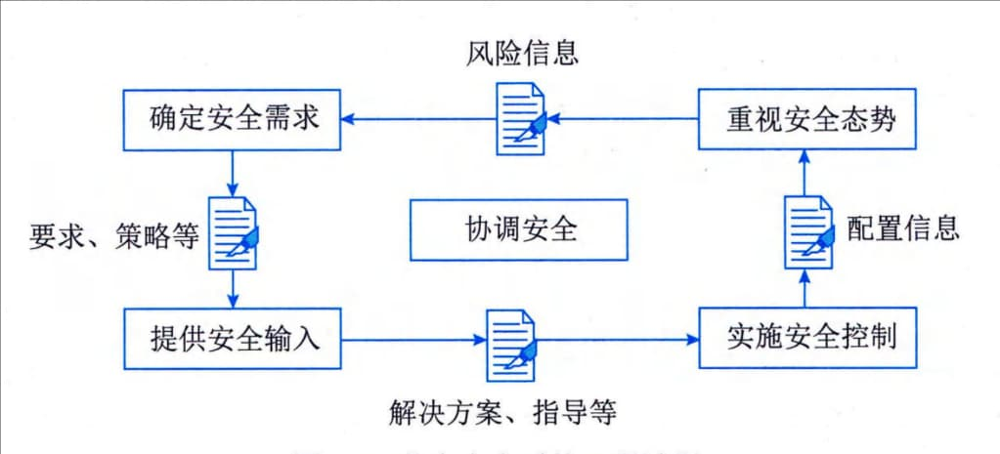
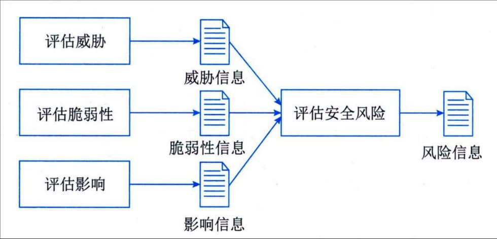
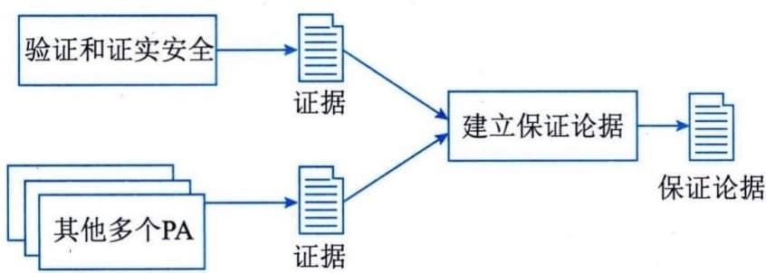

### 8.3.1 安全工程基础
信息安全系统工程就是要建造一个信息安全系统，它是整个信息系统工程的一部分，而且最好是与业务应用信息系统工程同步进行，而它主要是围绕"信息安全"的内容，如信息安全风险评估、信息安全策略制定、信息安全需求确定、信息安全系统总体设计、信息安全系统详细设计、信息安全系统设备选型、信息安全系统工程招投标、密钥密码机制确定、资源界定和授权、信息安全系统施工中需要注意的防泄密问题和施工中后期的信息安全系统测试、运营、维护的安全管理等问题。这些问题与用户的业务应用信息系统建设主要关注的内容完全不同。业务应用信息系统工程主要关注的是客户的需求、业务流程、价值链等的组织业务优化和改造的问题。信息安全系统建设所关注的问题恰恰是业务应用信息系统正常运营所不能缺少的。
为了进一步论述信息安全系统工程，我们需要区分几个术语，并了解它们之间的关系。如图8-2所示为信息系统、业务应用信息系统、信息安全系统、信息系统工程、业务应用信息系统工程、信息安全系统工程以及信息系统安全和信息系统安全工程之间的关系。

图8-2 几个术语之间的关系
信息安全系统服务于业务应用信息系统，并与之密不可分，但两者又不能混为一谈。信息安全系统不能脱离业务应用信息系统而存在，比如，建立国税信息系统、公安信息系统、社保信息系统等，一定包含业务应用信息系统和信息安全系统两个部分。但二者的功能、操作流程、管理方式、人员要求、技术领域等都完全不同。随着信息化的深入，两者的界限也越来越明晰。
业务应用信息系统是支撑业务运营的计算机应用信息系统，如银行柜台业务信息系统、国税征收信息系统等。信息系统工程，即建造信息系统的工程，包括两个独立且不可分割的部分，即信息安全系统工程和业务应用信息系统工程。业务应用信息系统工程就是为了达到建设好业务应用信息系统所组织实施的工程，一般称为信息系统集成项目工程，它是信息系统工程的一部分。
信息安全系统工程是指为了达到建设好信息安全系统的特殊需要而组织实施的工程，它是信息系统工程的一部分。信息安全系统工程作为信息系统工程的一个子集，其安全体系和策0必须遵从系统工程的一般性原则和规律。信息安全系统工程的原理适用于系统和应用的开发、集成、运行、管理、维护和演变，以及产品的开发、交付和演变。这样，信息安全系统工程就能够在一个系统、一个产品或一个服务中得到体现。
我们讲述的是信息安全系统工程，而不是信息系统安全工程。从字面上理解，信息系统安全工程可能会被误解为安全地建设一个信息系统，而忽略了信息系统中的信息安全问题。因为信息系统可以安全地建设成一个没有信息安全子系统的信息系统，目前部分组织仍然存在这样的新建的信息系统-没有考虑信息安全的问题，或没有充分地考虑信息安全的问题，从而留下相当大的隐患。而信息安全系统工程就明白无误地确定了这个工程就是要建设一个信息安全系统。
信息安全系统的建设是在OSI网络参考模型的各个层面进行的，因此信息安全系统工程活动离不开其他相关工程，主要包括硬件工程、软件工程、通信及网络工程、数据存储与灾备工程、系统工程、测试工程、密码工程和组织信息化工程等。
信息安全系统建设是遵从组织所制定的安全策略进行的。而安全策略由组织和组织的客户及服务对象、集成商、安全产品开发者、密码研制单位、独立评估者和其他相关组织共同协商建立。因此，信息安全系统工程活动必须要与其他外部实体进行协调。也正是因为信息安全系统工程存在着这些与其他工程的关系接口，而这些接口又遍布各种组织，且具有相互影响，所以信息安全系统工程与其他工程相比就更加复杂。的脆弱度或敏感性。ISSE并不是一个独立的过程，它依赖并支持系统工程和获取（保证）过程，而且是后者不可分割的一部分。
ISSE过程的目标是提供一个框架，每个工程项目都可以对这个框架进行裁剪以符合自己特定的需求。ISSE表现为直接与系统工程功能和事件相对应的一系列信息安全系统工程行为。ISSE
将信息安全系统工程实施过程分解为工程过程（Engineering
Process）、风险过程（Risk Process）和保证过程（Assurance
Process）3个基本的部分，如图8-3所示。它们相互独立，但又有着有机的联系。粗略地说，在风险过程中，人们识别出所开发的产品或系统风险，并对这些风险进行优先
图8-3 信息安全系统工程实施过程的组成部分
级排序。针对风险所面临的安全问题，信息安全系统工程过程与其他工程一起来确定安全策略和实施解决方案。最后，由安全保证过程建立起解决方案的可信性，并向用户转达这种安全可信性。
#### **1．工程过程**
信息安全系统工程过程与其他工程活动一样，是一个包括概念、设计、实现、测试、部署、运行、维护、退出的完整过程，如图8-4所示。在这个过程中，信息安全系统工程的实施必须紧密地与其他的系统工程组进行合作。ISSE-CMM强调信息安全系统工程是一个大项目队伍中的组成部分，需要与其他科目工程的活动相互协调。这将有助于保证安全成为一个大项目过程中一个部分，而不是一个分离的独立部分。

图8-4 信息安全系统工程过程
使用上面所描述的风险管理过程的信息和关于系统需求、相关法律、政策的其他信息，信息安全系统工程就可以与用户一起来识别安全需求。一旦需求被识别，信息安全系统工程就可以识别和跟踪特定的安全需求。
对于信息安全问题，创建信息安全解决方案一般包括识别可能选择的方案，然后评估决定哪一种更可能被接受。将这个活动与工程过程的其他活动相结合，不但要解决方案的安全问题，还需要考虑成本、性能、技术风险、使用的简易性等因素。
#### **2．风险过程**
信息安全系统工程的一个主要目标是降低信息系统运行的风险。风险就是有害事件发生的可能性及其危害后果。出现不确定因素的可能性取决于各个信息系统的具体情况。这就意味着这种可能性仅可能在某些限制条件下才可预测。此外，对一种具体风险的影响进行评估，必须要考虑各种不确定因素。因此大多数因素是不能被综合起来准确预报的。在很多情况下，不确定因素的影响是很大的，这就使得对安全的规划和判断变得非常困难。
一个有害事件由威胁、脆弱性和影响3个部分组成。脆弱性包括可被威胁利用的资产性质。如果不存在脆弱性和威胁，则不存在有害事件，也就不存在风险。风险管理是调查和量化风险的过程，并建立组织对风险的承受级别，它是安全管理的一个重要部分。风险管理过程如图8-5所示。

图8-5 信息安全系统风险管理过程
安全措施的实施可以减轻风险，但无论如何，不可能消除所有威胁或根除某个具体威胁。这主要是因为消除风险所需的代价，以及与风险相关的各种不确定性。因此，必须接受残留的风险。在存在很大不确定性的情况下，由于风险度量不精确的本质特征，在怎样的程度上接受它才是恰当的，往往会成为很大的问题。ISSE-CMM过程域包括实施组织对威胁、脆弱性、影响和相关风险进行分析的活动保证。
#### **3．保证过程**
保证过程是指安全需求得到满足的可信程度，它是信息安全系统工程非常重要的部分。保证过程如图8-6所示。保证的形式多种多样。ISSE-CMM的可信程度来自于信息安全系统工程实施过程可重复性的结果质量。这种可信性的基础是工程组织的成熟性，成熟的组织比不成熟的组织更可能产生出重复的结果。

图8-6信息安全系统保证过程
安全保证并不能增加任何额外的对安全相关风险的抵抗能力，但它能为减少预期安全风险提供信心。安全保证也可看作安全措施按照需求运行的信心，这种信心来自于措施及其部署的正确性和有效性。正确性保证了安全措施按设计实现了需求，有效性则保证了提供的安全措施可充分地满足用户的安全需求。安全机制的强度也会发挥作用，但其作用却受到保护级别和安全保证程度的制约。
