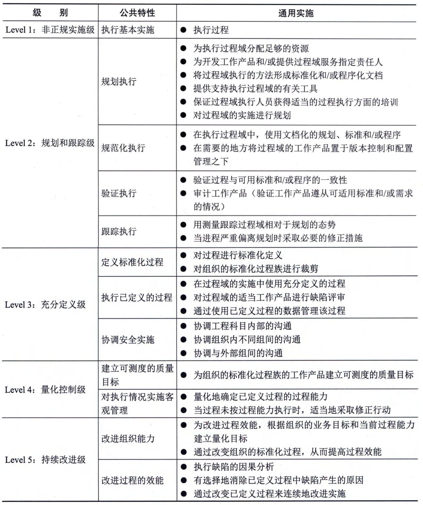
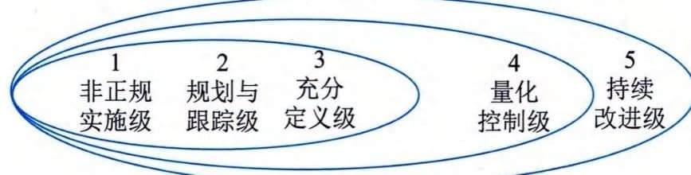
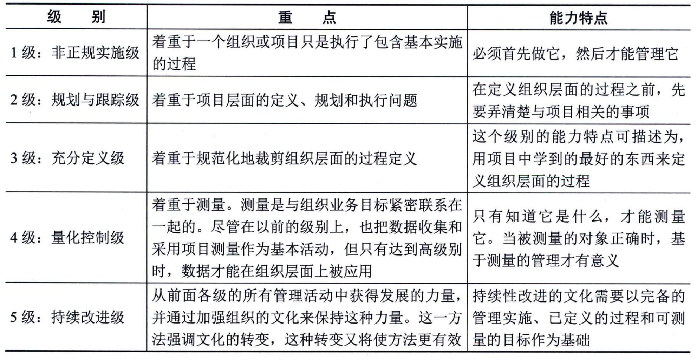

### 8.3.4 ISSE-CM[M]{.underline}体系结构
ISSE-CMM的体系结构可以在整个信息安全系统工程范围内决定信息安全工程组织的成熟性。这个体系结构的目标是落实安全策略，从管理和制度化方面突出信息安全工程的基本特征。为此，该模型采用两维设计，其中的一维是"域"（Domain），另一维是"能力"(Capability)
#### **1．域维／安全工程过程域**
域维汇集了定义信息安全系统工程的所有实施活动，这些实施活动被称为过程域。能力维代表组织能力，它由过程管理能力和制度化能力构成，这些实施活动被称作公共特性，可在广泛的域中应用。执行一个公共特性是一个组织能力的标志。通过设置这两个相互依赖的维，ISSE-CMM在各个能力级别上覆盖了整个信息安全活动范围。
ISSE包括6个基本实施，这些基本实施被组织成11个信息安全工程过程域，这些过程域覆盖了信息安全系统工程的所有主要领域。安全工程过程域的设计是为了满足信息安全工程组织广泛的需求。划分信息安全工程过程域的方法有许多种，典型的做法之一就是将实际的信息安全工程服务模型化，即原型法，以此创建与信息安全工程服务相一致的过程域。其他的方法如识别概念域，它们将识别的这些域形成相应的基本信息安全工程构件模块。每一个过程域包括一组表示组织成功执行过程域的目标，每一个过程域也包括一组集成的基本实施，基本实施定义了获得过程域目标的必要步骤。
一个过程域通常需要满足：
 - · 汇集一个域中的相关活动，以便于使用；
 - · 有关有价值的信息安全工程服务；
 - · 可在整个组织生命周期中应用；
 - · 能在多个组织和多个产品范围内实现；
 - · 能作为一个独立过程进行改进；
 - · 能够由类似过程兴趣组进行改进；
 - · 包括所有需要满足过程域目标的基本实施（Base Practices，BP）。
基本实施的特性包括：
 - · 应用于整个组织生命周期；
 - · 和其他BP互相不覆盖；
 - · 代表安全业界"最好的实施"；
 - · 不是简单地反映当前技术；·可在业务环境下以多种方法使用；
 - · 不指定特定的方法或工具。
由基本实施组成的11个安全工程过程域包括：PA01实施安全控制、PA02评估影响、PA03评估安全风险、PA04评估威胁、PA05评估脆弱性、PA06建立保证论据、PA07协调安全、PA08监控安全态、PA09提供安全输入、PA10确定安全需求、PA11验证和证实安全。
ISSE-CMM还包括11个与项目和组织实施有关的过程域：PA12保证质量、PA13管理配置、PA14管理项目风险、PA15监测和控制技术工程项目、PA16规划技术工程项目、PA17定义组织的系统工程过程、PA18改进组织的系统工程过程、PA19管理产品线的演变、PA20管理系统工程支持环境、PA21提供不断更新的技能和知识、PA22与供应商的协调。
#### **2．能力维／公共特性**
通用实施（Generic
Practices，GP）由被称为公共特性的逻辑域组成。公共特性分为5个级别，依次表示增强的组织能力。与域维的基本实施不同的是，能力维的通用实施按其成熟性排序，因此高级别的通用实施位于能力维的高端。
公共特性设计的目的是描述在执行工作过程（即信息安全工程域）中组织特征方式的主要变化。每一个公共特性包括一个或多个通用实施。通用实施可应用到每一个过程域（ISSE-CMM应用范畴），但第一个公共特性"执行基本实施"例外。其余公共特性中的通用实施可帮助确定项目管理好坏的程度，并可将每一个过程域作为一个整体加以改进。公共特性的成熟度等级定义如表8-2所示。
**表8-2
公共特性的成熟度等级定义**
#### **3．能力级别**
将通用实施划分为公共特性，将公共特性划分为能力级别有多种方法。公共特性的排序得益于对现有其他安全实施的实现和制度化，特别是当实施活动有效建立时尤其如此。在一个组织能够明确地定义、裁剪和有效使用一个过程前，单独执行的项目应该获得一些过程执行方面的管理经验。例如，一个组织应首先尝试对一个项目规模评估过程后，再将其规定为这个组织的过程规范。有时，当把过程的实施和制度化放在一起考虑可以增强能力时，则无须要求严格地进行前后排序。
公共特性和能力级别无论在评估一个组织过程能力还是改进组织过程能力时都是重要的。当评估一个组织能力时，如果这个组织只执行了一个特定级别的一个特定过程的部分公共特性时，则这个组织对这个过程而言处于这个级别的最底层。例如，在2级能力上，如果缺乏跟踪执行公共特性的经验和能力，那么跟踪项目的执行将会很困难。如果高级别的公共特性在一个组织中实施，但其低级别的公共特性未能实施，则这个组织不能获得该级别的所有能力带来的好处。评估组织在评估一个组织个别过程能力时，应对这种情况加以考虑。
当一个组织希望改进某个特定过程能力时，能力级别的实施活动可为实施改进的组织提供一个"能力改进路线图"。基于这一理由，ISSE-CMM的实施按公共特性进行组织，并按级别进行排序。对每一个过程域能力级别的确定，均需执行一次评估过程。这意味着不同的过程域能够或可能存在于不同的能力级别上。组织可利用这个面向过程的信息，作为侧重于这些过程改进的手段。组织改进过程活动的顺序和优先级应在业务目标里加以考虑。业务目标是使用ISSE-CMM模型的主要驱动力。但是，对典型的改进活动，也存在着基本活动次序和基本的原则。这个活动次序在ISSE-CMM结构中通过公共特性和能力级别加以定义。能力级别代表工程组织的成熟度级别的5级模型如图8-7所示。

图8-7 能力级别代表工程组织的成熟度级别的5级模型
5级能力级别的重点及能力特点如表8-3所示。
**表8-3
能力级别的重点与能力特点**
