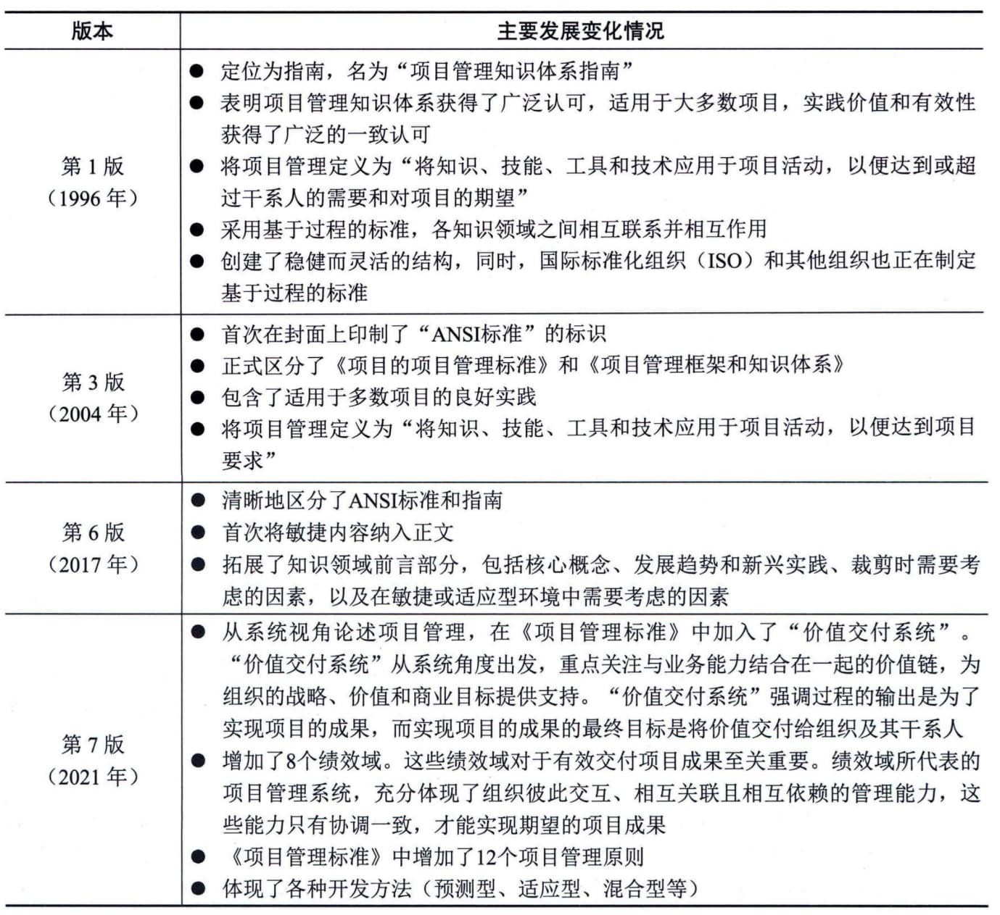

## 9.1 PMBOK的发展
项目管理知识体系（Project Management Body Of
Knowledge，PMBOK）是由美国项目管理协会（Project Management
Institute，PMI）开发的一套描述项目管理专业范围的知识体系，包含了对项目管理所需的知识、技能和工具的描述。
1981年，PMI组委会成立了专门的小组，开展相应的研发工作，旨在将项目管理人在项目管理过程中的优秀实践总结成标准。1983年，该小组发表了第一份报告，报告中将项目管理的基本内容划分为范围管理、成本管理、时间管理、质量管理、人力资源管理和沟通管理六个领域，形成了后期项目管理专业化的基础内容。1984年，PMI组委会批准了关于进一步开发项目管理标准的项目。1987年，该小组发表了题为"项目管理知识体系"的研究报告，并于1996年进行了修订，称之为"项目管理知识体系指南"，国际标准化组织（ISO）随后以该文件为框架，制定了第一个项目管理的标准，即ISO
10006：1997《质量管理 项目管理质量指南》。
从1996年PMBOK指南的第一个版本开始，PMI基本每4年更新一版PMBOK指南，截至2022年，已经出版的有2000年的第2版、2004年的第3版、2008年的第4版、2012年的第5版、2017年的第6版和2021年的第7版。
在PMBOK指南的发展过程中，1996年的第1版、2004年的第3版、2017年的第6版和2021年的第7版的变化较为突出，主要的变化情况如表9-1所示。
**表9-1
PMBOK指南的主要变化情况**
