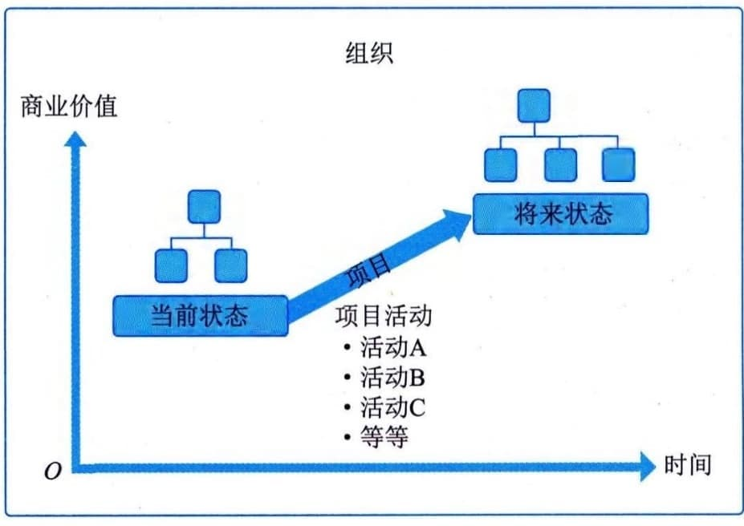
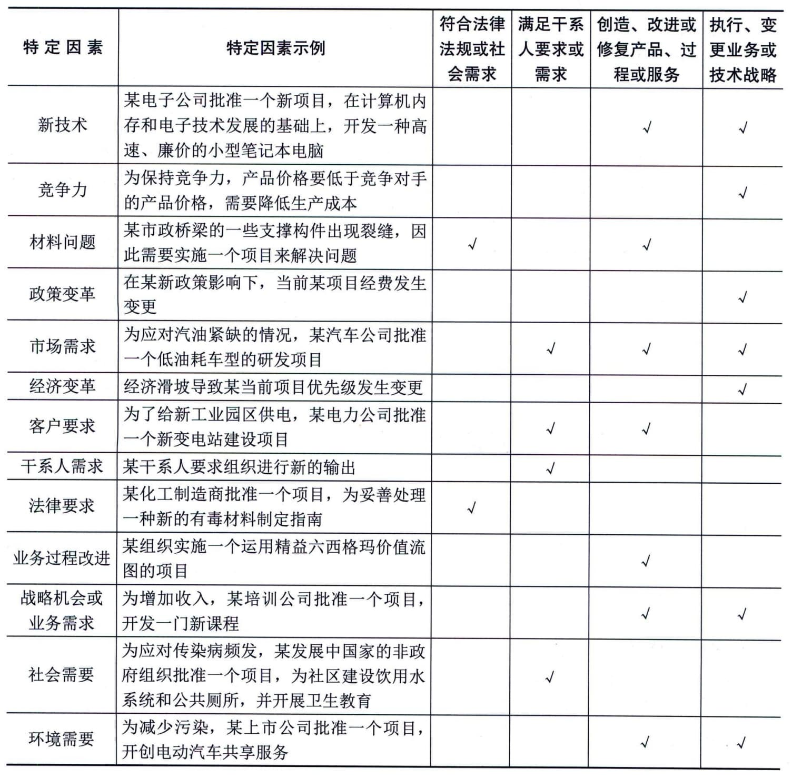

### 9.2.1 项目基础
项目是为创造独特的产品、服务或成果而进行的临时性工作。
#### **1．独特的产品、服务或成果**
开展项目是为了通过可交付成果达成目标。目标是指工作所指向的结果、要取得的战略地位、要达到的目的、要获得的成果、要生产的产品或者要提供的服务。可交付成果是指在某一过程、阶段或项目完成时，形成的独特并可验证的产品、成果或服务。可交付成果可能是有形的，也可能是无形的。实现项目目标可能会产生一个或多个可交付成果。
某些项目可交付成果和活动中可能存在相同的元素，但这并不会改变项目本质上的独特性。例如，即便采用相同或相似的语言或工具，由相同的团队来开发，但每个信息系统项目仍具备独特性（例如需求、设计、运行环境、项目干系人都是独特的）。
项目可以在组织的任何层级上开展。一个项目可能只涉及一个人，也可能涉及一组人；可能只涉及一个组织单元，也可能涉及多个组织的多个单元。
下面列举一些项目的例子，例如为市场开发新的复方药，扩展导游服务，合并两家组织，改进组织内的业务流程，为组织采购和安装新的计算机硬件系统，一个地区的石油勘探，修改组织内使用的计算机软件，研发新的工艺流程，建造一座大楼等。
#### **2．临时性工作**
项目的"临时性"是指项目有明确的起点和终点。"临时性"并不一定意味着项目的持续时间短。项目可宣告结束的情况主要包括：·达成项目目标；
 - · 不会或不能达到目标；
 - · 项目资金耗尽或不再获得资金支持；
 - · 对项目的需求不复存在（例如，客户不再要求完成项目，战略或优先级的变更致使项目终止，组织管理层下达终止项目的指示）；
 - · 无法获得所需的人力或物力资源；
 - · 出于法律或其他原因终止项目等。
虽然项目是临时性工作，但其可交付成果可能会在项目终止后依然存在。例如，国家纪念碑建设项目就是要创造一个可以流传百世的建筑。
#### **3．项目驱动变更**
项目驱动组织进行变更。从业务价值角度看，项目旨在推动组织从一个状态转到另一个状态，从而达成特定目标，获得更高的业务价值。组织通过项目进行状态转换的过程如图9-1所示。在项目开始之前，组织处于"当前状态"，项目驱动变更是为了获得期望的结果，即"将来状态"。通过成功完成一个或一系列项目，组织可以实现将来状态并达成特定的目标。

图9-1 组织通过项目进行状态转换
#### **4．项目创造业务价值**
业务价值是从组织运营中获得的可量化的净效益。在价值分析中，业务价值被视为回报，即以某种投入换取时间、资金、货物或无形的回报。项目的业务价值指特定项目的成果能够为干系人带来的效益。
项目带来的效益可以是有形的、无形的或两者兼而有之。有形效益的例子包括货币资产、股东权益、公共事业、固定资产、工具、市场份额等。无形效益的例子包括商誉、声誉、商标、公共利益、战略联盟、品牌认知度等。
#### **5．项目启动背景**
促进项目创建的因素多种多样。组织领导者启动项目是为了应对影响该组织持续运营和业务战略的因素。这些因素说明了项目的启动背景，它们最终应与组织的战略目标以及各个项目的业务价值相关联。促进项目创建的因素大致可以分为4个基本类别，各类项目示例如表9-2所示。
**表9-2
促成项目创建的因素**
