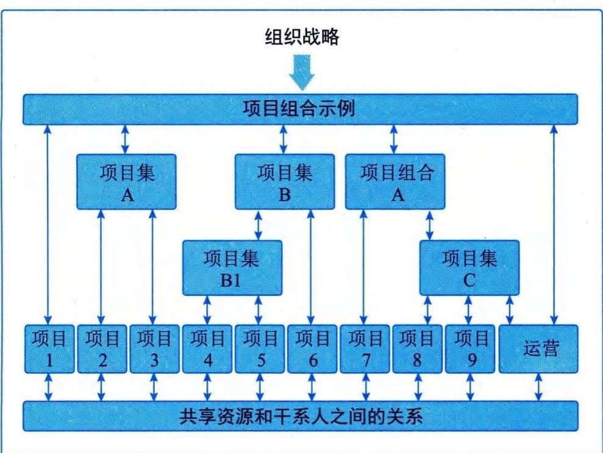
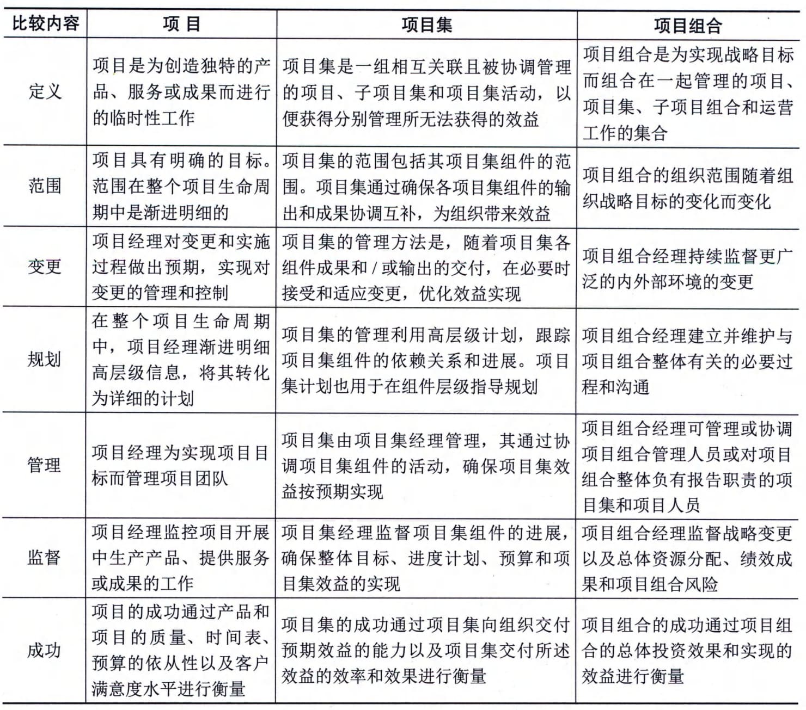
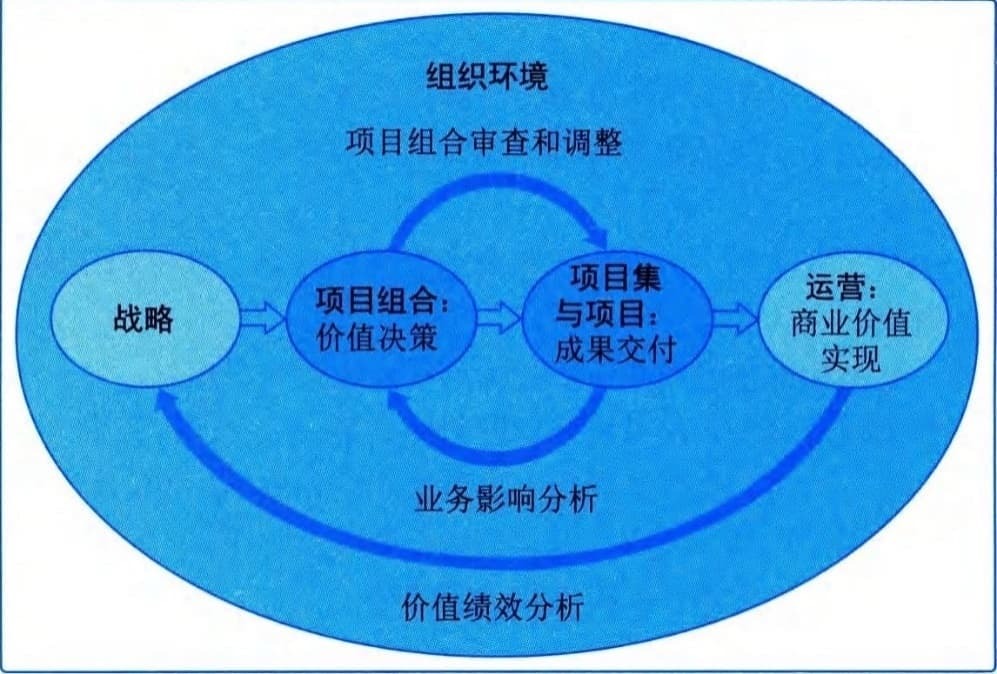

### 9.2.4 项目、项目集、项目组合和运营管理之间的关系
#### **1．概述**
项目管理过程、工具和技术的运用为组织达成目标奠定了坚实的基础。一个项目可以采用3种不同的模式进行管理：独立项目（不包括在项目集或项目组合中）、在项目集内、在项目组合内。如果在项目集或项目组合内管理某个项目，则项目经理需要与项目集或项目组合经理沟通与合作。
为达成组织的一系列目的和目标，可能需要实施多个项目。在这种情况下，项目可能被归入项目集中。项目集是一组相互关联且被协调管理的项目、子项目集和项目集活动，目的是获得分别管理所无法获得的利益。项目集不是大项目，大项目是指规模、影响等特别大的项目。
有些组织可能会采用项目组合，用于有效管理在任何特定的时间内同时进行的多个项目集和项目。项目组合是指为实现战略目标而组合在一起管理的项目、项目集、子项目组合和运营工作。项目组合、项目集、项目和运营在特定情况下是相互关联的，如图9-2所示。

图9-2 项目组合、项目集、项目和运营的关系
项目集管理和项目组合管理的生命周期、活动、目标、重点和效益都与项目管理不同。但是，项目组合、项目集、项目和运营通常都涉及相同的干系人，还可能需要使用同样的资源，而这可能会导致组织内出现冲突。这种情况促使组织增强内部协调，通过项目组合、项目集和项目管理达成组织内部的有效平衡。
图9-2所示的项目组合结构表明了项目集、项目、共享资源和干系人之间的关系。项目组合能够促进这项工作的有效治理和管理，从而有助于实现组织战略和相关优先级。在开展组织和项目组合规划时，要基于风险、资金和其他考虑因素对项目组合组件进行优先级排列。项目组合有利于组织了解战略目标在项目组合中的实施情况，还能适当促进项目组合、项目集和项目治理的实施与协调。这种协调治理方式可以合理分配资源，为实现预期绩效和效益分配人力、财力和实物资源。
从组织的角度看，项目和项目集管理的重点在于以"正确"的方式开展项目集和项目，即"正确地做事"；项目组合管理则注重于开展"正确"的项目集和项目，即"做正确的事"。表9-3列出了项目、项目集、项目组合在定义、范围、变更、规划、管理、监督和成功等方面的比较结果。
**表9-3
项目、项目集、项目组合管理的比较结果**
#### **2．项目集管理**
项目集管理指在项目集中应用知识、技能与原则来实现项目集的目标，获得分别管理项目集组成部分所无法实现的利益和控制。项目集组成部分指项目集中的项目和其他项目集。项目管理注重项目内部的依赖关系，以确定管理项目的最佳方法。项目集管理注重项目集组成部分之间的依赖关系，以确定管理这些项目的最佳方法。项目集的具体管理措施包括：
 - · 调整对项目集和所辖项目的目标有影响的组织或战略方向；
 - · 将项目集范围分配到项目集的组成部分；
 - · 管理项目集组成部分之间的依赖关系，从而以最佳方式实施项目集；
 - · 管理可能影响项目集内多个项目的项目集风险；
 - · 解决影响项目集内多个项目的制约因素和冲突；
 - · 解决作为组成部分的项目与项目集之间的问题；
 - · 在同一个治理框架内管理变更请求；
 - · 将预算分配到项目集内的多个项目中；
 - · 确保项目集及其包含的项目能够实现效益。
建立一个新的卫星通信系统就是一个项目集管理的实例，其所辖项目包括卫星与地面站的设计和建造、卫星发射以及系统整合。
#### **3．项目组合管理**
项目组合是指为实现战略目标而组合在一起管理的项目、项目集、子项目组合和运营工作。项目组合管理是指为了实现战略目标而对一个或多个项目组合进行的集中管理。项目组合中的项目集或项目不一定存在彼此依赖或直接相关的关联关系。
项目组合管理的目的是：
 - · 指导组织的投资决策；
 - · 选择项目集与项目的最佳组合方式，以达成战略目标；
 - · 提供决策透明度；
 - · 确定团队资源分配的优先级；
 - · 提高实现预期投资回报的可能性；
 - · 集中管理所有组成部分的综合风险；
 - · 确定项目组合是否符合组织战略。
要实现项目组合价值的最大化，需要精心检查项目组合的各个组成部分。确定各组成部分的优先级，使最有利于组织战略目标的部分拥有所需的财力、人力和实物资源。
#### **4．运营管理**
运营管理是另外一个领域，不属于项目管理范围。
运营管理关注产品的持续生产、服务的持续提供。运营管理使用最优资源满足客户要求，以保证组织或业务持续高效地运行。运营管理重点管理把输入（如材料、零件、能源和人力）转变为输出（如产品、服务）的过程。
#### **5．运营与项目管理**
运营的改变可以作为某个项目的关注焦点，尤其是当项目交付的新产品或新服务将导致运营有实质性改变时。持续运营不属于项目的范畴，但是项目与运营会在产品生命周期的不同时间点存在交叉，例如：
 - · 在新产品开发、产品升级或提高产量时；
 - · 在改进运营或产品开发过程时；
 - · 在产品生命周期结束阶段；
 - · 在每个收尾阶段。
在每个交叉点，可交付成果及知识都会在项目与运营之间转移，可能是将项目资源及知识转移到运营部门，也可能是将运营资源转移至项目中。
#### **6．组织级项目管理和战略**
项目组合、项目集和项目都需要符合组织战略，由组织战略驱动，并以如下不同的方式服务于战略目标的实现：
 - ·项目组合管理通过选择适当的项目集或项目，对工作进行优先级排序，并提供所需资源，与组织战略保持一致；

 - ·项目集管理通过对其组成部分进行协调，对它们之间的依赖关系进行控制，从而实现既定收益；
 - · 项目管理使组织的目标得以实现。
组织往往用战略规划引导项目投资，明确项目对实现组织战略和目标的作用。通过组织级项目管理，对项目组合、项目集和项目进行系统化管理，可以确保项目符合组织战略业务目标。组织级项目管理是指为实现战略目标，通过组织驱动因素整合项目组合、项目集和项目管理的框架。
组织级项目管理旨在确保组织开展正确的项目并合适地分配关键资源。组织级项目管理有助于确保组织的各个层级都了解组织的战略愿景、实现愿景的措施、组织目标以及可交付成果。组织级项目管理中，项目组合、项目集、项目和运营相互作用的组织环境如图9-3所示。

图9-3 组织级项目管理
