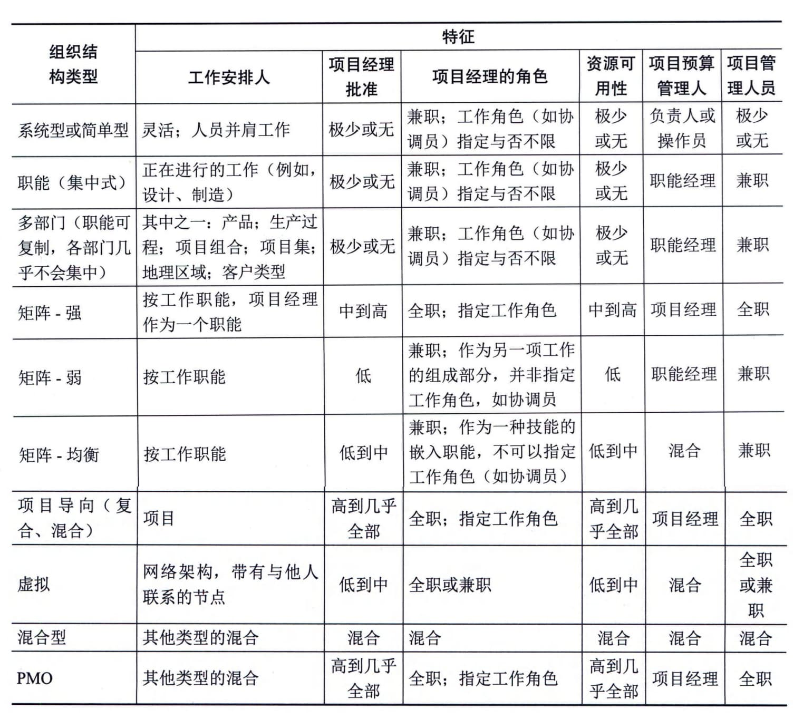

### 9.2.6 组织系统
项目运行时会受到项目所在的组织结构和治理框架的影响与制约。为有效且高效地开展项目，项目经理需要了解组织内的组织机构及职责分配情况，帮助自己有效地利用其权力、影响力、能力、领导力等，以便成功完成项目。
组织内多种因素的交互影响创造出一个独特的组织系统，该组织系统会影响项目的运行，并决定了组织系统内部人员的权力、影响力、利益、能力等。组织系统的影响因素包括治理框架、管理要素和组织结构类型。
#### **1．治理框架**
治理是在组织各层级上的组织性或结构性安排，旨在确定和影响组织成员的行为。治理是一个多维度概念，需要考虑人员、角色、结构和政策，同时需要通过数据和反馈提供指导和监督。治理框架是在组织内行使职权的框架，包括规则、政策、程序、规范、关系、系统和过程。该治理框架会对以下几方面内容产生影响：
 - · 组织目标的设定和实现方式；
 - · 风险监控和评估方式；
 - · 绩效优化方式。
#### **2．管理要素**
管理要素是组织内部关键职能部门或一般管理原则的组成部分。组织根据其选择的治理框架和组织结构类型确定一般的管理要素。组织的管理要素包括：
 - · 部门，基于专业技能及其可用性开展工作；
 - · 组织授予的工作职权；
 - · 工作职责，用于开展组织根据技能和经验等属性合理分派的工作任务；
 - · 行动纪律（如尊重职权、人员和规定）；
 - · 统一指挥原则（如对于一项行动或活动仅由一个人发布指示）；
 - · 统一领导原则（如对服务于同一目标的一组活动，只能有一份计划或一个领导）；·组织的总体目标优先于个人目标；
 - · 支付合理的薪酬；
 - · 资源的优化使用；
畅通的沟通渠道；
在正确的时间让正确的人使用正确的材料做正确的事情；
 - · 公正、平等地对待所有员工；
明确的工作职位；
 - · 确保员工安全；
 - · 允许任何员工参与计划和实施；
 - · 保持员工士气。
组织会将这些管理要素分配给相应的员工，让他们负责这些管理要素的落实。员工可以在不同的组织结构中落实这些管理要素。例如，在层级式组织结构中，员工之间存在横向关系和纵向关系。纵向关系从一线管理层一直向上延伸到高级管理层。在特定的组织结构中，需要赋予员工所在层级的职责、终责和职权，才能保证员工在特定的组织结构内落实相应的管理要素。
#### **3．组织结构类型**
组织结构的形式或类型多种多样，组织在确定本组织选取并采用哪一种组织结构类型时，需要考虑各种可变因素，不存在适用于所有组织的通用的结构类型，特定组织最终选取和采用的组织结构具有各自的独特性。几种常见的组织结构类型的特征如表9-4所示。
**表9-4
常见的组织结构类型的特征**
在确定组织结构时，每个组织都需要考虑大量的因素。在最终分析中，每个因素的重要性也各不相同。综合考虑各种因素及其价值，能够帮助组织决策者选择合适的组织结构。选择组织结构时应考虑的因素主要包括：与组织目标的一致性；专业能力；控制、效率与效果的程度；明确的决策升级渠道；明确的职权线和范围；授权方面的能力；终责分配；职责分配；设计的灵活性；设计的简单性；实施效率；成本考虑；物理位置（例如集中办公、区域办公、虚拟远程办公）；清晰的沟通（例如政策、工作状态、组织愿景）等。
项目管理办公室（PMO）是项目管理中常见的一种组织结构，PMO对与项目相关的治理过程进行标准化，并促进资源、方法论、工具和技术共享。PMO的职责范围可大可小，小到提供项目管理支持服务，大到直接管理一个或多个项目。PMO的具体形式、职能和结构取决于所在组织的需要。
PMO有几种不同的类型，它们对项目的控制和影响程度各不相同，主要有支持型、控制型和指令型。
 - （1）支持型。支持型PMO担当顾问的角色，向项目提供模板、最佳实践、培训，以及来自其他项目的信息和经验教训。这种类型的PMO其实就是一个项目资源库，对项目的控制程度很低。
 - （2）控制型。控制型PM[O]{.underline}不仅给项目提供支持，而且通过各种手段要求项目服从，这种类型的PMO对项目的控制程度中等。它可能在以下几个方面要求项目：一是采用项目管理框架或方法论；二是使用特定的模板、格式和工具；三是遵从治理框架。
 - （3）指令型。指令型PMO直接管理和控制项目。项目经理由PM[O]{.underline}指定并向其报告。这种类型的PMO对项目的控制程度很高。
PMO还有可能承担整个组织范围的职责，在支持战略调整和创造组织价值方面发挥重要的作用。PMO从组织战略型项目中获取数据和信息，进行综合分析，评估高层战略目标的实现情况。PMO在组织的项目组合、项目集、项目与组织考评体系（如平衡计分卡）之间建立联系。PMO只是把项目进行了集中管理，它所支持和管理的项目之间不一定彼此关联。为了保证项目符合组织的业务目标，PMO有权在每个项目的生命周期中充当重要干系人和关键决策者。PMO
可以提出建议、支持知识传递、终止项目，并根据需要采取其他行动。PMO的一个主要职能是通过各种方式向项目经理提供支持，包括：
 - · 对PMO所辖全部项目的共享资源进行管理；
 - · 识别和制定项目管理方法、最佳实践和标准；
 - · 指导、辅导、培训和监督；
 - · 通过项目审计，监督项目对项目管理标准、政策、程序和模板的合规性；
 - · 制定和管理项目政策、程序、模板及其他共享的文件（组织过程资产）；
 - · 对跨项目的沟通进行协调等。
