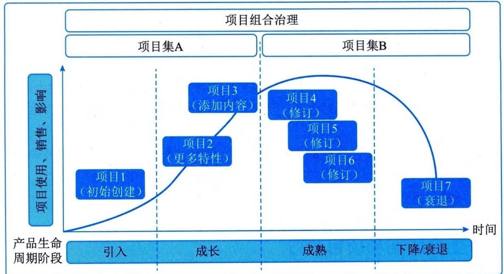

### 9.2.7 项目管理和产品管理
在当前复杂的项目管理环境中，项目组合、项目集、项目和产品管理等领域的相互关联性正逐渐加强。了解它们之间的关系能为项目提供有用的背景信息。
产品是指可以量化生产的工件（包括服务及其组件）。产品既可以是最终制品，也可以是组件制品。产品管理涉及将人员、数据、过程和业务系统整合，以便在整个产品生命周期中创建、维护和开发产品（或服务）。产品生命周期是指一个产品从引入、成长、成熟到衰退的整个演变过程的一系列阶段。产品管理可以在产品生命周期的任何时间点启动项目集或项目，以便为创建或增强特定组件、职能或功能提供支持，如图9-4所示。
初始产品开始时可以是项目集或项目的可交付物。在整个产品生命周期中，新的项目集或项目可能会增加或改进创造额外价值的特定组件、属性或功能。在某些情况下，项目集可以涵盖产品（或服务）的整个生命周期，以便更直接地管理收益并为组织创造价值。

图9-4 产品管理与产品生命周期的关系
产品管理可以表现为不同的形式，主要包括以下3种，即产品生命周期中包含项目集管理，产品生命周期中包含单个项目管理，以及项目集内的产品管理。
 - （1）产品生命周期中包含项目集管理。这种方法中，产品生命周期中包括相关项目、子项目集和项目集活动。对于规模很大或长期运作的产品，一个或多个产品生命周期阶段可能非常复杂，因此需要一系列协同运作的项目集和项目。
 - （2）产品生命周期中包含单个项目管理。这种方法将产品作为某个单个项目的目标来进行管理，将产品功能的开发到成熟作为持续的业务活动进行监督。这种方法根据需要特许设立单个项目，执行对产品的增强和改进，或产生其他独特成果。
 - （3）项目集内的产品管理。这种方法会在给定项目集的范围内应用完整的产品生命周期。为了获得产品的特定收益，项目集内也可以特许设立一系列子项目集或项目。我们可以通过应用产品管理能力（例如竞争分析、客户获取和客户代言）增强这些收益。
虽然产品管理是一个单独的领域，有自己的知识体系，但它是项目集管理和项目管理这两个领域中的一个关键整合点。可交付物中包含产品的项目集和项目会使用的一种综合方法，这种方法包含所有相关知识体系及其相关实践、方法和工件。
