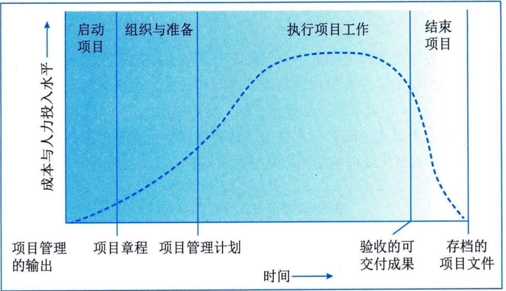
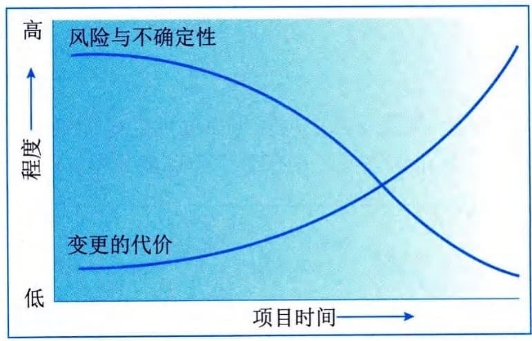

### 9.4.1 定义与特征
项目生命周期指项目从启动到完成所经历的一系列阶段，这些阶段之间的关系可以顺序、迭代或交叠进行。它为项目管理提供了一个基本框架。项目生命周期适用于任何类型的项目。项目的规模和复杂性各不相同，但不论其大小繁简，所有项目都呈现出包含启动项目、组织与准备、执行项目工作和结束项目4个项目阶段的通用的生命周期结构。
通用的生命周期结构具有以下两方面的主要特征：
 - （1）成本与人力投入水平在开始时较低，在工作执行期间达到最高，并在项目快要结束时迅速回落。这种典型的走势如图9-5所示。

图9-5 成本与人力投入水平随项目时间变化的情况
 - （2）风险与不确定性在项目开始时最大，并在项目的整个生命周期中随着决策的制定与可交付成果的验收而逐步降低；做出变更和纠正错误的成本随着项目越来越接近完成而显著增高，如图9-6所示。

图9-6 风险与不确定性以及变更的代价随项目时间变化的情况
上述特征在几乎所有项目生命周期中都存在，但是程度有所不同。
在通用生命周期结构的指导下，项目经理可以确定需要对哪些可交付成果施加更为有力的控制，或者哪些可交付成果完成之后才能完全确定项目范围。大型、复杂的项目尤其需要这种特别的控制。在这种情况下，项目经理需要将项目工作正式分解为若干阶段，并根据项目特点采取合适的方法进行控制。
