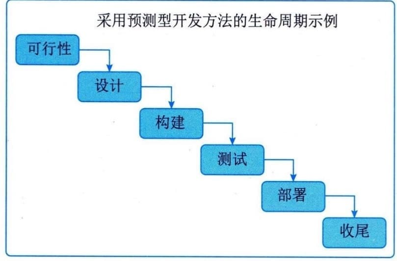
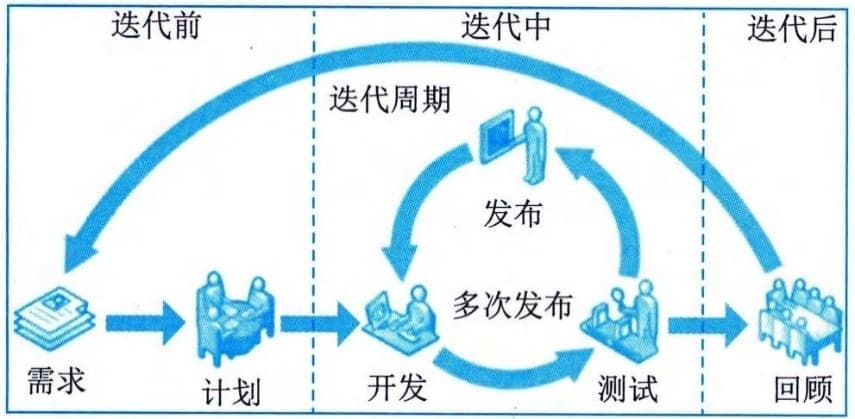
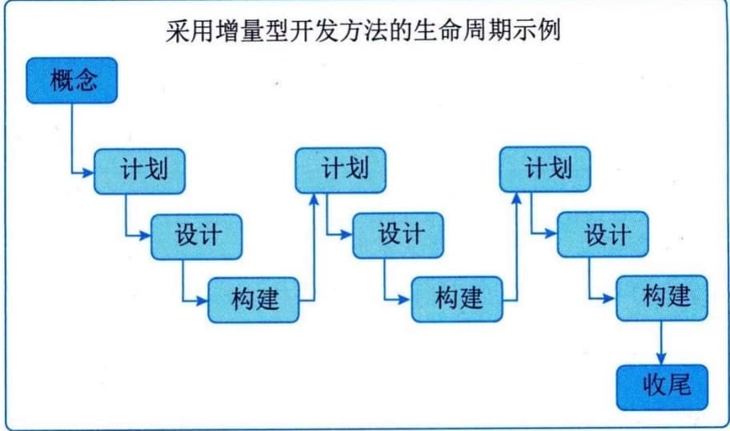
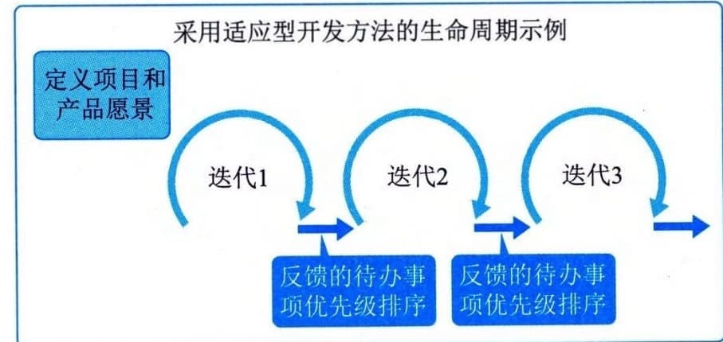
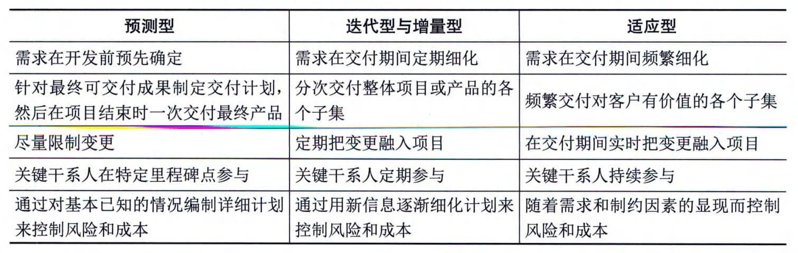

### 9.4.2 生命周期类型
在项目生命周期内的一个或多个阶段，通常会对产品、服务或成果进行开发，开发生命周期可分为预测型（计划驱动型）、迭代型、增量型、适应型（敏捷型）和混合型等多种类型，采用不同的开发生命周期的项目会呈现出不同的项目生命周期的特点。
#### **1．预测型生命周期**
采用预测型开发方法的生命周期适用于已经充分了解并明确需求的项目，又称为瀑布型生命周期。在生命周期的早期阶段确定项目范围、时间和成本，对任何范围的变更都要进行严格管理，每个阶段只进行一次，每个阶段都侧重于某一特定类型的工作，如图9-7所示。高度预测型项目范围变更很少、干系人之间有高度共识。这类项目会受益于前期的详细规划，但有些情况（例如增加范围、需求变化或市场变化）则会导致某些阶段重复进行。

图9-7 预测型生命周期
#### **2．迭代型生命周期**
采用迭代型生命周期的项目范围通常在项目生命周期的早期确定，但时间及成本会随着项目团队对产品理解的不断深入而定期修改。迭代型生命周期如图9-8所示。

图9-8 迭代型生命周期
#### **3．增量型生命周期**
采用增量型生命周期的项目通过在预定的时间区间内渐进增加产品功能的一系列迭代来产出可交付成果。只有在最后一次迭代之后，可交付成果具有了必要和足够的能力，才能被视为完整的，如图9-9所示。

图9-9 增量型生命周期
迭代型开发方法和增量型开发方法的区别：迭代型开发方法是通过一系列重复的循环活动来开发产品，而增量型开发方法是渐进地增加产品的功能。
#### **4．适应型生命周期**
采用适应型开发方法的项目又称为敏捷型或变更驱动型项目，适合于需求不确定、不断发展变化的项目。在每次迭代前，项目和产品愿景的范围被明确定义和批准，每次迭代（有时称为"冲刺"）结束时，客户会对具有功能性的可交付物进行审查。在审查时，关键干系人会提供反馈，项目团队会更新项目待办事项列表，以确定下一次迭代中特性和功能的优先级，如图9-10所示。适应型项目生命周期的特点是先基于初始需求制定一套高层级的计划，再逐渐把需求细化到适合特定的规划周期所需的详细程度。

图9-10 适应型生命周期
#### **5．混合型生命周期**
混合型生命周期是预测型生命周期和适应型生命周期的组合。项目生命周期具有复杂性和多维性。特定项目的不同阶段往往采用不同的生命周期，项目管理团队需要确定项目及其不同阶段最适合的生命周期。各生命周期的联系与区别如表9-5所示。开发生命周期需要足够灵活，才能够应对项目包含的各种因素。
**表9-5
各生命周期之间的联系与区别**
