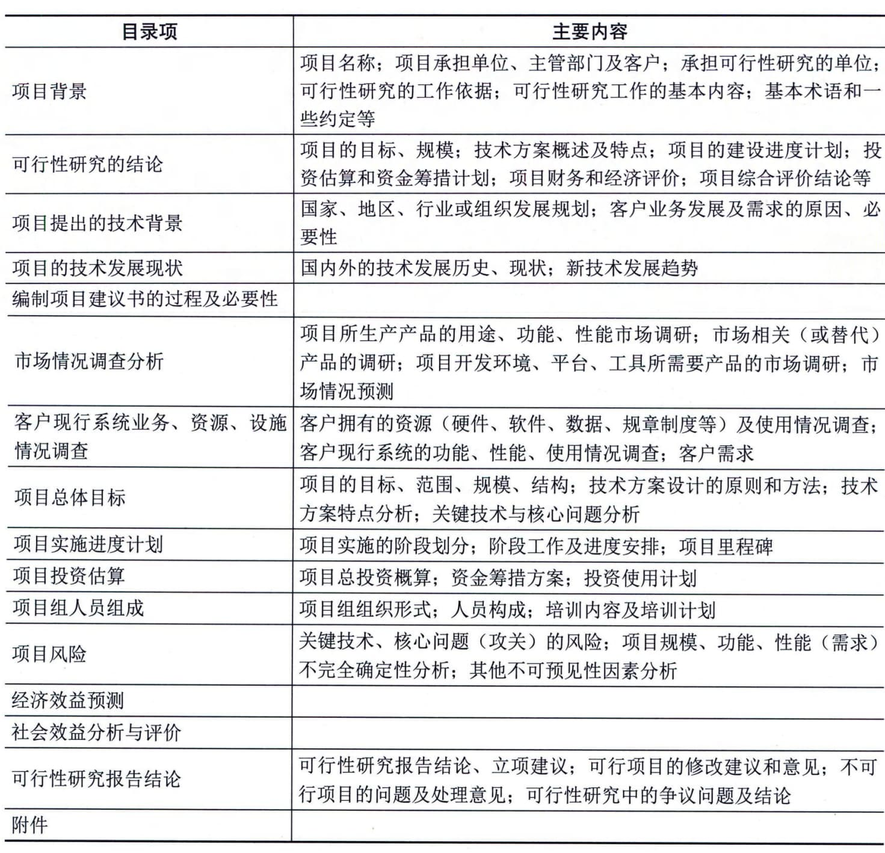

### 9.5.2 项目可行性研究
可行性研究是在项目建议书被批准后，对技术、经济、社会和人员等方面的条件和情况进行调查研究，对可能的技术方案进行论证，以最终确定整个项目是否可行。可行性研究是为项目决策提供依据的一种综合性的分析方法，可行性研究具有预见性、公正性、可靠性、科学性的特点。
#### **1．可行性研究的内容**
信息系统项目进行可行性研究包括很多方面的内容，可以归纳为以下几个方面：技术可行性分析、经济可行性分析、社会效益可行性分析、运行环境可行性分析以及其他方面的可行性分析等。
1）技术可行性分析
技术可行性分析是指在当前的技术、产品条件限制下，分析能否利用现在拥有的及可能拥有的技术能力、产品功能、人力资源来实现项目的目标、功能、性能，能否在规定的时间期限内完成整个项目。
技术可行性分析一般应考虑的因素包括：
 - ·进行项目开发的风险：在给定的限制范围和时间期限内，能否设计出预期的系统，并实现必需的功能和性能；
 - ·人力资源的有效性：可以用于项目开发的技术人员队伍是否可以建立，是否存在人力资源不足、技术能力欠缺等问题，是否可以在社会上或者通过培训获得所需要的熟练技术人员；
 - ·技术能力的可能性：相关技术的发展趋势和当前所掌握的技术是否支持该项目的开发，是否存在支持该技术的开发环境、平台和工具；
 - ·物资（产品）的可用性：是否存在可以用于建立系统的其他资源，如一些设备及可行的替代产品等。
技术可行性分析往往决定了项目的方向，一旦技术人员在评估技术可行性分析时估计错误，将会出现严重的后果，造成项目根本上的失败。
2）经济可行性分析
经济可行性分析主要是对整个项目的投资及所产生的经济效益进行分析，具体包括支出分析、收益分析、投资回报分析及敏感性分析等。
 - （1）支出分析。信息系统项目的支出可分为一次性支出和非一次性支出两类。
 - · 一次性支出：包括开发费、培训费、差旅费、初试数据录入、设备购置费等；
 - · 非一次性支出：包括软硬件租金、人员工资及福利、水电等公用设施使用费，以及其他消耗品支出等。
 - （2）收益分析。信息系统项目的收益包括直接收益、间接收益及其他方面的收益等。
 - · 直接收益：指通过项目实施获得的直接经济效益，如销售项目产品的收入；
 - · 间接收益：指通过项目实施以间接方式获得的收益，如成本的降低；
 - · 其他收益：如知识产权、软件著作权等。（3）投资回报分析。投资回报分析包括收益投资比、投资回收期分析。对投入产出进行对比分析，以确定项目的收益率和投资回收期等经济指标。
 - （4）敏感性分析。敏感性分析是指当诸如设备和软件配置、处理速度要求、系统的工作负荷类型和负荷量等关键性因素变化时，对支出和收益产生影响的估计。
3）社会效益可行性分析
项目除了需要考虑经济可行性分析外，往往还需要对项目的社会效益进行分析。尤其是针对面向公共服务领域的项目，其社会效益往往是可行性分析的关注重点。
社会效益可行性分析主要包括以下内容：
 - （1）对组织内部。信息系统项目往往都能为组织的发展带来一定的知识和经验沉淀，这些沉淀会夯实组织进一步发展的基础，需要充分挖掘和分析项目各项能力的效益，具体包括：
 - · 品牌效益：指通过项目建设、服务等为组织的知名度提升及正向特征带来的收益；
 - ·竞争力效益：指通过项目预期成果能够为组织在行业或领域中获得更好竞争优势的收益；
 - ·技术创新效益：指通过项目的建设过程中对技术矛盾或难点的攻克，为组织技术能力积累，以及产品与服务创新等方面带来的收益；
 - ·人员提升收益：指通过项目锻炼和人员知识、技能、经验的应用，为组织人员能力提升或骨干人员培育等方面带来的收益；
 - ·管理提升效益：指通过项目过程管控以及项目管理与组织管理的实践融合等，为组织的管理水平提升带来的收益。
 - （2）对社会发展。信息系统项目也可能成为组织履行社会责任的关键举措，这些举措可以为局部或区域社会发展带来各种进步，主要包括：
 - ·公共效益：指为广大群众增加信息惠民、美好生活、理念创造、知识普及、居民健康等方面带来的各种收益；
 - ·文化效益：指在社会精神文明建设中所发挥的积极作用，也包括网络文明方面；
 - ·环境效益：指在保护自然资源或生态环境方面的作用和价值；
 - ·社会责任感效益：指组织在履行社会责任与义务方面的收益；
 - ·其他收益：如提高国防能力，保障国家和社会安全等。
4）运行环境可行性分析
信息系统项目的可行性分析不同于一般项目，信息系统项目的产品大多数是一个软硬件配套的信息系统，或一套需要安装并运行在用户现场的软件、相关说明文档、管理与运行规程等。只有基础硬件运转正常可靠，软件正常使用，并达到预期的技术（功能、性能）指标、经济效益和社会效益指标，才能称信息系统项目是成功的。
运行环境是制约信息系统发挥效益的关键。因此，需要从用户的管理体制、管理方法、规章制度、工作习惯、人员素质（甚至包括人员的心理承受能力、接受新知识和技能的积极性等）、数据资源积累、基础软硬件平台等多方面进行评估，以确定软件系统在交付以后，是否能够在用户现场顺利运行。
但在实际项目中，软（硬）件的运行环境往往是需要再建立的，这就为项目运行环境可行性分析带来了不确定因素。因此，在进行运行环境可行性分析时，可以重点评估是否可以建立系统顺利运行所需要的环境，以及建立这个环境所需要进行的工作，以便可以将这些工作纳入项目计划之中。
5）其他方面的可行性分析
信息系统项目的可行性研究除了前面介绍的技术、经济、社会效益和运行环境可行性分析外，还包括诸如法律可行性、政策可行性等方面的可行性分析。
信息系统项目也会涉及合同责任、知识产权等法律方面的可行性问题。特别是在系统开发和运行环境、平台和工具方面，以及产品功能和性能方面，往往存在一些软件版权问题，是否能够购置所使用环境、工具的版权，有时也可能影响项目的建立。
此外，在可行性分析方面，还包括项目实施对社会环境、自然环境的影响，以及可能带来的社会效益分析。总之，项目的可行性分析主要包括上述几个方面的内容，但是对于具体的项目，应该根据实际情况选取重点进行可行性研究分析。
#### **2．初步可行性研究**
1）初步可行性研究的定义
初步可行性研究一般是在对市场或者客户情况进行调查后，对项目进行的初步评估。详细可行性研究需要对项目在技术、经济、社会、运行环境、法律等方面进行深入的调查研究和分析，是一项费时、费力的工作，特别是大型的或比较复杂的项目更是如此。因此，进行初步可行性研究可以从如下几方面进行，以便衡量、决定是否开始详细可行性研究：
 - ·分析项目的前途，从而决定是否应该继续深入调查研究；
 - ·初步估计和确定项目中的关键技术及核心问题，以确定是否需要解决；
 - ·初步估计必须进行的辅助研究，以解决项目的核心问题，并判断是否具备必要的技术、实验、人力条件作为支持等。
2）辅助研究的目的和作用
辅助（功能）研究包括项目的一个或几个方面，但不是所有方面，并且只能作为初步可行性研究、详细可行性研究和大规模投资建议的前提或辅助。辅助研究包括：①对要设计开发的产品进行的市场研究，包括市场的需求预测及预期的市场渗透情况。②配件和投入物资的研究，包括项目使用的基本配件和投入物资的当前可获得性及预测的可获得性，以及这些配件和投入物资的目前价格和预测的价格趋势。③试验室和中间工厂的试验，根据需要进行试验，以决定具体配件是否合适，设计方案是否可行。④网络物理布局设计。⑤规模的经济性研究，一般作为技术选择研究的一个部分进行。如果牵扯到几种技术和几种市场规模，则分开进行这些研究，但研究不扩大到复杂的技术问题中去。这些研究的主要任务是在考虑各种选择的技术、投资费用、开发成本和价格之后，评价最具经济性的设计开发规模。这种研究通常对几种规模的设计开发能力进行分析，研究该项目的主要特性，并计算出每种规模的结果。⑥设备选择研究，如果项目的设备涉及的部门多，来源分散，而且成本各不相同，就要进行这种研究。一般在投资或实施阶段进行设备订货，包括准备投标、招标并对其进行评价，以及订货和交货。如果涉及巨额投资，项目的构成和经济性在极大程度上取决于设备的类型及其成本和经营成本，所选设备直接影响项目的经营效果。在这种情况下，如果得不到标准化的成本，那么设备选择研究就是必不可少的。
辅助研究的内容视研究的性质和打算研究的项目各有不同，但由于其关系到项目的关键方面，因此其结论应为随后的项目阶段指明方向。在大多数情况下，投资前的辅助研究如果在项目可行性研究之前或与项目可行性研究一起进行，其内容则构成项目可行性研究的一个必不可少的部分。如果一项基本投入可能是确定项目可行性的一个决定因素，那么应在初步可行性研究之前进行辅助研究。如果对一项具体功能的详细研究过于复杂，不能作为项目可行性研究的一部分进行，辅助研究则与项目初步可行性研究分头同时进行。如果在进行项目可行性研究的过程中发现，尽管作为决策过程一部分的初步评价可以早些开始，但比较稳妥的做法是对项目的某一方面进行更详尽的鉴别，那么就在完成该项目可行性研究之后再进行辅助研究。辅助研究的费用必须和项目可行性研究的费用一并考虑，因为这种研究的目的之一就是要在项目可行性研究阶段节省费用。
3）初步可行性研究的作用
如果对项目价值和收益等存在疑问，组织需要进行初步可行性研究来确定项目是否可行。初步可行性研究主要回答的问题包括：
 - · 项目进行投资建设是否具有必要性；
 - · 项目建设的周期是否合理且可接受；
 - · 项目需要的人力、财力资源等是否可接受；
 - · 项目的功能和目标是否可以实现；
 - · 项目的经济效益、社会效益是否可以保证；
 - · 项目从经济上、技术上是否是合理的等。
经过初步可行性研究，可以形成初步可行性研究报告，该报告虽然比详细可行性研究报告粗略，但是对项目已经有了全面的描述、分析和论证，所以初步可行性研究报告可以作为正式的文献供项目决策参考，也可以为进一步做详细可行性研究提供基础。
4）初步可行性研究的主要内容
初步可行性研究的结果及研究的主要内容基本与详细可行性研究相同，所不同的是在占有的资源、研究细节方面有较大差异。可以通过捷径来决定投资支出和生产成本中的次要组成部分，但不能决定其主要组成部分，此时必须把估计项目的主要投资支出和生产成本作为初步可行性研究的一部分。初步可行性研究的主要内容包括：
 - ·需求与市场预测：包括客户和服务对象需求分析预测，营销和推广分析，如初步的销售量和销售价格预测；

 - ·设备与资源投入分析：包括从需求、设计、开发、安装、实施到运营的所有设备与材料的投入分析；
 - · 空间布局：如网络规划、物理布局方案的选择；
 - · 项目设计：包括项目总体规划、信息系统设计和设备计划、网络工程规划等；·项目进度安排：包括项目整体周期、里程碑阶段划分等；
 - · 项目投资与成本估算：包括投资估算、成本估算、资金渠道及初步筹集方案等。
#### **3．详细可行性研究**
详细可行性研究是在项目决策前对项目有关的技术、经济、法律、社会环境等方面的条件和情况进行详尽的、系统的、全面的调查、研究、分析，对各种可能的技术方案进行详细的论证、比较，并对项目建设完成后所可能产生的经济、社会效益进行预测和评价，最终提交的可行性研究报告将成为进行项目评估和决策的依据。
1）详细可行性研究的依据
进行详细可行性研究时，必须在国家有关法律、法规、政策、规划的前提下进行，同时还应当具备一些必需的技术资料。进行详细可行性研究工作的主要依据包括：①国民经济和社会发展的长期规划，地区的发展规划；②国家和地区的相关政策、法律、法规和制度；③项目主管部门对项目设计开发建设要求请示的批复；④项目建议书或者项目建议书批准后签订的意向性协议；⑤国家、地区、组织的信息化规划和标准；⑥市场调研分析报告；⑦技术、产品或工具的有关资料等。
2）详细可行性研究的原则
详细可行性研究应遵循以下原则：
 - （1）科学性原则：按客观规律办事。这是可行性研究工作必须遵循的最基本的原则。遵循这一原则要做到以下几点：①运用科学的方法和认真的态度来收集、分析和鉴别原始的数据和资料，以确保它们的真实和可靠，真实可靠的数据资料是可行性研究的基础和出发点；②要求每一项技术与经济的决定要有科学依据，是经过认真分析、计算而得出的。
 - （2）客观性原则：坚持从实际出发、实事求是。信息化建设项目的可行性研究，要根据信息化建设的要求与具体条件进行分析论证，进而得出可行或不可行的结论。组织需要做到以下几点：①正确地认识各种信息化建设条件，这些条件都是客观存在的，研究工作要求排除主观臆断，要从实际出发；②要实事求是地运用客观的资料做出符合科学的决定和结论；③可行性研究报告和结论必须是分析研究过程合乎逻辑的结果，而不掺杂任何主观成分。
 - （3）公正性原则：站在公正的立场上，不偏不倚。在信息化建设项目可行性研究的工作中，应该把国家的和人民的利益放在首位，综合考虑项目干系人的各方利益，决不为任何单位或个人而生偏私之心，不为任何利益或压力所动。实际上，只要能够坚持科学性与客观性原则，不有意弄虚作假，就能够保证可行性研究工作的正确和公正，从而为项目的投资决策提供可靠的依据。
3）详细可行性研究的方法
详细可行性研究的方法有很多，包括如经济评价法、市场预测法、投资估算法和增量净效益法等。这里主要介绍投资估算法和增量净效益法。
 - （1）投资估算法。投资费用一般包括固定资金及流动资金两大部分。固定资金又分为设计开发费、设备费、场地费、安装费及项目管理费等。投资估算是可行性研究中的一个重要工作，投资估算的正确与否将直接影响项目的经济效果，因此要求尽量准确。投资估算根据其进程或精确程度可分为数量性估算（即比例估算法）、研究性估算、预算性估算及投标估算等方法。
 - （2）增量净效益法（有无比较法）。将有项目时的成本（效益）与无项目时的成本（效益）进行比较，求得两者差额，即为增量成本（效益），这种方法称为有无比较法。有无比较法比传统的前后比较法更能准确地反映项目的真实成本和效益。因为前后比较法不考虑不上项目时组织的变化趋势，会人为地夸大或低估项目的效益。有无比较法则先对不上项目时组织的变动趋势做预测，将上项目以后的成本／效益逐年做动态比较，因此得出的结论更科学、更合理。
4）详细可行性研究的内容
详细可行性研究所涉及的内容很多，每一方面都有其处理问题的方法。详细可行性研究所涉及的主要内容和方法包括：
 - （1）市场需求预测。产品的需求预测是项目可行性研究的基础工作，这项工作的好坏将直接影响项目可行性研究的水平。需求和市场分析的关键因素就是对某一时间范围内项目的主要产出或成果需求量做出估计，因为一个项目是否可行，除其他因素外，主要取决于预计的销售额或收入。在任何一个特定时间，需求都是若干可变因素的函数，这些可变因素包括市场构成，来自相同（或替代）产品和服务的其他供应来源的竞争，需求的收入弹性与价格弹性，市场对社会经济形式产生的反应，经销渠道和消费增长水平等。因此，需求估计比一般想象的复杂，而且，不仅需要估计对某一具体产品或服务的需求，而且还要辨明其组成（如产品组合、服务组合）和各个部分或各消费者类别，以及其增长与敏感性所受到的社会与制度方面的限制。
 - （2）部件和投入的选择供应。这也是进行项目可行性研究首先应考虑的问题。项目可行性研究应包括与部件和投入需要量有关的问题，包括部件和投入的分类、部件和投入的选择与说明、部件和投入的特点等。
 - （3）信息系统架构及技术方案的确定。信息系统架构及其建设过程采用的技术方案是项目可行性研究中的技术选择问题，它对组织的经济效益有着直接的影响。要根据具体的技术经济条件选择"适宜技术"，并做相应的评价。采用新结构、新技术应有实验的根据，而不应采用不成熟的技术，因为工程项目的技术方案在技术上首先应是"可行"的。技术方案的选择，包括所采用的技术和开发过程。当然，它与生产规模有着密切关系。
项目可行性研究中的技术评价应反映下述几个方面：技术的先进性、技术的实用性、技术的可靠性、技术的连锁效果、技术后果的危害性等。
 - （4）技术与设备选择。项目可行性研究应该说明具体项目所需的技术，评价可供选择的各种技术，并按项目各组成部分的最佳结合选择最适合的技术。应估计获得这类技术所涉及的各种问题，还应说明与选择的技术相联系的具体设计和技术服务，同时选择和获得技术还必须与选择机器设备相呼应。设备选择和技术选择是相互依存的，在项目可行性研究报告中，应根据项目研发能力和所选择的技术来确定设备方面的需要。
项目可行性研究阶段的设备选择，应概略说明通过使用某种技术达到某种效果或模式所必需的设备最佳组合。在所有项目中，必须说明每一项目阶段的额定设备，并使之同下一阶段的研发能力和设备需要相联系。从投资角度来看，在符合各种功能和研发需要的条件下，设备费用要控制到最低限度。
 - （5）网络物理布局设计。信息系统项目的网络物理布局主要考虑场地的电气特性、基本设施（网络基础设施）和网络新技术发展等方面。
 - （6）投资、成本估算与资金筹措。进行项目可行性研究时应考虑投资、成本估算与奖金筹措等问题，具体包括以下内容：
 - ·投资费用：投资费用就是固定资本与净周转资金的合计。固定资本是建设和装备一个投资项目所需的资金，除了固定投资外，还包括项目启动前的所有投资费用，诸如筹建开办费、项目可行性研究和其他咨询费、项目建设期间贷款利息、人员培训费以及试运行费用等；周转资金（或称流动资金）则相当于全部或部分经营该项目所需的资金，在项目评价阶段计算周转资金需要量很重要，应使它保持在一个合理的、必要的水平上；净周转资金则是流动资产减去短期负债，流动资产包括应收账款、存货（配件、辅助材料、供应品、包装材料、备件及小工具等）、在制品、成品和现金，短期负债主要包括应付账款（贷方）等。在不同的研究设计阶段，投资估算的精确性不同。毛估和粗估，一般可据此否定或初步肯定一个项目，估计的精度一般在±30％。初步项目可行性研究要求估计的精度在±20％，详细可行性研究要求估计的精度在±10％，设计开发时则要达到±5％。

 - ·资金筹措：为一个项目调拨资金，这对任何投资决定，包括对项目拟定和投资前的分析都是明显的基本先决条件。如果一个项目可行性研究没有这样的合理保证的支持，那么这项研究就没有多大用处。大多数情况下，在进行项目可行性研究之前就应该对项目筹资的可能性做出初步估计。因此，说明实际或可能的资金来源，包括自有资金、各种贷款及其偿还条件，是项目可行性研究最为基本和最为关键的内容。大型投资项目，除了自筹资金外，通常还需要一定数量的贷款。两者各占多少，要有适当的比例，因为贷款要付息，自筹资金要分红。自筹资金比例大，则盈利用来分红的就多；反之，贷款比例大，则利息负债就多。一般认为，自筹资金、贷款各占一半比较稳妥。自筹资金不足时可以多贷款，这个限额通常为50％～80％不等；相反，自有资金雄厚时，可以少贷款。

 - ·项目成本：在项目可行性研究阶段，所遇到的另一个问题就是项目活动的消耗和成本预算开支不精确，从而可能导致完全不同的结论。成本估算的精度也应当和投资估算的精度相当。成本计算要以项目计划的各种消耗和费用开支为依据，计算全部成本和单位产品的成本。大多数投资前的项目可行性研究报告只算项目总成本，这是因为作为整体估算要比计算单位产品成本简单一些。项目总成本一般划分为4类：研发成本、行政管理费、销售与分销费用、财务费用和折旧。前3类成本的总和称为经营成本。项目成本在项目可行性研究中的用途为计算盈亏，计算净周转资金的需要量，并用于财务评价。
 - · 财务报表：为了估计一个新建或扩建项目的资金需要，要编制一套财务报表。财务报表关系到管理决策，所以在对一个组织的财务状况分析中，必须注重所用的表格形式。只有财务报表有标准的项目和格式，才能从事有意义的对比和分析。所以财务报表的格式不应随意改变。项目可行性研究中的财务报表主要是为了向投资者说明项目编制以及随之而来的财务分析，财务报表通常包括现金流动表、净收入报表和预计资产负债表。（7）经济评价及综合分析。进行项目可行性研究时应进行经济评价及综合分析，具体包括以下内容：
 - ·经济评价：经济评价分为组织经济评价和国民经济评价。①组织经济评价：对于一项投资来说，投资的准则是从投入资本取得最大的收益，因此，投资盈利率分析基本上就是要确定利润和投资的比率，同时在分析投资和利润两者之间的关系时应考虑时间因素，并对项目的整个生命周期进行总的评价。组织经济评价大致可以分为3个步骤：第一步，进行分析的基础准备；第二步，编制财务报表；第三步，进行经济效果计算。进行组织经济评价时可以使用静态评价方法，如投资收益率与投资回收期，但最好使用动态评价方法，如净现值法、内部收益率法、外部收益率法、动态投资回收期法以及收益／成本比值法等，以便考虑资金的时间价值。②国民经济评价：从国民经济的利害得失出发对项目所做的经济效果评估。就是将项目纳入整个国民经济系统之中，考虑对其他相关部门的影响，从国家和社会的全局出发去衡量项目在经济效果上是否可行。该评估要求比较真实地反映项目在生命周期过程中投入与产出的价值，国民经济的真正得失，因此在评估的方法及数据处理上不完全与组织经济评价相同。国民经济评价是从国家视角，评价项目对实现国家经济发展战略目标及对社会福利的实际贡献。它除了考虑项目的直接经济效果外，还要考虑项目对社会的全面的费用效益状况。与组织经济评价不同，它将工资、利息、税金作为国家收益，它所采用的产品价格为社会价格，采用的贴现率也为社会贴现率。

 - ·综合分析：在对项目进行了经济评价后，还需要对项目进行综合评价分析，这是因为一方面拟建项目未来所处的环境可能随时发生变化，另一方面需要分析项目的实施对整个社会以及国民经济的影响。
5）详细可行性研究报告
详细可行性研究报告视项目的规模和性质，有简有繁。编写一份关于信息系统项目的详细可行性研究报告，可以考虑从项目背景、可行性研究的结论、项目的技术背景等方面进行描述，如表9-6所示。
**表9-6
详细可行性研究报告结构示例**
