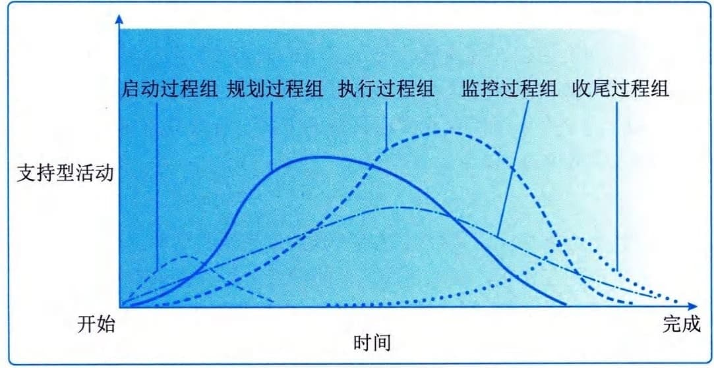
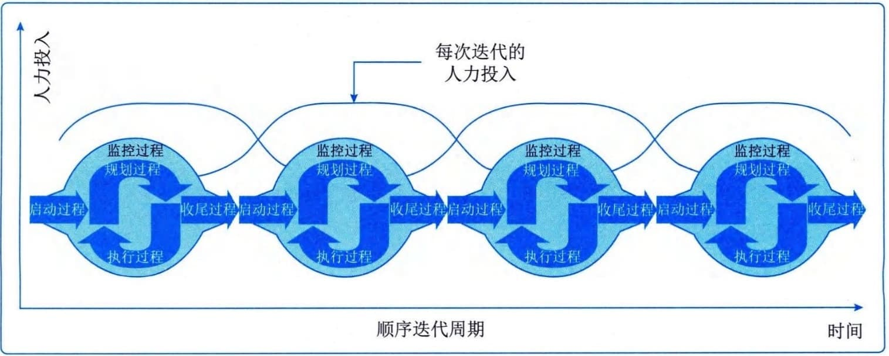
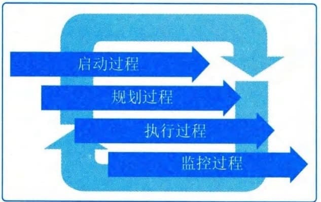

## 9.6 项目管理过程组
项目管理过程组是为了达成项目的特定目标，对项目管理过程进行的逻辑上的分组。需要注意的是，项目管理过程组不同于项目阶段，项目管理过程组是为了管理项目，针对项目管理过程进行的逻辑上的划分；项目阶段是项目从开始到结束所经历的一系列阶段，是一组具有逻辑关系的项目活动的集合，通常以一个或多个可交付成果的完成为结束的标志。
项目管理过程可分为以下5个项目管理过程组：
 - （1）启动过程组。启动过程组定义了新项目或现有项目的新阶段，启动过程组授权一个项目或阶段的开始。
 - （2）规划过程组。规划过程组明确项目范围、优化目标，并为实现目标制订行动计划。
 - （3）执行过程组。执行过程组完成项目管理计划中确定的工作，以满足项目要求。
 - （4）监控过程组。监控过程组跟踪、审查和调整项目进展与绩效，识别变更并启动相应的变更。
 - （5）收尾过程组。收尾过程组正式完成或结束项目、阶段或合同。
一个过程组的输出通常成为另一个过程组的输入，或者成为项目或项目阶段的可交付成果。例如，需要把规划过程组编制的项目管理计划和项目文件（如风险登记册、责任分配矩阵等）及其更新，提供给执行过程组作为输入。各过程组在项目阶段中的相互作用如图9-11所示。

图9-11 项目阶段中各过程组的相互作用
过程组中的各个过程会在每个阶段按需要重复开展，直到达到该阶段的完工标准。在适应型和高度适应型项目中，过程组之间相互作用的方式会有所不同。
#### **1．适应型项目中的过程组**
1）启动过程组
在采用适应型生命周期的项目上，启动过程通常要在每个迭代期开展。适应型项目非常依赖知识丰富的干系人代表，他们要能够持续地表达需要和意愿，并不断针对新形成的可交付成果提出反馈意见。因此应该在项目开始时识别出这些关键干系人，以便在开展执行和监控过程组时与他们频繁互动，获得的反馈意见能够确保项目交付出正确的成果。同时，随着项目进展，优先级和情况的动态变化，项目制约因素和项目成功的标准也会变化。因此，需要定期开展启动过程，频繁回顾和重新确认项目章程，以确保项目在最新的制约因素内朝最新的目标推进。
2）规划过程组
在高度复杂和不确定的项目中，在采用适应型生命周期的项目上，应该让尽可能多的团队成员和干系人参与到规划过程，以便依据广泛的信息开展规划，降低不确定性。高度预测型项目范围变更很少、干系人之间有高度共识，这类项目会受益于前期的详细规划。适应型生命周期的特点是先基于初始需求制订一套高层级的计划，再逐渐把需求细化到适合特定规划周期所需的详细程度。预测型和适应型生命周期在规划阶段的主要区别在于做多少规划工作，以及什么时间做。
3）执行过程组
在敏捷型或适应型生命周期中，执行过程通过迭代对工作进行指导和管理。每次迭代都是在一个很短的固定时间段内开展工作，然后演示所完成的工作成果，有关的干系人和团队基于演示来进行回顾性审查。这种演示和审查有助于对照计划检查进展情况，确定是否有必要对项目范围、进度或执行过程做变更。进行回顾性审查有利于及时发现和讨论与执行方法有关的问题，以及提出改进建议。
虽然工作是通过短期迭代进行的，但是也需要对照长期的项目交付时间框架对其进行跟踪和管理。先在迭代期层面上追踪开发速度、成本支出、缺陷率和团队能力的走势，再汇总并推算到项目层面，来跟踪整体项目的完工绩效。高度适应型项目中，项目经理聚焦于高层级的目标，并授权团队成员作为一个小组用最能实现目标的方式自行安排具体工作，有助于团队成员高度投入，制订出切合实际的计划。
4）监控过程组
在敏捷型或适应型生命周期中，监控过程通过维护未完项的清单，对进展和绩效进行跟踪、审查和调整。针对未完成的工作项，在项目团队的协助（分析并提供有关技术依赖关系的信息）下，业务代表对未完成的工作项进行优先级排序，基于业务优先级和团队能力，提取未完项清单最前面的任务，供下一个迭代期完成。针对变更，业务代表在听取项目团队的技术意见之后，评审变更请求和缺陷报告，排列所需变更或补救的优先级，列入工作未完项清单。
这种把工作和变更列入同一张清单的做法，多应用于充满变更的项目环境。在这种项目环境中，无法把变更从原先计划的工作中分离出来，所以把变更和原先的工作整合到一张未完项清单中，便于对全部工作进行重新排序，能够为干系人管理和控制项目工作、实施变更控制和确认范围提供统一的平台。
随着排定了优先级的任务和变更从未完项清单中提取出来，并通过迭代加以完成，就可以测算已完成工作的趋势和指标、变更工作量和缺陷率。通过在短期迭代中频繁抽样，计算变更影响的数量和缺陷补救工作量，就可以对照原来的范围来考察团队能力和工作进展，进而能够基于实际的进展速度和变更影响来估算项目成本、进度和范围。
应该借助趋势图表与项目干系人分享这些指标和预测，以便沟通进展情况，共同面对问题，推动持续改进，以及管理干系人期望。
5）收尾过程组
在敏捷型或适应型生命周期中，收尾过程对工作进行优先级排序，以便首先完成最具业务价值的工作。这样，即便不得不提前关闭项目或阶段，也很可能已经创造出一些有用的业务价值。这就使得提前关闭不太像是一种归因于沉没成本的失败，而更像是提前实现收益、快速取得成功或验证某种业务概念。
#### **2．适应型项目中过程组之间的关系**
1）以迭代方式顺序开展的项目
适应型项目往往可分解为一系列先后顺序进行的、被称为"迭代期"的阶段。在每个迭代期都要利用相关的项目管理过程。为了有效管理高度复杂且充满不确定性和变更的项目，重复开展项目管理过程组会产生管理费用。在迭代的各个阶段，所需的人力投入水平如图9-12所示。

图9-12 以迭代方式顺序开展的项目的人力投入水平
2）持续反复开展的项目
高度适应型项目往往在整个项目生命周期内持续实施所有的项目管理过程组。采用这种方法，工作一旦开始，计划就需根据新情况而改变，需要不断调整和改进项目管理计划的所有要素。这种方法中过程组之间的相互作用如图9-13所示。
图9-13 持续反复开展的项目中过程组之间的相互作用
