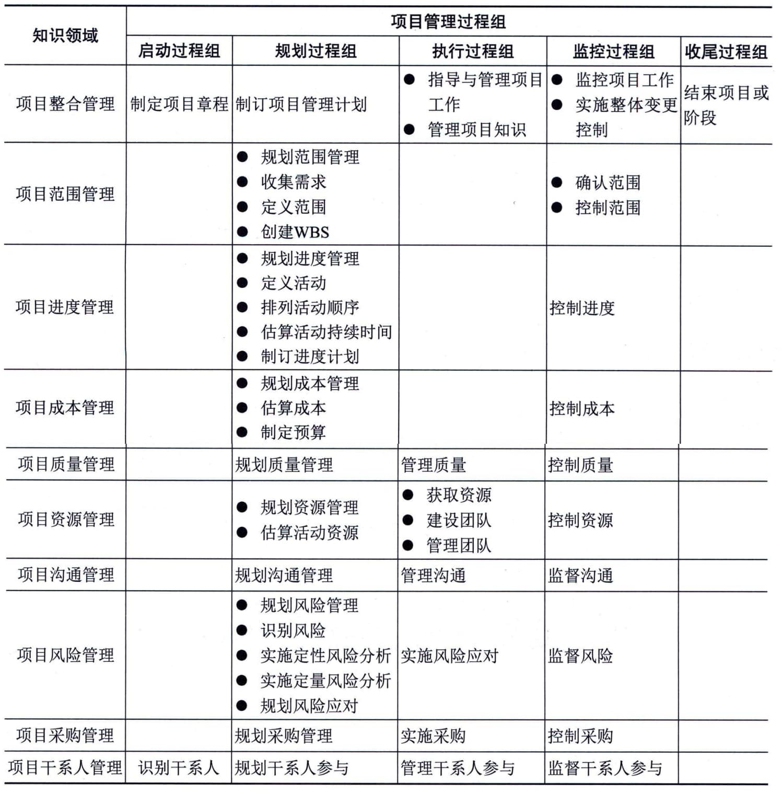

## 9.8 项目管理知识领域
除了过程组，过程还可以按知识领域进行分类。知识领域是指按所需知识内容来定义的项目管理领域，并用其所含过程、实践、输入、输出、工具和技术进行描述。
虽然知识领域相互联系，但从项目管理的角度来看，它们是分别定义的。根据美国项目管理协会出版的《项目管理知识体系指南》第6版，在大多数情况下，大部分项目通常使用的是10个知识领域，具体如下：
 - （1）项目整合管理：识别、定义、组合、统一和协调各项目管理过程组的各个过程和活动。
 - （2）项目范围管理：确保项目做且只做所需的全部工作以成功完成项目。
 - （3）项目进度管理：管理项目按时完成所需的各个过程。
 - （4）项目成本管理：使项目在批准的预算内完成而对成本进行规划、估算、预算、融资、筹资、管理和控制。
 - （5）项目质量管理：把组织的质量政策应用于规划、管理、控制项目和产品的质量，以满足干系人的期望。
 - （6）项目资源管理：识别、获取和管理所需资源以成功完成项目。
 - （7）项目沟通管理：确保项目信息及时且恰当地规划、收集、生成、发布、存储、检索、管理、控制、监督和最终处置。
 - （8）项目风险管理：规划风险管理、识别风险、开展风险分析、规划风险应对、实施风险应对和监督风险。
 - （9）项目采购管理：从项目团队外部采购或获取所需产品、服务或成果。
 - （10）项目干系人管理：识别影响或受项目影响的人员、团队或组织，分析干系人对项目的期望和影响，制定合适的管理策略来有效调动干系人参与项目决策和执行。
某些项目可能需要一个或多个其他的知识领域，例如，建造项目可能需要财务管理或安全与健康管理。表9-7列出了项目管理5个过程组和10个知识领域。
**表9-7
项目管理5个过程组和10个知识领域**
