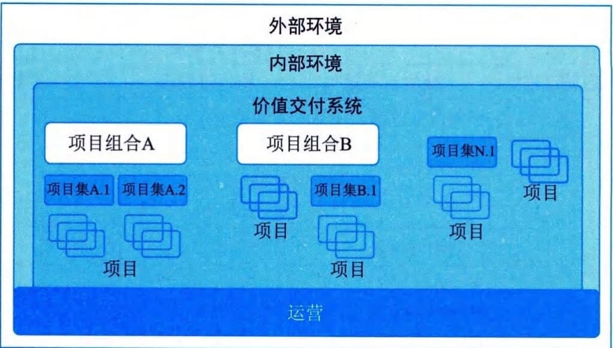
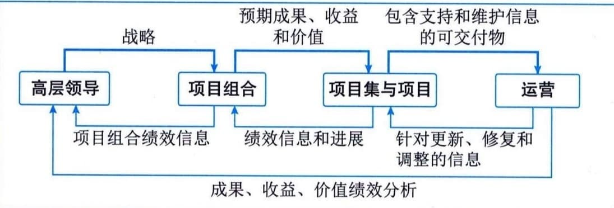

## 9.9 价值交付系统
价值交付系统描述了项目如何在系统内运作，为组织及其干系人创造价值，包括项目如何创造价值、价值交付组件和信息流。
#### **1．创造价值**
项目存在于组织中，包括政府机构、科研院所、企事业单位和其他组织，项目为干系人创造价值。项目可以通过以下方式创造价值：
 - · 创造满足客户或最终用户需要的新产品、服务或结果；
 - · 做出积极的社会或环境贡献；
 - · 提高效率、生产力、效果或响应能力；
 - · 推动必要的变革，以促进组织向期望的未来状态过渡；
 - · 维持以前的项目集、项目或业务运营所带来的收益等。
#### **2．价值交付组件**
可以单独或共同使用多种组件（例如项目组合、项目集、项目、产品和运营）来创造价值。这些组件共同组成了一个符合组织战略的价值交付系统。价值交付系统所包含的组件如图9-14所示，该系统有两个项目组合，它们包含了多个项目集和项目。该系统还显示了一个包含多个项目的独立项目集以及与项目组合或项目集无关的多个独立项目。任何项目或项目集都可能会包括产品。运营可以直接支持和影响项目组合、项目集和项目以及其他业务职能，例如工资支付、供应链管理等。项目组合、项目集和项目会相互影响，也会影响运营。
图9-14 价值交付系统
价值交付系统是组织内部环境的一部分，该环境受政策、程序、方法论、框架、治理结构等制约。内部环境存在于更大的外部环境中，包括经济、竞争环境、法律限制等。
价值交付系统中的组件创建了用于产出成果的可交付物。成果是某一过程或项目的最终结果或后果。成果可带来收益，收益是组织实现的利益。收益继而可创造价值，而价值是具有收益作用、重要性或实用性的事物。
#### **3．信息流**
当信息和信息反馈在所有价值交付组件之间以一致的方式共享时，价值交付系统最为有效，能够使系统与战略保持一致，这就是信息流的作用。信息流如图9-15所示。高层领导会与项目组合分享战略信息。项目组合与项目集和项目分享预期成果、收益和价值。项目集和项目的可交付物及其支持和维护信息一起传递给运营部门。

图9-15 信息流
反之，从运营部门到项目集和项目的信息反馈表明对可交付物的调整、修复和更新。项目集和项目给项目组合提供实现预期成果、收益和价值方面的绩效信息和进展。项目组合会提供与高层领导一起对项目组合进行绩效评估的绩效信息。此外，运营部门还提供有关组织战略推进情况的信息。
