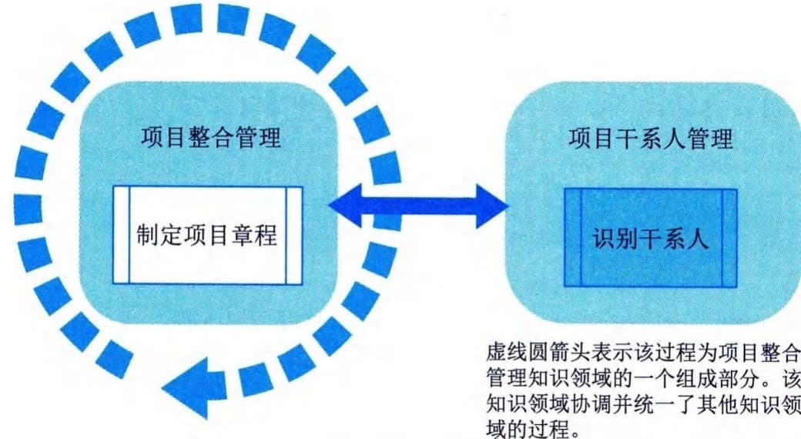
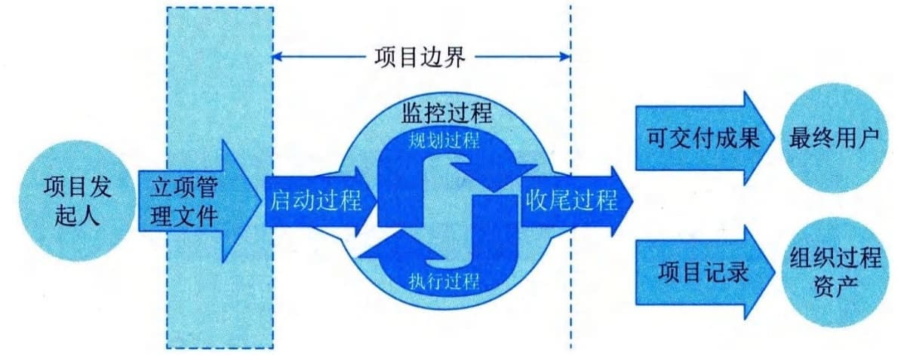

# 第10章 启动过程组
启动过程组包括定义一个新项目或现有项目的一个新阶段，授权开始该项目或阶段的一组过程。启动过程组包括两个过程，分别是项目整合管理中的"制定项目章程"和项目干系人管理中的"识别干系人"。启动过程组各过程之间的关系如图10-1所示，各过程之间存在相互作用，工作并行开展。

图10-1 启动过程组
启动过程组的目的是协调各方干系人的期望与项目目的，告知各干系人项目范围和目标，并商讨他们对项目及相关阶段的参与将如何有助于实现其期望。在启动过程中，需要定义初步项目范围和落实初步财务资源，识别那些将相互作用并影响项目总体结果的干系人，指派项目经理（如果尚未安排）。这些信息应反映在项目章程和干系人登记册中。一旦项目章程获得批准，项目也就正式立项，同时，项目经理就有权将组织资源用于项目活动。
启动过程组的主要作用是确保只有符合组织战略目标的项目才能被立项，以及在项目开始时就认真考虑商业论证、项目效益和干系人。在一些组织中，项目经理会参与制定商业论证和分析项目效益，会帮助编写项目章程。在另一些组织中，项目的前期准备工作则由项目发起人、项目管理办公室（PMO）、项目组合指导委员会或其他干系人群体完成。图10-2显示了项目发起人及立项管理文件与启动过程的关系。
项目通常划分为多个阶段。一旦划分了阶段，就需要在后续阶段复审从启动过程得到的信息，以确认是否仍然有效。在每个阶段开始时重新开展启动过程，有助于保持项目符合其预定的商业需求，有助于核实项目章程、立项管理文件和成功标准，有助于复审项目干系人的影响、动机、期望和目标。
项目发起人、客户和其他干系人参与项目启动，有助于促进他们对项目成功标准达成一致，也有助于提升项目完成时可交付成果通过验收的可能性，以及在整个项目期间干系人的满意程度。

图10-2 项目发起人及立项管理文件与启动过程的关系
启动过程组需要开展以下13类工作：
 - （1）基于事业环境因素、组织过程资产和项目的前期准备资料（包括商业论证、效益管理计划和协议），开展项目评估，来确认以前做出的关于项目可行性的商业论证结论仍然是合理可靠的；
 - （2）在开展项目评估时，应该广泛征求干系人的意见，并与重要干系人一起分析项目效益，确认项目仍然符合组织战略，能够为组织实现拟定的变革，创造预期的商业价值；
 - （3）明确为了实现变革和创造价值，项目必须在特定范围、进度、成本和质量要求下完成的关键可交付成果，这也有利于引导干系人（特别是客户）对项目抱有合理的期望；
 - （4）分析整体项目风险，确认整体项目风险水平是可接受的；
 - （5）分析项目合规性要求，制定项目合规目标；
 - （6）识别项目的单个项目风险类别、主要制约因素和主要假设条件；
 - （7）确定项目治理结构，组建项目治理委员会，并规定其权责；
 - （8）初选适用的项目开发方法（预测型、敏捷型或混合型）；
 - （9）提出项目执行的总体要求，如项目范围设计、里程碑进度计划、所需的财务资源估计；
 - （10）对前述所有工作的成果进行整理、分析和提炼，编制出项目章程和假设日志，在这个过程中，应该保持与干系人的良好沟通，以便大家对项目章程和假设日志的内容达成一致意见；
 - （11）获得项目发起人对项目章程的批准，以便项目正式立项，项目经理正式上任；
 - （12）向干系人分发（可召开项目启动会）已批准的项目章程，确保他们理解项目的意义和目标，以及各自的角色和职责；
 - （13）与已有的干系人一起，开展干系人识别和分析工作，编制出干系人登记册。
本章对启动过程组的2个过程-"制定项目章程"和"识别干系人"的输入输出、工具与技术进行说明时，采取以下规则进行描述：
 - · 省略常见的输入输出、工具与技术；
 - · 针对主要输入输出、重要的工具与技术进行详细阐述。
