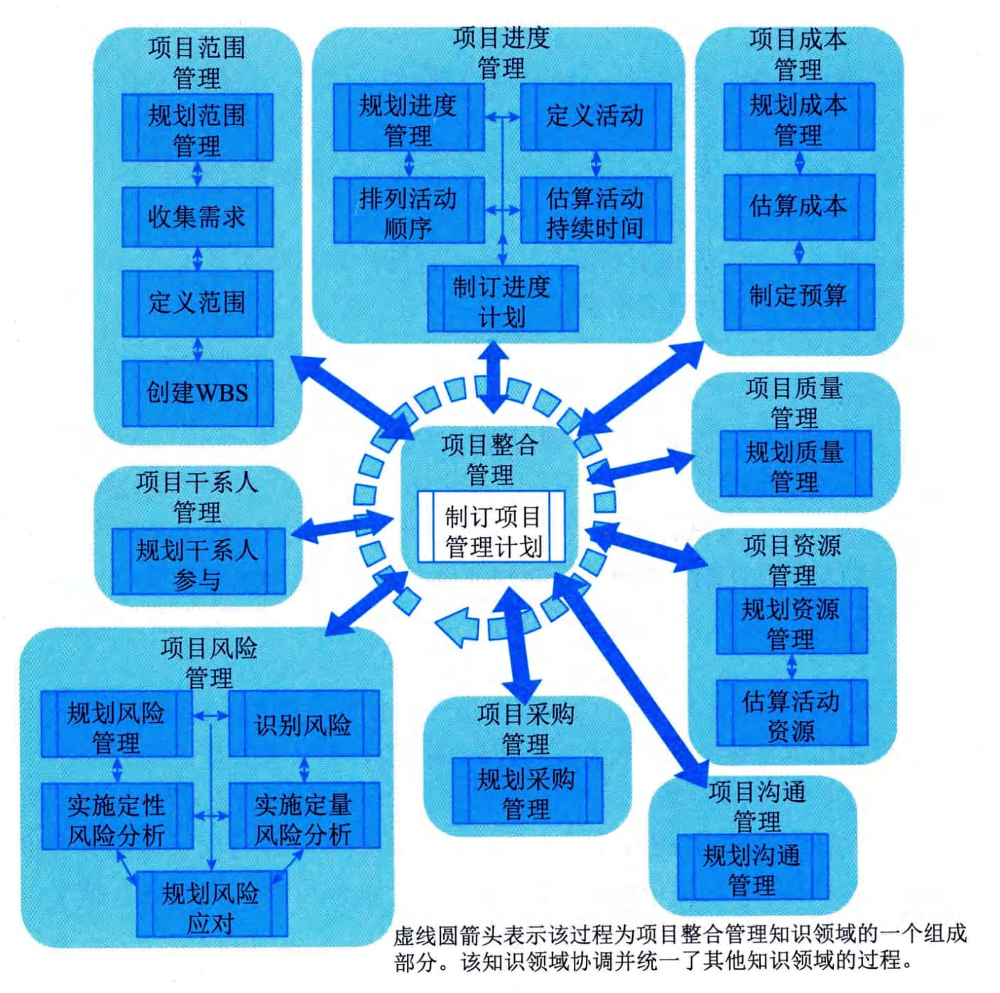

# 第11章 规划过程组
规划过程组包括明确项目全部范围、定义和优化目标，并为实现目标制定行动方案的一组过程。规划过程组中的过程负责制订项目管理计划的各组成部分以及用于执行项目的项目文件。
规划过程组共包括24个过程：项目整合管理中的"制订项目管理计划"，项目范围管理中的"规划范围管理""收集需求""定义范围""创建WBS"，项目进度管理中的"规划进度管理""定义活动""排列活动顺序""估算活动持续时间""制订进度计划"，项目成本管理中的"规划成本管理""估算成本""制定预算"，项目质量管理中的"规划质量管理"，项目资源管理中的"规划资源管理""估算活动资源"，项目沟通管理中的"规划沟通管理"，项目风险管理中的"规划风险管理""识别风险""实施定性风险分析""实施定量风险分析""规划风险应对"，项目采购管理中的"规划采购管理"，项目干系人管理中的"规划干系人参与"。规划过程组各过程之间的关系如图11-1所示，各过程之间存在相互作用，工作并行开展。

图11-1 规划过程组各过程之间的关系
规划过程取决于项目本身的性质，可能需要通过多轮反馈来做进一步分析。随着收集和掌握更多的项目信息或特性，项目很可能需要进一步规划。项目生命周期中发生的重大变更，可能引发重新开展一个或多个规划过程，甚至一个或全部启动过程。这种对项目管理计划的持续精细化叫作"渐进明细"，表明项目规划和文件编制是迭代或持续开展的活动。本过程组的主要作用是确定成功完成项目或阶段的行动方案。
在规划项目、制订项目管理计划和项目文件时，项目管理团队应当适当征求干系人的意见，并鼓励干系人参与。初始规划工作完成时，经批准的项目管理计划就被视为基准。在整个项目期间，监控过程将把项目绩效与基准进行比较。
规划过程组需要开展以下15类主要工作：
 - （1）通过规划管理过程，编制需求管理计划、范围管理计划、进度管理计划、成本管理计划、质量管理计划、风险管理计划、资源管理计划、沟通管理计划、采购管理计划和干系人参与计划。
 - （2）通过制订项目管理计划过程，编制变更管理计划和配置管理计划，确定项目开发方法和项目生命周期类型。
 - （3）根据需求管理计划和范围管理计划，编制范围目标计划，包括项目范围说明书、工作分解结构和WBS字典。
 - （4）根据资源管理计划、范围目标计划以及其他相关信息，估算活动和项目所需的资源，得到资源需求。
 - （5）根据进度管理计划、范围目标计划和资源需求，编制进度目标计划，包括里程碑进度计划、汇总进度计划和详细进度计划，以及相应的支持材料。
 - （6）根据成本管理计划、范围目标计划、进度目标计划和资源需求，编制成本目标计划，包括成本估算、项目预算和项目资金需求。
 - （7）根据质量管理计划、范围目标计划、进度目标计划和成本目标计划，编制质量目标计划，即质量测量指标。
 - （8）根据范围管理计划、质量管理计划、资源管理计划，以及范围、进度、成本和质量目标计划，编制采购计划，包括采购策略、采购工作说明书、招标文件和供方选择标准等。
 - （9）根据风险管理计划等其他各种管理计划和其他相关信息，对已编制出的范围、进度、成本和质量目标计划及采购计划进行风险识别和分析，并制定风险应对措施。
 - （10）根据风险识别、分析和应对措施制定的结果，回头调整范围、进度、成本和质量目标计划及采购计划。
 - （11）根据需要，反复开展上述第（3）步至第（10）步，直到得到现实可行、令人满意的范围、进度、成本和质量目标计划，以及采购计划和风险计划（风险登记册）。
 - （12）把最终的项目范围说明书、工作分解结构和WBS字典汇编在一起，报领导和主要干系人批准，得到范围基准。把最终的里程碑进度计划和汇总进度计划报领导和其他主要干系人批准，得到进度基准。把最终的项目预算报领导和其他主要干系人批准，得到成本基准。
 - （13）把所有的分项管理计划和分项基准汇编在一起，形成项目管理计划，并报领导和其他主要干系人批准。把其他不属于项目管理计划的组成部分的内容（项目资金需求除外）归入"项目文件"或"采购文档"。
 - （14）把项目资金需求报给项目发起人，以便他据此准备和提供资金。
 - （15）召集项目开工会议，向干系人介绍项目计划和项目目标，获得干系人对项目的支持和参与，宣布项目正式进入执行阶段。
在编制计划的过程中，要留意并考虑项目执行组织内外部的商业环境的动态变化，考虑如何确保项目合规，如何确保项目能够实现组织变革和创造商业价值。
本章对规划过程组的24个过程-"制定项目管理计划""规划范围管理""收集需求""定义范围""创建
WBS""规划进度管理""定义活动""排列活动顺序""估算活动持续时间""制订进度计划""规划成本管理""估算成本""制定预算""规划质量管理""规划资源管理""估算活动资源""规划沟通管理""规划风险管理""识别风险""实施定性风险分析""实施定量风险分析""规划风险应对""规划采购管理""规划干系人参与"的输入输出、工具与技术进行说明时，采取以下规则进行描述：
 - · 省略常见的输入输出、工具与技术；
 - · 针对主要输入输出、重要的工具与技术进行详细阐述。
