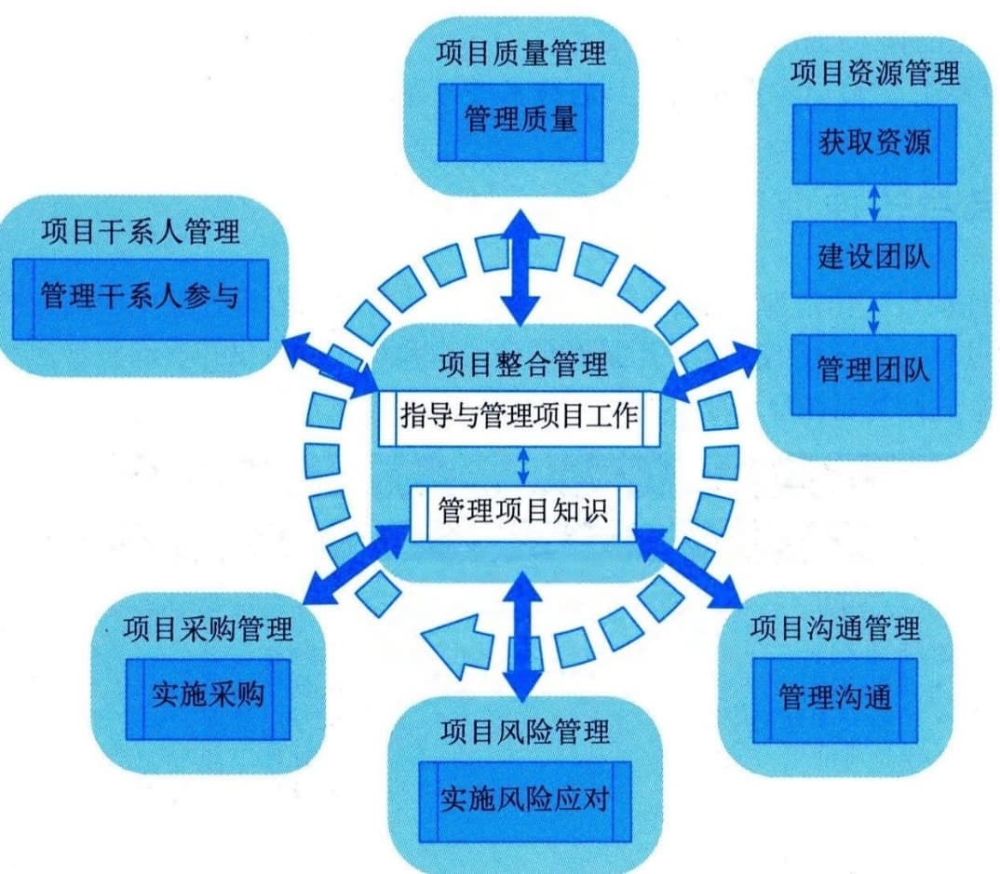

# 第12章 执行过程组
执行过程组包括完成项目管理计划中确定的工作，以满足项目要求的10个过程，包括：项目整合管理中的"指导与管理项目工作"和"管理项目知识"；项目质量管理中的"管理质量"；项目资源管理中的"获取资源""建设团队"和"管理团队"；项目沟通管理中的"管理沟通"；项目风险管理中的"实施风险应对"；项目采购管理中的"实施采购"；项目干系人管理中的"管理干系人参与"，执行过程组各子过程之间的关系如图12-1所示，各过程之间存在相互作用，工作并行开展。本过程组需要按照项目管理计划来协调资源，管理干系人参与，以及整合并实施项目活动。本过程组的主要作用是，根据计划执行为满足项目要求、实现项目目标所需的项目工作。执行过程组会耗费绝大多数的项目预算、资源和时间，同时开展执行过程组的过程涉及的工作，还可能会引发变更请求，一旦变更请求获得批准，则可能触发一个或多个规划过程，来修改项目管理计划、完善项目文件，甚至建立新的基准。

图12-1 执行过程组各过程关系图
执行过程组需要开展以下11类工作。
 - （1）按照资源管理计划，从项目执行组织内部或外部获取项目所需的团队资源和实物资源。
 - （2）对于团队资源，组建、建设和管理团队。对于实物资源，将其在正确的时间分配到正确的工作上。（3）按照采购计划开展采购活动，从项目执行组织外部获取项目所需的资源、产品或服务。
 - （4）领导团队按照计划执行项目工作，随时收集能真实反映项目执行情况的工作绩效数据，并完成符合范围、进度、成本和质量要求的可交付成果。
 - （5）开展管理质量过程相关工作，有效执行质量管理体系。
 - （6）执行经批准的变更请求，包括纠正措施、缺陷补救和预防措施。
 - （7）执行经批准的风险应对策略和措施，降低威胁对项目的影响，提升机会对项目的影响。
 - （8）执行沟通管理计划，管理项目信息的流动，确保干系人了解项目情况。
 - （9）执行干系人参与计划，维护与干系人之间的关系，引导干系人的期望，促进其积极参与和支持项目。
 - （10）开展管理项目知识过程相关工作，促进利用现有知识，并形成新知识，进行知识分享和知识转移，促进本项目顺利实施和项目执行组织的发展。
 - （11）对项目团队成员和项目干系人进行培训或辅导，促进其更好地参与项目。
本章对执行过程组的10个过程-"指导与管理项目工作""管理项目知识""管理质量""获取资源""建设团队""管理团队""实施风险应对""实施采购""管理沟通""管理干系人参与"的输入／输出、工具与技术进行说明时，采取以下规则进行描述：
 - · 省略常见的输入／输出、工具与技术；
 - · 针对主要输入／输出、重要的工具与技术进行详细阐述。
