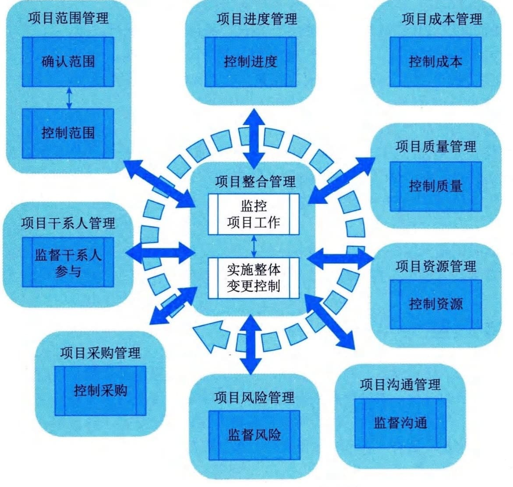

# 第13章 监控过程组
监控过程组是由监督项目执行情况并在必要时采取纠正措施，识别必要的计划变更并启动相应的变更程序等12个过程组成，包括：项目范围管理中的"确认范围"和"控制范围"；项目进度管理中的"控制进度"；项目成本管理中的"控制成本"；项目质量管理中的"控制质量"；项目资源管理中的"控制资源"；项目沟通管理中的"监督沟通"；项目风险管理中的"监督风险"；项目采购管理中的"控制采购"；项目干系人管理中的"监督干系人参与"；项目整合管理中的"监控项目工作"和"实施整体变更控制"。监控过程组各过程之间的关系如图13-1所示，各过程之间存在相互作用，工作并行开展。监督是收集项目绩效数据，计算绩效指标，并报告和发布绩效信息。控制是比较实际绩效与计划绩效，分析偏差，评估趋势以改进过程，评价可选方案，并建议必要的纠正措施。这个项目过程组的目的在于，定期监督和计量项目绩效以及时发现实际情况与项目管理计划之间的偏差，对预知可能出现的问题制定预防措施，以及控制变更。监控过程组不仅监视和控制某一过程组正在进行的工作，而且还监视和控制整个项目的成果。

图13-1
监控过程组各过程关系图持续的监督使项目团队和其他干系人得以洞察项目的健康状况，并识别需要格外注意的方面。在监控过程组，需要监督和控制在每个知识领域、每个过程组、每个生命周期阶段以及整个项目中正在进行的工作。
监控过程组需要开展以下11类工作。
 - （1）把执行情况和计划进行比较，分析项目绩效（包括范围绩效、进度绩效、成本绩效和质量绩效），识别和量化绩效的偏差。
 - （2）分析偏差的程度和原因，并预测未来绩效。
 - （3）基于分析和预测结果（如果超出了控制临界值），提出变更请求，包括纠正措施、缺陷补救措施建议、计划修改建议和预防措施建议。
 - （4）根据变更管理计划的规定，对变更请求进行综合评审，做出批准、否决或搁置等决定。
 - （5）除了为实现项目的既定目标而管理项目变更，还要从确保项目继续符合商业需要的高度来管理项目变更，提出修改项目目标的变更请求，并报变更控制委员会审批。
 - （6）及时查看和处理随同项目执行而记录的问题日志中的各种问题，最小化这些问题对项目的不利影响。
 - （7）及时检查已完成的可交付成果的质量，并及时验收质量合格的可交付成果，确保项目可交付成果能够满足项目要求，实现组织变革和创造商业价值。
 - （8）监控团队成员和干系人对项目的参与情况，确保有利于项目成功。
 - （9）监控项目采购活动，确保采购工作有利于项目目标的实现。
 - （10）既要监控单个项目风险，又要监控整体项目风险，还要监控风险管理工作的有效性，以便降低对项目目标的威胁，提高实现项目目标的机会。
 - （11）不断总结经验教训，以便持续改进。
本章对监控过程组的12个过程-"确认范围""控制范围""控制进度""控制成本""控制质量""控制资源""监督沟通""监督风险""控制采购""监督干系人参与""监控项目工作""实施整体变更控制"的输入输出、工具与技术进行说明时，采取以下规则进行描述：
 - · 省略常见的输入输出、工具与技术；
 - · 针对主要输入输出、重要的工具与技术进行详细阐述。
