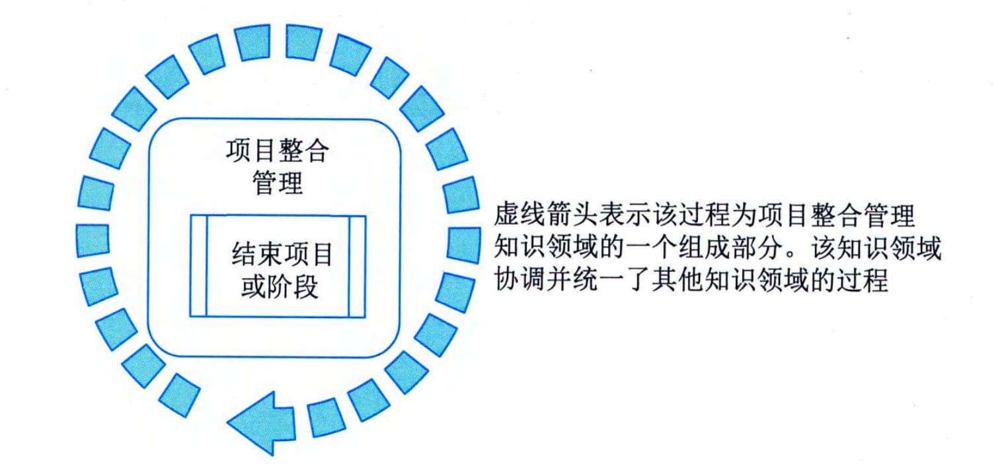

# 第14章 收尾过程组
收尾过程组包括为正式完成或关闭项目、阶段或合同而开展的过程。本过程组旨在核实为完成项目或阶段所需的所有过程组的全部过程均已完成，并正式宣告项目或阶段关闭。本过程组的主要作用是，确保恰当地关闭阶段、项目和合同。虽然本过程组只有一个过程，但是组织可以自行为项目、阶段或合同添加相关过程。因此，仍把它称为"过程组"，如图14-1所示。本过程组也适用于项目的提前关闭，例如项目流产或取消。

图14-1 监控过程组各过程关系图
收尾过程组需要开展以下10类工作。
 - （1）确认所有的项目合同都已经妥善关闭，没有未解决问题。
 - （2）获得主要的干系人对项目可交付成果的最终验收，确保项目目标已经实现。
 - （3）把项目可交付成果移交给指定的干系人，如发起人或客户。这件工作经常可以与最终验收同时开展。
 - （4）编制和分发最终的项目绩效报告。这份报告既有利于干系人了解项目的最终绩效，又可称为开展项目后评价的重要依据。
 - （5）收集、整理并归档项目资料，更新组织过程资产。这是为了保留项目记录，遵守相关法律法规，供后续审计（如果需要开展）使用，以及供以后其他项目借鉴。
 - （6）收集各主要干系人对项目的反馈意见，调查满意度。
 - （7）评估项目合规性、实现组织变革和创造商业价值的情况。
 - （8）全面开展项目后评价，总结经验教训，更新组织过程资产。
 - （9）开展知识分享和知识转移，为后续的项目成果运营实现商业价值提供支持。
 - （10）开展财务、法律和行政收尾，宣布正式关闭项目，把对项目可交付成果的管理和使用责任转移给指定的干系人，如发起人或客户。
本章对收尾过程组的1个过程-"结束项目或阶段"的输入输出、工具与技术进行说明时，采取以下规则进行描述：
 - · 省略常见的输入输出、工具与技术；
 - · 针对主要输入输出、重要的工具与技术进行详细阐述。
